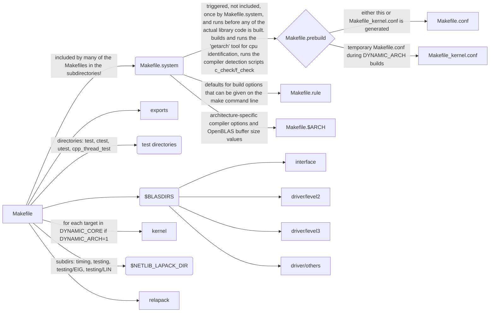

!!! info "Supported build systems"

    This page describes the Make-based build, which is the
    default/authoritative build method. Note that the OpenBLAS repository also
    supports building with CMake (not described here) - that generally works
    and is tested, however there may be small differences between the Make and
    CMake builds.

## Makefile dependency graph

<!---
An easy way to update this diagram is to copy it into https://mermaid.live
and edit it interactively.
-->

## Important Variables

Most of the tunable variables are found in
[Makefile.rule](https://github.com/xianyi/OpenBLAS/blob/develop/Makefile.rule),
along with their detailed descriptions.

Most of the variables are detected automatically in
[Makefile.prebuild](https://github.com/xianyi/OpenBLAS/blob/develop/Makefile.prebuild),
if they are not set in the environment.

The most commonly used variables are documented below. There are more options
though - please read the linked Makefiles if you want to see all variables.

### CPU related

- `ARCH`: target architecture (e.g., `x86-64`).
- `DYNAMIC_ARCH`: For building library for multiple `TARGET`s (does not lose any
  optimizations, but increases library size).
- `DYNAMIC_LIST`: optional user-provided subset of the `DYNAMIC_CORE` list in
   [Makefile.system](https://github.com/xianyi/OpenBLAS/blob/develop/Makefile.system).
- `TARGET`: target CPU architecture. In case of `DYNAMIC_ARCH=1`, it means that
  the library will not be usable on less capable CPUs.
- `TARGET_CORE`: override `TARGET` internally during each CPU-specific cycle of
  the build for `DYNAMIC_ARCH`.

### Toolchain related

- `CC`: `TARGET` C compiler used for compilation (can be cross-toolchains).
- `FC`: `TARGET` Fortran compiler used for compilation (can be cross-toolchains,
  set `NOFORTRAN=1` if the used cross-toolchain has no Fortran compiler).
- `COMMON_OPT`: flags to add to all invocations of the target C and Fortran compilers
  (overrides `CFLAGS`/`FFLAGS` - prefer using `COMMON_OPT`)
- `CCOMMON_OPT`: flags to add to all invocations of the target C compiler
  (overrides `CFLAGS`)
- `FCOMMON_OPT`: flags to add to all invocations of the target Fortran compiler
  (overrides `FFLAGS`)
- `LDFLAGS`: flags to add to all target linker invocations
- `AR`, `AS`, `LD`, `RANLIB`: `TARGET` toolchain helpers used for compilation
  (can be cross-toolchains).
- `HOSTCC`: compiler of build machine, needed to create proper config files for
  the target architecture.
- `HOST_CFLAGS`: flags for the build machine compiler.

### Library related

#### Library kind and bitness options

- `BINARY`: whether to build a 32-bit or 64-bit library (default is `64`, set
  to `32` on a 32-bit platform).
- `INTERFACE64`: build with 64-bit (ILP64) integer representations to support
  large array index values (incompatible with the standard 32-bit integer (LP64) API).
- `NO_STATIC`: if set to `1`, don't build a static library (default is `0`)
- `NO_SHARED`: if set to `1`, don't build a shared library (default is `0`)

#### Data type options

- `BUILD_SINGLE`: build the single-precision real functions of BLAS and (if
  it's built) LAPACK
- `BUILD_DOUBLE`: build the double-precision real functions
- `BUILD_COMPLEX`: build the single-precision complex functions
- `BUILD_COMPLEX16`: build the double-precision complex functions
- `BUILD_BFLOAT16`: build the "half precision brainfloat" real functions 
- `EXPRECISION`: (do not use, this is a work in progress) option to use `long
  double` functions

By default, the single- and double-precision real and complex floating-point
functions are included in the build, while the half- and extended-precision
functions are not.
 
#### Threading options

- `USE_THREAD`: Use a multithreading backend (defaults to `pthreads`).
- `USE_LOCKING`: implement locking for thread safety even when `USE_THREAD` is
  not set (so that the single-threaded library can safely be called from
  multithreaded programs).
- `USE_OPENMP`: Use OpenMP as multithreading backend
- `NUM_THREADS`: define this to the maximum number of parallel threads you
  expect to need (defaults to the number of cores in the build CPU).
- `NUM_PARALLEL`: define this to the number of OpenMP instances that your code
  may use for parallel calls into OpenBLAS (the default is `1`, see below).

OpenBLAS uses a fixed set of memory buffers internally, used for communicating
and compiling partial results from individual threads. For efficiency, the
management array structure for these buffers is sized at build time - this
makes it necessary to know in advance how many threads need to be supported on
the target system(s).

With OpenMP, there is an additional level of complexity as there may be calls
originating from a parallel region in the calling program. If OpenBLAS gets
called from a single parallel region, it runs single-threaded automatically to
avoid overloading the system by fanning out its own set of threads. In the case
that an OpenMP program makes multiple calls from independent regions or
instances in parallel, this default serialization is not sufficient as the
additional caller(s) would compete for the original set of buffers already in
use by the first call. So if multiple OpenMP runtimes call into OpenBLAS at the
same time, then only one of them will be able to make progress while all the
rest of them spin-wait for the one available buffer. Setting `NUM_PARALLEL` to
the upper bound on the number of OpenMP runtimes that you can have in a process
ensures that there are a sufficient number of buffer sets available.

#### Library and symbol name options

- `FIXED_LIBNAME`: if set to `1`, uses a non-versioned name for the library and
  no symbolic linking to variant names (default is `0`)
- `LIBNAMEPREFIX`: prefix that, if given, will be inserted in the library name
  before `openblas` (e.g., `xxx` will result in `libxxxopenblas.so`)
- `LIBNAMESUFFIX`: suffix that, if given, will be inserted in the library name
  after `openblas`, separated by an underscore (e.g., `yyy` will result in
  `libopenblas_yyy.so`)
- `SYMBOLPREFIX`: prefix that, if given, will be added to all symbol names
  *and* to the library name
- `SYMBOLSUFFIX`: suffix that, if given, will be added to all symbol names
  *and* to the library name

#### BLAS and LAPACK options

By default, the Fortran and C interfaces to BLAS and LAPACK are built,
including deprecated functions, while
[ReLAPACK](https://github.com/HPAC/ReLAPACK) is not.

- `NO_CBLAS`: if set to `1`, don't build the CBLAS interface (default is `0`)
- `ONLY_CBLAS`: if set to `1`, only build the CBLAS interface (default is `0`)
- `NO_LAPACK`: if set to `1`, don't build LAPACK (default is `0`)
- `NO_LAPACKE`: if set to `1`, don't build the LAPACKE interface (default is `0`)
- `BUILD_LAPACK_DEPRECATED`: if set to `0`, don't build deprecated LAPACK
  functions (default is `1`)
- `BUILD_RELAPACK`: if set to `1`, build Recursive LAPACK on top of LAPACK
  (default is `0`)
