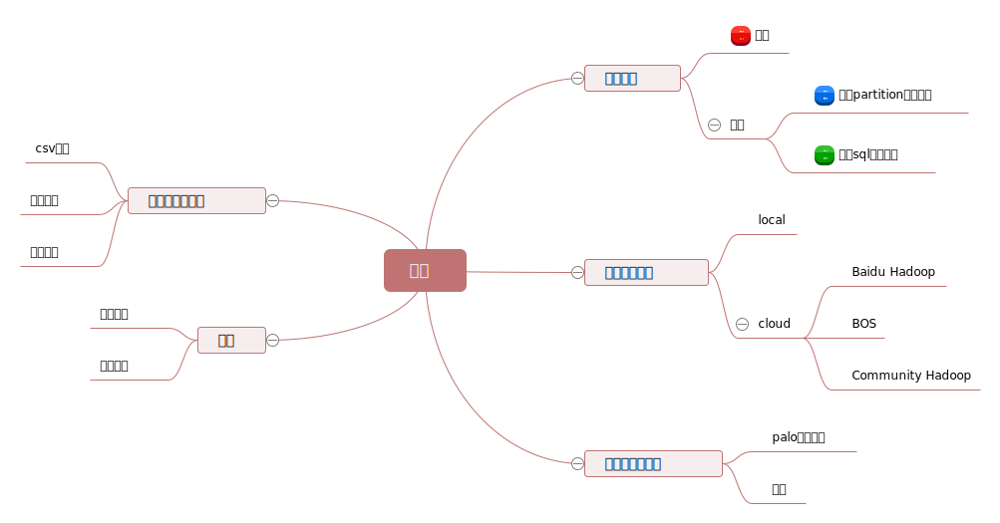

[TOC]

# 数据导出设计

## 背景

数据导出虽然一个低频场景，但是有时却非常重要。目前palo不提供导出功能。

### 常见的集中导出形式

+ Physical(Raw) VS Logical  
  Physical是指以原始文件和目录的形式导出。Logical是指导出更有意义的方式，常常是文本，insert语句等。

+ Online VS Offline
  Online是指在导出过程中不停止服务，不影响其他用户使用。注意有的时候，尤其是物理导出时，在导出过程中，需要对正在访问的物理文件加锁。  
  Offline是指停止服务，进行导出。

+ Local VS Remote  
  指相对于服务所在机器，导出到本地，还是远程机器。

+ Full VS Incremental  
  全量导出和增量导出

## 需求分析

主要从用户的角度，主要阐述用户可能需要哪些功能，以及我们提供哪些功能。

### 1. 导出的数据内容？

如下图：



+ **1. 导出全量数据**  
当用户希望导出的数据可以灌入其他数据库。
另外，如果有多个表的时候，用户可能希望同时导出整个DB，或者同时导出多个表。

可能希望原子的导出多个表的数据，即导出的数据在同一个版本，在导出过程中，新load的数据，不被导出。
希望原子导出：对于已经导出的数据，再次执行导出时不需要重新导出，只需要将增量部分补充即可。

+ **2. 按照partition导出某个表的数据**  
Palo支持两层分区，尤其是对于时序性数据，历史数据分布在较老的partition，这些数据很少被使用，用户可以选择将它们导出去，然后删除这些partition，从而节省在palo中的资源占用。

+ **3. 任意指定数据**  
用户处于临时测试等需求，可能要根据过滤条件导出一部分数据。

### 2. 将数据导出到哪里？

+ 导出到用户本地  
  这种需求可以通过mysql -e "select clause" 方式进行解决。  
  这种方式最大的缺点是：如果数据量较大，常常会因为网络不稳定等原因而失败，需要多次重新执行。
+ 导出到云存储  
  -  内网用户，导出到百度内部的hadoop集群。
  -  开放云用户，导出到BOS集群。
  -  私有云用户，导出到BOS集群和社区版hadoop集群。

### 3. 导出数据后的访问方式？

+ 导出的数据可以被palo快速的再次访问  
  用户可能希望导出的数据，palo还可以继续使用，只是不再关注访问的高性能，可以看做是“分级存储”功能的扩展。这种需求，用户导出后的数据作为palo的外部表存在。
+ 导出的数据不再需要被palo访问。  
  导出数据的目的可能是希望被其他系统使用，而不再需要palo使用。

### 4. 导出的数据保存为什么格式？

数据保存的格式有很多种，用户可能根据用途、使用方式、费用成本等方面的考虑，希望数据采用某种特定的格式。
例如：
+ 为了能够快速被查看，采用csv格式。
+ 为了能够上传和下载方便，也同时节省费用，希望导出的数据被压缩，从而减小数据大小。
+ 为了对接HIVE等其他Hadoop生态的存储系统，希望数据直接按照HIVE的格式进行存储。

除此之外，用户对导出文件的数量，大小等均不是很敏感。

### 5. 其它

对于数据导出的效率，用户并不是很敏感。

### 需求归纳

用户的需求多种多样，基于Palo的定位、人力和排期，Palo不准备做一个“又大又全”的导出，而是以“解决核心需求，兼顾小众需求”的原则，对功能进行取舍。

这里的导出是指：“**逻辑**”导出(Logical)，“**在线**导出”(Online)，**全量**导出，**远程**导出。

详细如下：
+ 对于导出内容数据：
  - 本次不支持多表同时导出，仅支持单表导出，但支持按照指定partition导出。
  - 对于任意数量的需求，我们采用"insert into 外部表 select clause"的方式解决，外部表暂时不支持分区。
  - 不支持指定版本导出，不支持增量导出。
+ 对于导出到云存储：  
    支持导出到BOS集群（云用户）和hadoop集群（内部用户）
+ 对于是否被palo访问：  
    如果有被palo再次访问的需求，用户可以通过broker的方式，进行访问。
+ 对于导出的数据格式：    
    支持csv格式，并且可以指定压缩（压缩方式同broker）。不支持HIVE等其他系统的存储方式。

## 其他系统调研

### MYSQL

#### 方法1：mysqldump命令
```
shell> mysqldump [arguments] > file_name

```

可以通过指定导出所有数据库、部分数据库、部分表进行导出。

+ 如果有--tab参数，生成两个文件，一个是包含create_table语句的tab_name.sql文件，一个是纯文本文件，包含所有数据，可以指定行尾符、转义字符等。
+ 如果没有--tab参数，生成一个文本文件。默认是生成一个SQL脚本，包含建表语句和insert语句。

#### 方法2：SELECT * INTO OUTFILE 'file_name' FROM tbl_name.
```
example：
  SELECT a,b,a+b 
  INTO OUTFILE '/tmp/result.text'
    FIELDS TERMINATED BY ',' 
    OPTIONALLY ENCLOSED BY '"'
    LINES TERMINATED BY '\n'
  FROM test_table;
```

说明：
+ 不支持where子句，只能导出全表。
+ **文件生成在服务端机器上，不是本地。**

#### 方法3：INSERT ... SELECT  和   CREATE ... SELECT

```
Syntax:
    CREATE [TEMPORARY] TABLE [IF NOT EXISTS] tbl_name [(create_definition,...)]
    [table_options]
    [partition_options]
    [IGNORE | REPLACE] [AS] query_expression
    
Syntax:
    INSERT [LOW_PRIORITY | HIGH_PRIORITY] [IGNORE] [INTO] tbl_name
    [PARTITION (partition_name,...)] [(col_name,...)]
    SELECT ...
    [ ON DUPLICATE KEY UPDATE col_name=expr, ... ]
```

mysql不支持外部表，所以这两种都无法将数据导出到外部。

### HIVE

因为Hive的数据都是在HDFS上，所以其数据都是可以通过HDFS直接访问的。

#### CTAS（Create Table As Select）
```
CREATE [EXTERNAL] TABLE table_name    
  [(col_name data_type [COMMENT col_comment], ... [constraint_specification])]
  [PARTITIONED BY (col_name data_type, ...)]
     ON ((col_value, col_value, ...), (col_value, col_value, ...), ...)
     [STORED AS DIRECTORIES]
  [
   [ROW FORMAT row_format] 
   [STORED AS file_format]
     | STORED BY 'storage.handler.class.name' [WITH SERDEPROPERTIES (...)]  -- (Note: Available in Hive 0.6.0 and later)
  ]
  [LOCATION hdfs_path]
  
  [AS select_statement];   -- (Note: Available in Hive 0.5.0 and later; not supported for external tables)
```

+ 只有当select执行完毕，并导入以后，该表才可见。
+ 如果希望将select语句的结果导入到hdfs_path中，将location指定为hdfs_path即可。
+ 有一些限制：
  - The target table cannot be a partitioned table.
  - The target table cannot be an external table.
  - The target table cannot be a list bucketing table.  
+ 如果指定了数据的存储格式，那么会自动被转化。

例如：
```
CREATE TABLE tbl_text 
  ROW FORMAT DELIMITED FIELDS TERMINATED BY ',' 
  LOCATION '/tmp/data' 
  AS select * from tbl where condition;
```

#### Writing data into the filesystem from queries

```sql
Standard syntax:
INSERT OVERWRITE [LOCAL] DIRECTORY directory1
  [ROW FORMAT row_format] [STORED AS file_format] 
  SELECT ... FROM ...
 
Hive extension (multiple inserts):
FROM from_statement
INSERT OVERWRITE [LOCAL] DIRECTORY directory1 select_statement1
[INSERT OVERWRITE [LOCAL] DIRECTORY directory2 select_statement2] ...
 
 
row_format
  : DELIMITED [FIELDS TERMINATED BY char [ESCAPED BY char]] [COLLECTION ITEMS TERMINATED BY char]
        [MAP KEYS TERMINATED BY char] [LINES TERMINATED BY char]
        [NULL DEFINED AS char] (Note: Only available starting with Hive 0.13)
```
说明：
+ 如果指定了LOCAL关键字，那么数据写入到本地文件系统。否则，写入到HDFS中。
+ 文件格式是文本文件，多个列之间用^A字符（'\001'）分隔。对于非Primitive type的列，转化为json格式。
+ 从0.11版本之后，列分隔符可以指定。
+ OVERWRITE关键字是必须的。如果指定的目录已经存在，那么会被覆盖。
+ 在一条语句中，可以指定多个INSERT子句。可以同时包含HDFS目录，local目录，以及table（或者partition）。
+ 对于大量数据，使用“INSERT OVERWRITE statements to HDFS filesystem directories”是最好的方式。因为这时，Hive可以在Map-Reduce作业中并行写入。
+ 在一个语句中指定多个insert，可以减少原始数据被扫描的次数。


#### Inserting values into tables from SQL
```
Standard syntax:
  INSERT OVERWRITE TABLE tablename1 [PARTITION (partcol1=val1, partcol2=val2 ...) [IF NOT EXISTS]] select_statement1 FROM from_statement;
  INSERT INTO TABLE tablename1 [PARTITION (partcol1=val1, partcol2=val2 ...)]   select_statement1 FROM from_statement;
 
Hive extension (multiple inserts):
  FROM from_statement
  INSERT OVERWRITE TABLE tablename1 [PARTITION (partcol1=val1, partcol2=val2 ...) [IF NOT EXISTS]] select_statement1
  [INSERT OVERWRITE TABLE tablename2 [PARTITION ... [IF NOT EXISTS]] select_statement2]
  [INSERT INTO TABLE tablename2 [PARTITION ...] select_statement2] ...;
  
  FROM from_statement
  INSERT INTO TABLE tablename1 [PARTITION (partcol1=val1, partcol2=val2 ...)]   select_statement1
  [INSERT INTO TABLE tablename2 [PARTITION ...] select_statement2]
  [INSERT OVERWRITE TABLE tablename2 [PARTITION ... [IF NOT EXISTS]] select_statement2] ...;
 
Hive extension (dynamic partition inserts):
INSERT OVERWRITE TABLE tablename PARTITION (partcol1[=val1], partcol2[=val2] ...) select_statement FROM from_statement;
INSERT INTO TABLE tablename PARTITION (partcol1[=val1], partcol2[=val2] ...) select_statement FROM from_statement;
```

说明：
+ 上述三种方式中，导出的文件数是和mapper和reducer的个数相关的，如果没有reduce,则文件数为mapper的个数；否则文件数为reducer的个数。

#### EXPORT TABLE

```
Export Syntax: 
  EXPORT TABLE tablename [PARTITION (part_column="value"[, ...])] 
  TO 'export_target_path' [ FOR replication('eventid') ]
```
+ Export不仅是data还有metadata。 metadata放在目标dir中，数据放在子目录中。
+ 数据的组织形式和原table的形式一致，原table有多少个文件，export出的就有多少文件。
+ 可以导出一整张表，也可以导出指定的partition。

### GreenplumDB

#### 方法1：INSERT ... SELECT

```
example:
  CREATE WRITABLE EXTERNAL TABLE table_name
  LOCATION ('gphdfs://hdfshost:port/path')
  FORMAT format
  DISTRIBUTED BY distributed_key;

  INSERT INTO table_name_1 SELECT * FROM table_name_2;
```

+  通过外部表导出可以并行导出，并发数为Segment Host的数目。

#### 方法2：COPY

```
Syntax:
  COPY (select_statement) TO 'target_path';
```

+ 数据需要在master上汇总，因此不能并行。
+ 这种方式的导出没有方法1高，但是其简单方便，主要用于数据量较小的情况。

### VerticaDB

#### 方法1：通过S3EXPORT()导出到S3

```
example:
  SELECT S3EXPORT(* USING PARAMETERS url='s3://exampleBucket/object') FROM exampleTable;
```

#### 方法2：EXPORT导出到另一个Vertica DB中

```
example1:导出整张表
  EXPORT TO VERTICA testdb.customer_dimension FROM customer_dimension;

example2:导出过滤后的表
  EXPORT TO VERTICA testdb.ma_customers 
  AS SELECT customer_key, customer_name, annual_income
  FROM customer_dimension
  WHERE customer_state = 'MA';

example3: 导出部分列
  EXPORT TO VERTICA testdb.people(name, gender, age)
  FROM customer_dimension (customer_name, customer_gender, customer_age);
```

### Impala

Impala虽然支持Hive的元数据，语法格式也与Hive内饰。但是并不支持Hive的EXPORT TABLE语法。目前只支持以external table的方式导出数据，包括CTAS、insert ... select ... 的方式。

```
Syntax:
  INSERT { INTO | OVERWRITE } [TABLE] table_name
    [(column_list)]
    [ PARTITION (partition_clause)]
    select_statement

  
  partition_clause ::= col_name [= constant] [, col_name [= constant] ...]
  
  hint_clause ::= [SHUFFLE] | [NOSHUFFLE]    (Note: the square brackets are
   part of the syntax.)
```

说明：
+ 尽管可以在select语句中指定order by，但是会被忽略。因为数据会在多台机器上进行，每个机器会生成一个文件，所以将数据排序没有实际意义。
+ 任何一个insert语句都会生成不同的名字的文件，所以多个insert into ...select语句可以同时执行（注意不是 INSERT OVERWRITE语句）。
+ 默认会在目标目录下生成一个以"_dir"记为的子目录,作为临时目录。在执行完毕后，执行mv操作。

## 概要设计

### API

采用类似于Hive的方式：
两种方式：

```
Syntax:

EXPORT TABLE tablename 
  [PARTITION (name1[, ...])] 
  TO 'export_target_path' 
  [PROPERTIES("key"="value")]
  BY BROKER 'broker_name' [( $broker_attrs)]

INSERT { INTO | OVERWRITE } TABLE table_name[(column_list)]
  select_statement
  [BY BROKER 'broker_name' [( $broker_attrs)]]

```

对于export语句，使用的BROKER通过by子句进行指定。行分隔符、压缩方式使用PROPERTIES子句指定。

insert...select语句中，并且需要使用建表时指定的broker，那么可以不提供BY BROKER子句，否则需要重新指定broker。行分隔符等属性，采用建外部表时指定的值，如未指定则取默认值。

### 导出的数据格式

导出数据为CSV格式，可以指定列分隔符；

支持对数据压缩，支持的压缩方式同broker scan。

### 异步执行

数据导出一般执行时间较长，所以采用异步方式，用户提交命令后，会先返回，然后后台执行，同时提供方式供用户查看执行进度。

和现有insert ... select 语句类似，对外部表的insert ..。 select 语句仍然使用**SHOW LOAD**来查看进度。

对于EXPORT语句，使用**SHOW EXPORT**查看进度。

考虑到排期，本期优先实现insert external table select...。

### 持久化

因为是异步执行，为了防止Palo集群宕机后，用户看不到export任务，所以需要对导出任务进行持久化。

### 导出任务的状态切换

和现有load作业的状态切换类似。


### SHOW LOAD

兼容现有show load语句。

### SHOW EXPORT
和SHOW LOAD类似。

```
    SHOW EXPORT
        [FROM db_name]
        [
            WHERE 
            [LABEL [ = "your_label" | LIKE "label_matcher"]]
            [STATE = ["PENDING"||"EXPORTING"|"FINISHED"|"CANCELLED"|]]
        ]
        [ORDER BY ...]
        [LIMIT limit];
```

### 执行计划

#### export语句的执行计划

如下图：


#### insert ... select语句的执行计划


### 并行导出

Palo中的外部表，**不支持多分区方式。**

对于源数据表多partition的表，可以做到多个BE同时并行的export，从而提高效率。

### 需要snapshot

对于export任务，因为持续时间较长，为了避免在导出过程中be将数据merge掉，导致找不到对应的数据。所以需要在执行之前要对BE上的tablet打一个snapshot，同时在任务结束后，及时将snapshot删除。

### 资源隔离

这里主要是指IO操作的隔离。

Export操作是一个**低频、低优先级**的操作，如果按照现有的查询逻辑进行自行，在Palo当前的资源隔离实现时，那么当表中数据量很大时，可能会将BE扫描线程打满，影响到正常的查询服务，所以需要对export的操作进行限速。

鉴于Palo后面会在底层进行IO隔离，不同用户间按比例调度，同一个用户按round robin进行调度，并且内部实现类似时间片的分配机制。这样即便export时查询很大，可以保证不会影响到其他用户，以及同一用户的其他查询。

在目前，采用的隔离方案：
+ 对于Export方式，对于多个Fragment instance，我们不在使用MPP的执行方式，而是采用串行的执行方式。（因为只有一级scan node，并且不需要节点进行汇聚数据，所以可以使用串行）
+ 对于insert select方式，因为select语句可能比较复杂，例如包含join等其他操作，不能采用串行的方式。

作为临时方案，为了简单起见，对于同一个fragment，执行时仍然是“每个BE只会有一个Fragment instance”。这样，虽然不会因为export任务将所有BE都打满，但是在极端情况下，仍然可能会将单台BE打满。但考虑到该功能主要在公有云上使用，每个用户都是自己独立的集群，并且是一个低频的操作，同时待新的IO隔离方式上线后，该功能就不需要了。

### 文件目录

目前Broker scan时，暂不支持子目录，所以导出的数据都在同一个目录下，不生成子目录。

多个BE并行导出，即多个BE同时向一个目录下写数据（写入到多个文件）。

**写入顺序**：先在临时目录下写入，待写入完成后，mv到目标目录。

这里要注意的是：在极端情况下，导出任务失败的情况下，例如Palo集群宕机等，可能会将数据遗留在临时目录中。这时需要手动进行清理。（hdfs dfs -rm -r tmp_dir）

### 文件命名格式：

每个tablet默认对应一个文件，如果文件较大时，会进行拆分，通过后缀的递增进行区分。

```
文件命名格式：
    [$partition_id_]{$instance_id}_{$random_int}.data.{$increasing_int}
```

### 文件大小

在broker scan时，对于单个大文件，目前只支持文本文件的拆分读取。如果是压缩文件，无法做到拆分读取。

同时在向BOS写入时，目前是要先写本地文件，然后在同一向BOS上传，如果文件过大，失败的可能性比较大。同时目前broker本身暂不支持自动将文件拆分写入。

综上，需要在上层对文件大小进行限制，尤其对压缩的HDFS文件和输出到BOS时。

初期可以采用比较简单的分拆方法，比如行数或者压缩前buffer大小。

### 错误重试

对于export方式，每台BE上的fragment可以单独进行重试。

对于insert...select方式，和普通查询一样，不进行重试。

### 忽略数据排序

对于insert select语句，select子句中可能会有order by，但是会被忽略。因为数据会在多台机器上进行，每个机器会生成一个文件，所以将数据排序没有实际意义。

### 不支持增量导出

即连续的两次导出任务，不支持用户在第二次仅导出第一次没有导出的数据。
