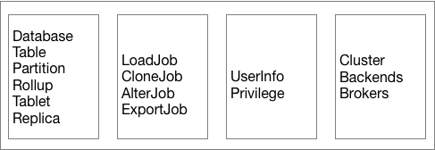
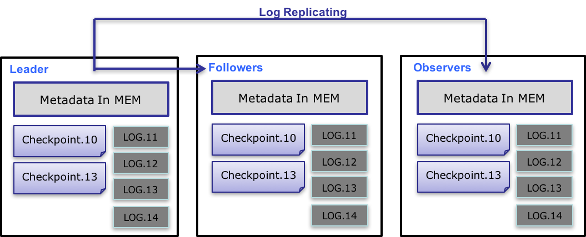

<!-- 
Licensed to the Apache Software Foundation (ASF) under one
or more contributor license agreements.  See the NOTICE file
distributed with this work for additional information
regarding copyright ownership.  The ASF licenses this file
to you under the Apache License, Version 2.0 (the
"License"); you may not use this file except in compliance
with the License.  You may obtain a copy of the License at

  http://www.apache.org/licenses/LICENSE-2.0

Unless required by applicable law or agreed to in writing,
software distributed under the License is distributed on an
"AS IS" BASIS, WITHOUT WARRANTIES OR CONDITIONS OF ANY
KIND, either express or implied.  See the License for the
specific language governing permissions and limitations
under the License.
-->

# 元数据设计文档

## 名词解释

* FE：Frontend，即 Doris 的前端节点。主要负责接收和返回客户端请求、元数据以及集群管理、查询计划生成等工作。
* BE：Backend，即 Doris 的后端节点。主要负责数据存储与管理、查询计划执行等工作。
* bdbje：[Oracle Berkeley DB Java Edition](http://www.oracle.com/technetwork/database/berkeleydb/overview/index-093405.html)。在 Doris 中，我们使用 bdbje 完成元数据操作日志的持久化、FE 高可用等功能。

## 整体架构

如上图，Doris 的整体架构分为两层。多个 FE 组成第一层，提供 FE 的横向扩展和高可用。多个 BE 组成第二层，负责数据存储于管理。本文主要介绍 FE 这一层中，元数据的设计与实现方式。

1. FE 节点分为 follower 和 observer 两类。各个 FE 之间，通过 bdbje（[BerkeleyDB Java Edition](http://www.oracle.com/technetwork/database/database-technologies/berkeleydb/overview/index-093405.html)）进行 leader 选举，数据同步等工作。

2. follower 节点通过选举，其中一个 follower 成为 leader 节点，负责元数据的写入操作。当 leader 节点宕机后，其他 follower 节点会重新选举出一个 leader，保证服务的高可用。

3. observer 节点仅从 leader 节点进行元数据同步，不参与选举。可以横向扩展以提供元数据的读服务的扩展性。

> 注：follower 和 observer 对应 bdbje 中的概念为 replica 和 observer。下文可能会同时使用两种名称。

## 元数据结构

Doris 的元数据是全内存的。每个 FE 内存中，都维护一个完整的元数据镜像。在百度内部，一个包含2500张表，100万个分片（300万副本）的集群，元数据在内存中仅占用约 2GB。（当然，查询所使用的中间对象、各种作业信息等内存开销，需要根据实际情况估算。但总体依然维持在一个较低的内存开销范围内。）

同时，元数据在内存中整体采用树状的层级结构存储，并且通过添加辅助结构，能够快速访问各个层级的元数据信息。

下图是 Doris 元信息所存储的内容。

如上图，Doris 的元数据主要存储4类数据：

1. 用户数据信息。包括数据库、表的 Schema、分片信息等。
2. 各类作业信息。如导入作业，Clone 作业、SchemaChange 作业等。
3. 用户及权限信息。
4. 集群及节点信息。

## 数据流

元数据的数据流具体过程如下：

1. 只有 leader FE 可以对元数据进行写操作。写操作在修改 leader 的内存后，会序列化为一条log，按照 key-value 的形式写入 bdbje。其中 key 为连续的整型，作为 log id，value 即为序列化后的操作日志。

2. 日志写入 bdbje 后，bdbje 会根据策略（写多数/全写），将日志复制到其他 non-leader 的 FE 节点。non-leader FE 节点通过对日志回放，修改自身的元数据内存镜像，完成与 leader 节点的元数据同步。

3. leader 节点的日志条数达到阈值后（默认 10w 条），会启动 checkpoint 线程。checkpoint 会读取已有的 image 文件，和其之后的日志，重新在内存中回放出一份新的元数据镜像副本。然后将该副本写入到磁盘，形成一个新的 image。之所以是重新生成一份镜像副本，而不是将已有镜像写成 image，主要是考虑写 image 加读锁期间，会阻塞写操作。所以每次 checkpoint 会占用双倍内存空间。

4. image 文件生成后，leader 节点会通知其他 non-leader 节点新的 image 已生成。non-leader 主动通过 http 拉取最新的 image 文件，来更换本地的旧文件。

5. bdbje 中的日志，在 image 做完后，会定期删除旧的日志。

## 实现细节

### 元数据目录

1. 元数据目录通过 FE 的配置项 `meta_dir` 指定。

2. `bdb/` 目录下为 bdbje 的数据存放目录。

3. `image/` 目录下为 image 文件的存放目录。

	* 	`image.[logid]` 是最新的 image 文件。后缀 `logid` 表明 image 所包含的最后一条日志的 id。
	*  `image.ckpt` 是正在写入的 image 文件，如果写入成功，会重命名为 `image.[logid]`，并替换掉就的 image 文件。
	*  `VERSION` 文件中记录着 `cluster_id`。`cluster_id` 唯一标识一个 Doris 集群。是在 leader 第一次启动时随机生成的一个 32 位整型。也可以通过 fe 配置项 `cluster_id` 来指定一个 cluster id。
	*  `ROLE` 文件中记录的 FE 自身的角色。只有 `FOLLOWER` 和 `OBSERVER` 两种。其中 `FOLLOWER` 表示 FE 为一个可选举的节点。（注意：即使是 leader 节点，其角色也为 `FOLLOWER`）

### 启动流程

1. FE 第一次启动，如果启动脚本不加任何参数，则会尝试以 leader 的身份启动。在 FE 启动日志中会最终看到 `transfer from UNKNOWN to MASTER`。

2. FE 第一次启动，如果启动脚本中指定了 `-helper` 参数，并且指向了正确的 leader FE 节点，那么该 FE 首先会通过 http 向 leader 节点询问自身的角色（即 ROLE）和 cluster_id。然后拉取最新的 image 文件。读取 image 文件，生成元数据镜像后，启动 bdbje，开始进行 bdbje 日志同步。同步完成后，开始回放 bdbje 中，image 文件之后的日志，完成最终的元数据镜像生成。

	> 注1：使用 `-helper` 参数启动时，需要首先通过 mysql 命令，通过 leader 来添加该 FE，否则，启动时会报错。
	
	> 注2：`-helper` 可以指向任何一个 follower 节点，即使它不是 leader。
	
	> 注2：bdbje 在同步日志过程中，fe 日志会显示 `xxx detached`, 此时正在进行日志拉取，属于正常现象。

3. FE 非第一次启动，如果启动脚本不加任何参数，则会根据本地存储的 ROLE 信息，来确定自己的身份。同时根据本地 bdbje 中存储的集群信息，获取 leader 的信息。然后读取本地的 image 文件，以及 bdbje 中的日志，完成元数据镜像生成。（如果本地 ROLE 中记录的角色和 bdbje 中记录的不一致，则会报错。）

4. FE 非第一次启动，且启动脚本中指定了 `-helper` 参数。则和第一次启动的流程一样，也会先去询问 leader 角色。但是会和自身存储的 ROLE 进行比较。如果不一致，则会报错。

#### 元数据读写与同步

1. 用户可以使用 mysql 连接任意一个 FE 节点进行元数据的读写访问。如果连接的是 non-leader 节点，则该节点会将写操作转发给 leader 节点。leader 写成功后，会返回一个 leader 当前最新的 log id。之后，non-leader 节点会等待自身回放的 log id 大于回传的 log id 后，才将命令成功的消息返回给客户端。这种方式保证了任意 FE 节点的 Read-Your-Write 语义。

	> 注：一些非写操作，也会转发给 leader 执行。比如 `SHOW LOAD` 操作。因为这些命令通常需要读取一些作业的中间状态，而这些中间状态是不写 bdbje 的，因此 non-leader 节点的内存中，是没有这些中间状态的。（FE 直接的元数据同步完全依赖 bdbje 的日志回放，如果一个元数据修改操作不写 bdbje 日志，则在其他 non-leader 节点中是看不到该操作修改后的结果的。）

2. leader 节点会启动一个 TimePrinter 线程。该线程会定期向 bdbje 中写入一个当前时间的 key-value 条目。其余 non-leader 节点通过回放这条日志，读取日志中记录的时间，和本地时间进行比较，如果发现和本地时间的落后大于指定的阈值（配置项：`meta_delay_toleration_second`。写入间隔为该配置项的一半），则该节点会处于**不可读**的状态。此机制解决了 non-leader 节点在长时间和 leader 失联后，仍然提供过期的元数据服务的问题。

3. 各个 FE 的元数据只保证最终一致性。正常情况下，不一致的窗口期仅为毫秒级。我们保证同一 session 中，元数据访问的单调一致性。但是如果同一 client 连接不同 FE，则可能出现元数据回退的现象。（但对于批量更新系统，该问题影响很小。）

### 宕机恢复

1. leader 节点宕机后，其余 follower 会立即选举出一个新的 leader 节点提供服务。
2. 当多数 follower 节点宕机时，元数据不可写入。当元数据处于不可写入状态下，如果这时发生写操作请求，目前的处理流程是 **FE 进程直接退出**。后续会优化这个逻辑，在不可写状态下，依然提供读服务。
3. observer 节点宕机，不会影响任何其他节点的状态。也不会影响元数据在其他节点的读写。
