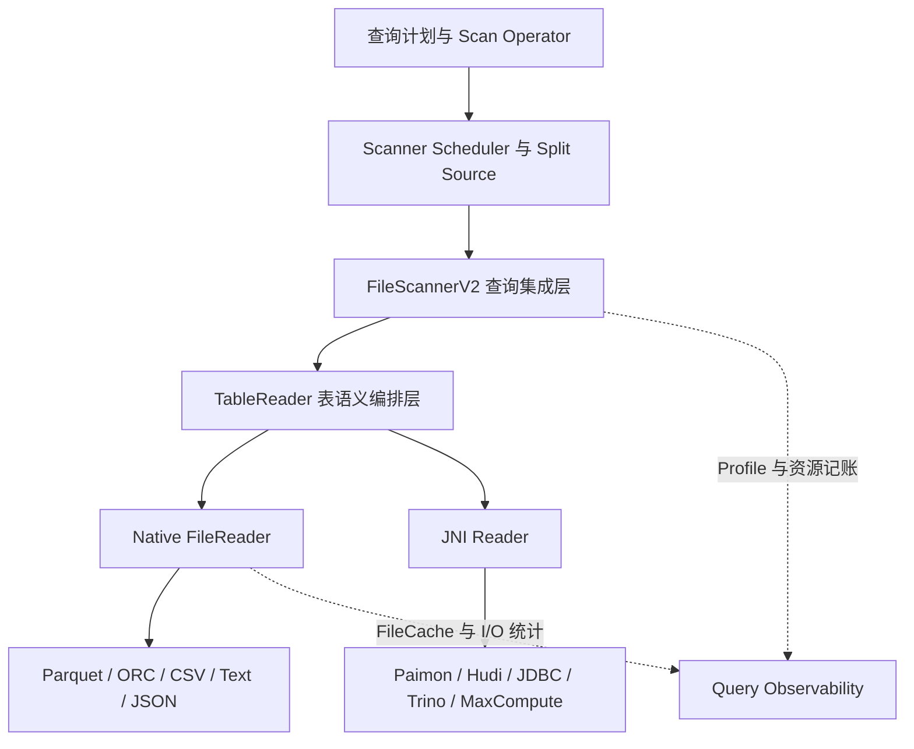
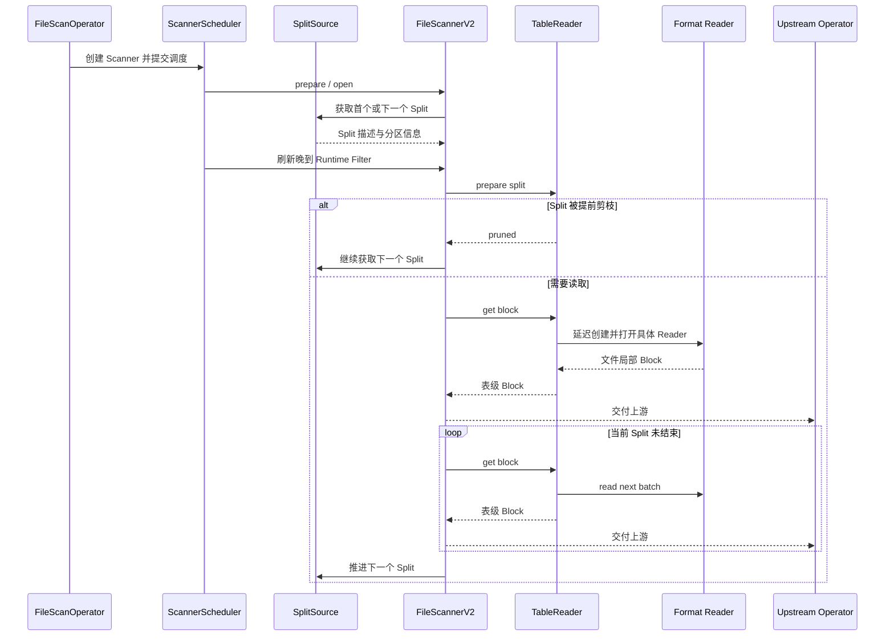
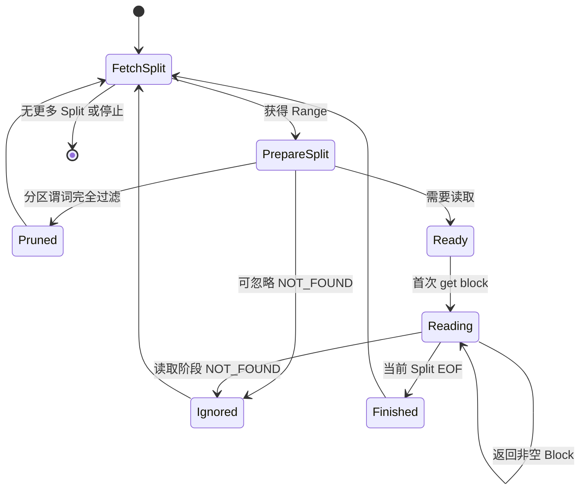
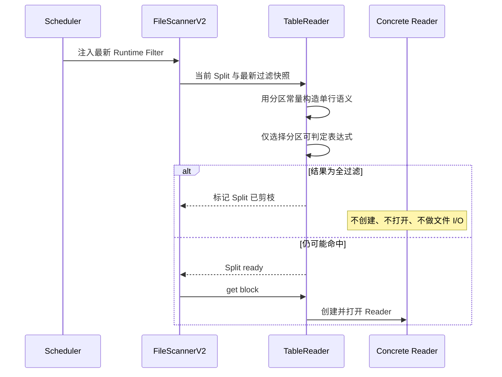
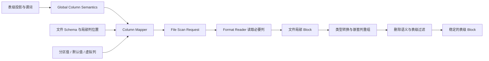
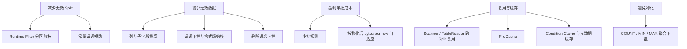
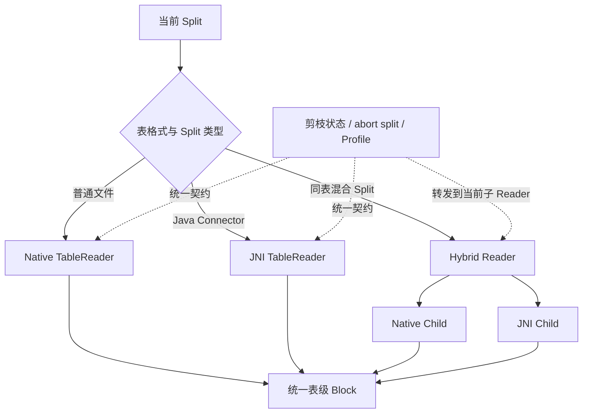
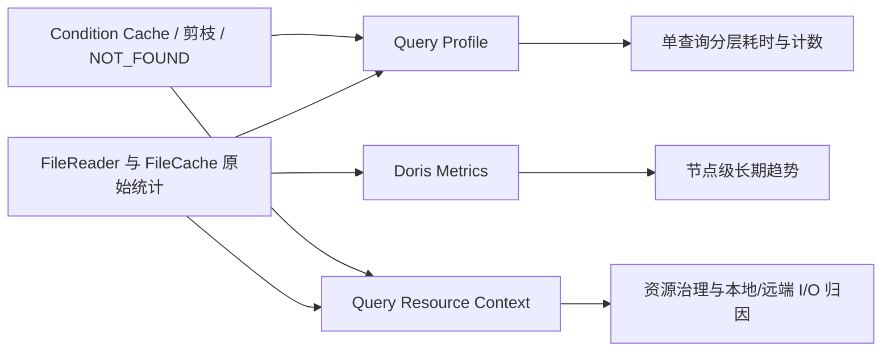

# FileScannerV2 链路设计说明

> **核心结论：** FileScannerV2 的重点不是“重写一个文件 Reader”，而是建立稳定的分层边界：
> Operator/Scheduler 管控制面，Scanner 管查询与 Split 生命周期，TableReader 管表语义，格式
> Reader 管物理读取。所有优化都围绕“尽早减少无效 I/O、按成本控制批次、跨格式保持一致语义、
> 让状态可复用且可观测”展开。

## 一、设计目标与边界

FileScannerV2 面向外部数据扫描场景，目标是把“查询执行、表格式语义、文件格式细节”拆成可独立
演进的层次。设计关注的是长期稳定的边界，而不是某一种格式的局部加速。

### 核心目标

- 统一 Parquet、ORC、文本、JSON、JNI 等读取链路
- 在文件 I/O 前尽量完成剪枝和短路
- 隔离表级语义与文件局部 Schema
- 让 Scanner 可跨多个 Split 复用重状态
- 保持统一的资源记账与 Profile 口径

### 非目标

- 不在 Scanner 中重新实现每种文件格式
- 不把所有优化强制应用到所有 Reader
- 不让文件局部列位置泄漏到查询层
- 不以牺牲错误语义换取“尽量继续执行”
- 当前不覆盖 Load 路径的全部能力

> **设计判断标准：** 一个能力应该放在哪一层，取决于它是在管理查询、管理 Split、恢复表语义，
> 还是解释物理文件。边界优先于代码复用。

## 二、总体架构

V2 将扫描链路划分为四层。上层只依赖稳定契约，下层可以按格式自由演进。

| 层次 | 主要职责 | 刻意隔离的内容 |
| --- | --- | --- |
| Operator / Scheduler | 选择 V1/V2、控制并发、分发 Split、接入晚到 Runtime Filter | 不知道文件 Schema 如何映射，也不解释格式元数据 |
| FileScannerV2 | 维护 Scanner 生命周期、推进 Split、连接查询上下文、批次预测、错误策略与统计 | 不承担具体格式的解码和表格式删除语义 |
| TableReader | 恢复表级列语义、管理分区常量、谓词、删除信息、Split 状态与 Reader 打开顺序 | 不关心 Scanner 如何被调度 |
| Format Reader | 理解物理格式、元数据、编码、页与行组、JNI 协议 | 不决定查询级并发与资源治理 |

> **关键收益：** 新增格式时优先扩展 Reader；新增表语义时优先扩展 TableReader；新增查询级治理
> 能力时放在 Scanner/Operator。变化被限制在正确的层次内。

## 三、核心扫描链路

一次 Scanner 会连续消费多个 Split。主链路通过循环推进，而不是为每个文件重新构造完整扫描对象。

1. **选择与调度：** Operator 基于开关、场景和完整格式支持矩阵选择 V2；多个 Scanner 从统一
   SplitSource 动态取任务。
2. **一次初始化：** 表达式、投影列、I/O Context 和 TableReader 在 Scanner 生命周期内复用。
3. **逐 Split 准备：** 只更新当前文件、分区值、删除信息和最新可用过滤条件。
4. **按需打开：** 真正读取时才建立格式 Reader，给早期剪枝保留机会。
5. **循环交付：** TableReader 输出稳定表级 Block，Scanner 再接入统一的上游过滤、投影和统计。

> **核心不变量：** 上游看到的始终是表级列顺序和类型；Split 切换、文件 Schema 差异、缓存来源
> 与具体格式均被隐藏在下层。

## 四、Split 生命周期与早期剪枝

Split 是 V2 最重要的状态隔离单元。每次切换 Split 都先清空上一个 Split 的局部状态，再决定当前
Split 是否值得创建 Reader。

### 为什么剪枝放在 prepare split

### 设计收益

- 晚到 Runtime Filter 可作用于后续 Split
- 避免无效的对象存储请求和元数据读取
- 删除文件解析也可在剪枝后跳过
- 不同格式共享同一剪枝语义

### 必要约束

- 只对当前分区值能够完整回答的表达式做决定
- 无法确定时必须保守保留 Split
- 剪枝、正常结束和忽略错误都要统一推进 finished range
- 清理动作必须覆盖 native、JNI 与 hybrid 子 Reader

## 五、Block 读取与表语义恢复

文件 Reader 返回的是“文件局部 Block”，而查询执行需要的是“表级 Block”。V2 把两者之间的转换
显式建模，避免 Schema 演进、分区列和虚拟列污染格式 Reader。

| 设计对象 | 解决的问题 | 带来的优化空间 |
| --- | --- | --- |
| Global Index | 表达式引用稳定的表级位置，不依赖文件列顺序 | 谓词可以在不同文件 Schema 上重新定位 |
| Column Mapper | 统一处理名称、位置、field ID、缺失列、分区列和嵌套投影 | 只读取必要物理列，复杂列可做子字段裁剪 |
| File Scan Request | 把表级意图翻译为格式 Reader 能理解的局部请求 | 谓词下推、延迟物化、字典/页/行组剪枝 |
| Finalize | 把文件列恢复成查询需要的类型、顺序和虚拟语义 | 上游无需感知文件格式差异 |

> **设计取舍：** 多一层映射会增加编排成本，但换来了跨格式一致性、Schema 演进能力和更细粒度的
> 投影/过滤优化，是 V2 的核心基础设施。

## 六、关键优化点

V2 的优化不是单点技巧，而是一条从“少做工作”到“控制单次工作成本”再到“复用已做工作”的连续路径。

| 优化点 | 设计动机 | 关键考量 |
| --- | --- | --- |
| 统一 SplitSource 动态取任务 | Scanner 不绑定固定文件，减少长尾和负载不均 | 并发数按执行资源控制，而不是简单等于文件数 |
| Reader 延迟打开 | 让剪枝先于远端 I/O 和格式初始化 | prepare 与 read 必须有清晰状态契约 |
| 自适应批次 | 固定行数无法控制宽行、嵌套列的内存峰值 | 以最终表级 Block 的实际字节形态采样；无历史时先小批探测 |
| 投影与谓词本地化 | 把表级意图转为最小文件读取集合 | 不能因下推改变最终查询语义 |
| 缓存分层 | 复用远端数据、稳定对象存储访问成本 | 缓存来源必须正确归因到本地、远端和 Peer |
| 聚合下推 | 元数据足够回答时避免完整列物化 | 存在过滤或删除时要保守关闭，避免错误结果 |

> **优化原则：** 先证明“可以不读”，再决定“读哪些”，最后优化“每次读多少”。越靠前的优化，
> 通常收益越大，也越需要严格的正确性边界。

## 七、格式扩展与混合 Reader

V2 不要求所有数据源走同一种物理执行方式。TableReader 提供统一表语义，具体 Split 可以选择
native、JNI，或由 hybrid Reader 在两者之间分发。

### 扩展新格式

- 实现 Schema、读取和格式级 Profile
- 复用 TableReader 的映射、删除、常量与 finalize
- 声明能力矩阵，只有全部 Split 支持时才选择 V2

### 扩展新表格式

- 补充字段标识、历史 Schema 与删除语义
- 按 Split 选择 native 或 JNI
- 确保状态查询和清理落到真实子 Reader

> **渐进迁移思路：** V2 通过能力矩阵守住兼容边界，而不是假设所有格式一次性完成迁移。这样
> 可以逐步扩大覆盖面，并保持 V1 回退路径。

## 八、可观测性与故障语义

扫描优化只有在“看得见成本、分得清来源、错误语义明确”时才可长期维护。V2 同时维护 Query
Profile、查询资源上下文和全局指标三套互补视角。

| 故障类别 | 默认语义 | 设计考量 |
| --- | --- | --- |
| 查询取消 / should stop | 尽快停止 Reader 与 Scanner 循环 | 停止信号贯穿 I/O Context，避免继续消耗远端资源 |
| NOT_FOUND | 默认返回错误；仅在显式配置允许时跳过当前 Split | 跳过前必须清理 Reader 状态并计数，不能把其他错误伪装成缺失文件 |
| Schema / 解码 / 删除语义错误 | 直接失败 | 这些错误可能影响结果正确性，不允许防御性吞掉 |
| 剪枝 | 正常完成当前 Split | 属于优化结果而非异常，要与 Empty/NOT_FOUND 分开观测 |

> **可观测性原则：** Profile 用于解释“这一条查询为什么慢”，ResourceContext 用于回答“这条查询
> 消耗了什么”，DorisMetrics 用于观察“节点整体是否健康”。三者口径相关但不互相替代。

## 九、设计取舍总结

| 设计选择 | 主要收益 | 代价与约束 |
| --- | --- | --- |
| Scanner、TableReader、Format Reader 分层 | 职责稳定、格式可扩展、测试边界清晰 | 多一层翻译与状态契约 |
| 一个 Scanner 消费多个 Split | 复用表达式、缓存和 Reader 编排状态 | 必须彻底隔离 Split 局部状态 |
| 表级 Global 语义与文件局部语义分离 | 支持 Schema 演进、字段映射和复杂列裁剪 | Column Mapper 与 finalize 逻辑更复杂 |
| 剪枝早于 Reader 打开 | 最大化减少远端 I/O 和初始化成本 | 只能处理能够安全判定的表达式 |
| 按实际字节自适应批次 | 控制宽行与嵌套列的内存峰值 | 首批需要探测，预测是动态近似值 |
| 能力矩阵与 V1 回退 | 支持渐进迁移，避免不完整格式路径影响查询 | 双路径在迁移期需要维护一致语义 |

> **一句话总结：** FileScannerV2 通过明确的语义边界，把“是否读取、读取什么、如何读取、如何恢复
> 表语义、如何记录成本”拆开处理，从而让正确性、性能和可扩展性可以分别演进。

## 延伸阅读

- [FileScannerV2 profiling and pruning PR](https://github.com/apache/doris/pull/65449)
