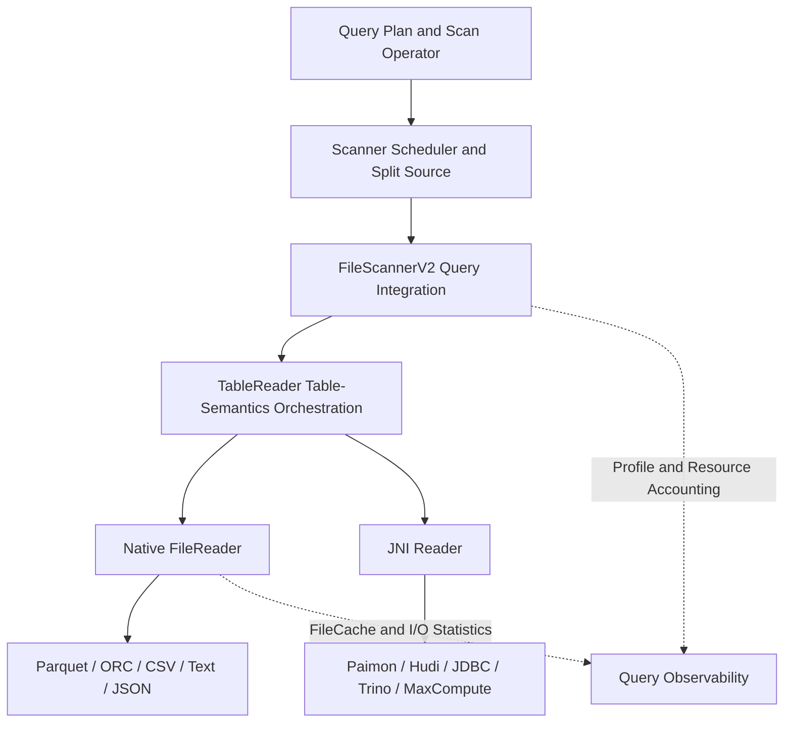
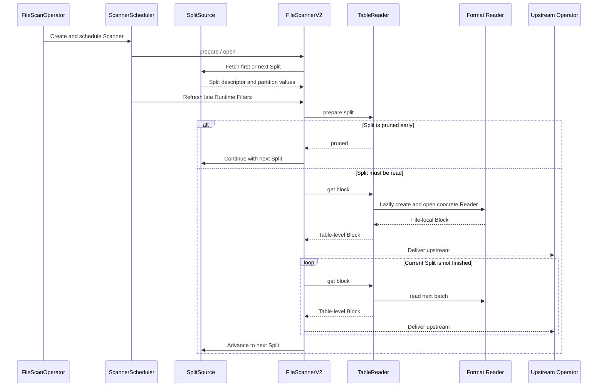
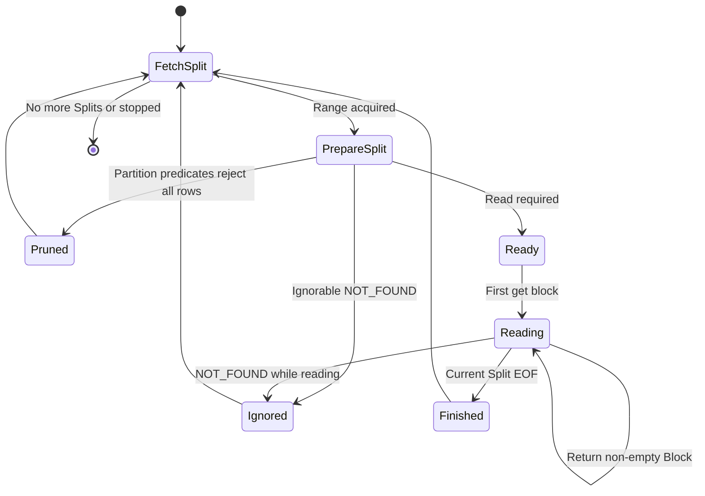
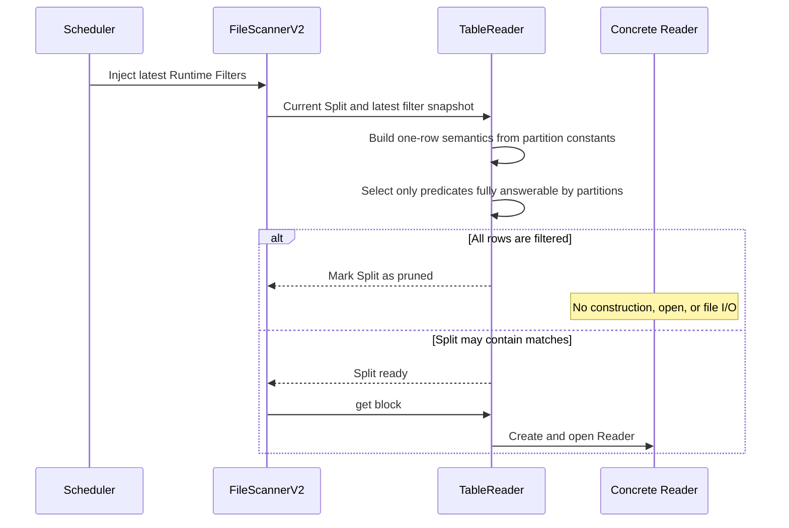
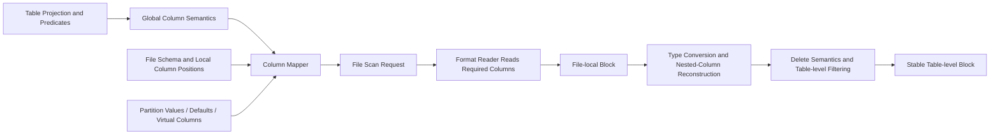
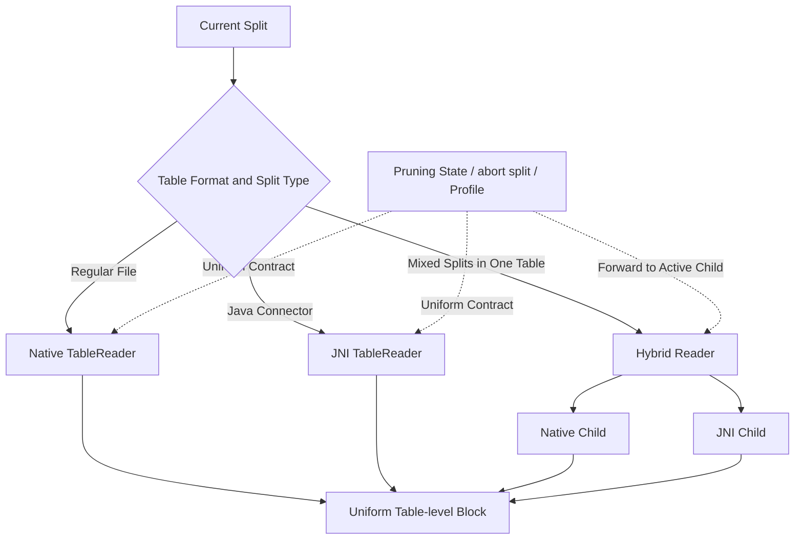
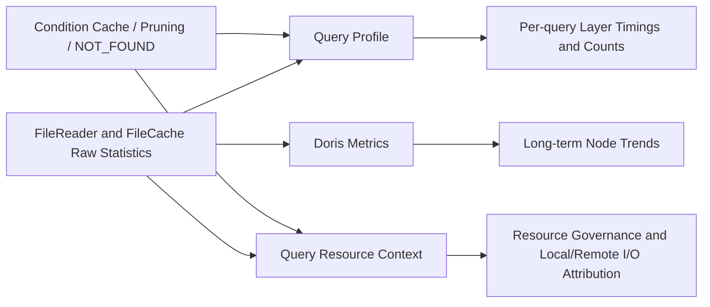

# FileScannerV2 Scan Pipeline Design

> **Core conclusion:** FileScannerV2 is not primarily about rewriting a file reader. Its purpose is
> to establish stable layer boundaries: Operator/Scheduler owns the control plane, Scanner owns
> query integration and the Split lifecycle, TableReader owns table semantics, and format readers
> own physical reads. All optimizations aim to eliminate unnecessary I/O as early as possible,
> control batch cost, preserve consistent semantics across formats, and make state reusable and
> observable.

## 1. Design Goals and Boundaries

FileScannerV2 targets external-data scans. It separates query execution, table-format semantics,
and file-format details into layers that can evolve independently. The design prioritizes durable
boundaries rather than isolated acceleration for a particular format.

### Core goals

- Unify the read pipeline for Parquet, ORC, text, JSON, JNI, and other formats.
- Complete pruning and short-circuit evaluation before file I/O whenever possible.
- Isolate table-level semantics from file-local schemas.
- Reuse heavyweight Scanner state across multiple Splits.
- Maintain consistent resource accounting and Profile conventions.

### Non-goals

- Do not reimplement every file format inside Scanner.
- Do not force every optimization onto every reader.
- Do not expose file-local column positions to the query layer.
- Do not sacrifice error semantics in order to continue execution.
- Full support for the Load path is currently out of scope.

> **Design placement rule:** The correct layer for a capability depends on whether it manages the
> query, manages a Split, restores table semantics, or interprets a physical file. Layer boundaries
> take priority over code reuse.

## 2. Overall Architecture

V2 divides the scan pipeline into four layers. Upper layers depend only on stable contracts, while
lower layers may evolve independently for each format.



| Layer | Primary responsibilities | Intentionally isolated concerns |
| --- | --- | --- |
| Operator / Scheduler | Select V1 or V2, control concurrency, distribute Splits, and apply late Runtime Filters | Does not understand file-schema mapping or interpret format metadata |
| FileScannerV2 | Maintain Scanner lifecycle, advance Splits, connect query context, predict batch size, handle errors, and collect statistics | Does not decode specific formats or implement table-format delete semantics |
| TableReader | Restore table-level column semantics and manage partition constants, predicates, deletes, Split state, and reader open order | Does not depend on Scanner scheduling |
| Format Reader | Interpret physical formats, metadata, encodings, pages, row groups, and JNI protocols | Does not control query-level concurrency or resource governance |

> **Primary benefit:** Add a new format by extending a reader, add new table semantics by extending
> TableReader, and add query-level governance in Scanner/Operator. Each change remains in the layer
> that owns it.

## 3. Core Scan Pipeline

One Scanner consumes multiple Splits sequentially. The main pipeline advances through a loop rather
than reconstructing the entire scan object for every file.



1. **Selection and scheduling:** Operator selects V2 from feature flags, the scan scenario, and the
   complete format-support matrix. Multiple Scanners dynamically fetch work from one SplitSource.
2. **One-time initialization:** Expressions, projected columns, I/O Context, and TableReader are
   reused throughout the Scanner lifecycle.
3. **Per-Split preparation:** Update only the current file, partition values, delete information,
   and the latest available filters.
4. **Open on demand:** Construct the format reader only when data must actually be read, preserving
   the opportunity for early pruning.
5. **Repeated delivery:** TableReader produces stable table-level Blocks. Scanner then applies the
   common upstream filtering, projection, and statistics path.

> **Core invariant:** Upstream operators always observe table-level column order and types. Split
> transitions, file-schema differences, cache sources, and concrete formats remain hidden below.

## 4. Split Lifecycle and Early Pruning

Split is the most important state-isolation unit in V2. Every transition clears the previous
Split's local state before deciding whether the current Split warrants reader construction.



### Why pruning happens during prepare split



### Benefits

- Late Runtime Filters can affect subsequent Splits.
- Unnecessary object-storage requests and metadata reads are avoided.
- Delete-file parsing can also be skipped after pruning.
- All formats share the same Split-pruning semantics.

### Required constraints

- Make a pruning decision only when the current partition values fully determine the expression.
- Conservatively retain a Split when the result cannot be determined.
- Pruning, normal completion, and ignored errors must all advance the finished range consistently.
- Cleanup must cover native, JNI, and hybrid child readers.

## 5. Block Reading and Table-Semantics Restoration

A file reader returns a file-local Block, while query execution requires a table-level Block. V2
models the conversion explicitly so schema evolution, partition columns, and virtual columns do not
leak into format readers.



| Design object | Problem addressed | Optimization enabled |
| --- | --- | --- |
| Global Index | Expressions use stable table-level positions independent of file-column order | Predicates can be relocated for different file schemas |
| Column Mapper | Handles names, positions, field IDs, missing columns, partition columns, and nested projection uniformly | Reads only required physical columns and enables nested-field pruning |
| File Scan Request | Translates table intent into a local request understood by a format reader | Predicate pushdown, lazy materialization, and dictionary/page/row-group pruning |
| Finalize | Restores file columns to the types, order, and virtual semantics required by the query | Upstream layers remain unaware of file-format differences |

> **Tradeoff:** The mapping layer adds orchestration cost, but enables cross-format consistency,
> schema evolution, and fine-grained projection and filter optimizations. It is core V2
> infrastructure.

## 6. Key Optimizations

V2 optimization is a continuous pipeline: eliminate work, control the cost of each remaining unit,
and reuse work already performed.

```mermaid
flowchart TB
    A[Eliminate Irrelevant Splits] --> A1[Runtime Filter Partition Pruning]
    A --> A2[Constant-Predicate Short Circuit]
    B[Eliminate Irrelevant Data] --> B1[Column and Subfield Projection]
    B --> B2[Predicate Pushdown and Format-level Pruning]
    B --> B3[Delete-Semantics Pushdown]
    C[Control Per-batch Cost] --> C1[Small Probe Batch]
    C --> C2[Adapt from Materialized Bytes per Row]
    D[Reuse and Caching] --> D1[Scanner / TableReader Reuse Across Splits]
    D --> D2[FileCache]
    D --> D3[Condition Cache and Metadata Cache]
    E[Avoid Materialization] --> E1[COUNT / MIN / MAX Aggregate Pushdown]
```



| Optimization | Design motivation | Key consideration |
| --- | --- | --- |
| Shared SplitSource with dynamic work assignment | Prevent a Scanner from binding to fixed files and reduce long-tail imbalance | Control concurrency by execution resources, not simply by file count |
| Lazy reader open | Allow pruning before remote I/O and format initialization | Define clear state contracts between prepare and read |
| Adaptive batches | A fixed row count cannot bound memory for wide or nested rows | Sample the final table-level Block's bytes per row; use a small probe without history |
| Projection and predicate localization | Translate table intent into the minimum physical read set | Pushdown must not change final query semantics |
| Layered caches | Reuse remote data and stabilize object-storage access cost | Attribute cache sources accurately to local, remote, and peer reads |
| Aggregate pushdown | Avoid data-page materialization when metadata can answer the query | Disable conservatively when filters or deletes may change the result |

> **Optimization rule:** First prove that data need not be read, then decide what must be read, and
> finally optimize how much to read at once. Earlier optimizations usually provide greater benefit
> and require stricter correctness boundaries.

## 7. Format Extension and Hybrid Readers

V2 does not require every data source to use one physical execution mechanism. TableReader provides
uniform table semantics, while each Split can use native execution, JNI, or a hybrid reader that
dispatches between them.



### Adding a new file format

- Implement schema discovery, reads, and format-level Profile reporting.
- Reuse TableReader mapping, deletes, constants, and finalize logic.
- Declare a capability matrix and select V2 only when every Split is supported.

### Adding a new table format

- Add field identity, historical schema, and delete semantics.
- Select native or JNI execution per Split.
- Ensure state queries and cleanup reach the actual child reader.

> **Incremental migration:** V2 protects compatibility through a capability matrix instead of
> assuming that every format migrates at once. Coverage can expand gradually while retaining the V1
> fallback path.

## 8. Observability and Failure Semantics

Scan optimization remains maintainable only when costs are visible, sources are distinguishable,
and failure semantics are explicit. V2 provides three complementary views: Query Profile, query
resource context, and global metrics.

Query Profile uses one stable ownership tree:

```text
FileScannerV2
└── TableReader
    └── FileReader
        ├── format-specific reader (ParquetReader, OrcReader, ...)
        └── IO
```

Scanner lifecycle and Split scheduling are charged to `FileScannerV2`; table-schema restoration,
delete handling, and reader lifecycle are charged to `TableReader`; metadata, index, decode, and
materialization are charged to `FileReader` and its format subtree; physical reads, bytes, cache
waits, and remote/local attribution remain under `IO`. Every executable lifecycle path needs a
timer, and cumulative child-reader statistics must be published at batch boundaries as well as
close, so an active slow query never presents an unexplained timing gap.



| Failure category | Default semantics | Design rationale |
| --- | --- | --- |
| Query cancellation / should stop | Stop Reader and Scanner loops promptly | Propagate the stop signal through I/O Context to avoid further remote-resource use |
| NOT_FOUND | Return an error by default; skip the current Split only when explicitly configured | Clean reader state and update counters before skipping; do not disguise another error as a missing file |
| Schema / decode / delete-semantics error | Fail immediately | These errors can affect result correctness and must not be swallowed defensively |
| Pruning | Complete the current Split normally | Pruning is an optimization result, not an error, and must be observed separately from Empty/NOT_FOUND |

> **Observability rule:** Profile explains why one query is slow, ResourceContext explains what that
> query consumed, and DorisMetrics describes overall node health. Their measurements are related but
> not interchangeable.

## 9. Summary of Design Tradeoffs

| Design choice | Primary benefit | Cost and constraint |
| --- | --- | --- |
| Scanner, TableReader, and Format Reader layering | Stable responsibilities, extensible formats, and clear test boundaries | Adds translation and state contracts |
| One Scanner consumes multiple Splits | Reuses expressions, caches, and reader-orchestration state | Requires complete isolation of Split-local state |
| Separate table-global and file-local semantics | Supports schema evolution, field mapping, and complex-column pruning | Makes Column Mapper and finalize logic more complex |
| Prune before opening a reader | Maximizes avoided remote I/O and initialization | Can evaluate only predicates that are safe to decide early |
| Adapt batches from actual bytes | Controls memory peaks for wide and nested rows | Requires an initial probe and uses a dynamic estimate |
| Capability matrix with V1 fallback | Enables incremental migration without exposing incomplete format paths | Requires both paths to preserve equivalent semantics during migration |

> **In one sentence:** FileScannerV2 separates whether to read, what to read, how to read, how to
> restore table semantics, and how to account for cost, allowing correctness, performance, and
> extensibility to evolve independently.

## Further Reading

- [FileScannerV2 profiling and pruning PR](https://github.com/apache/doris/pull/65449)
