# FileScannerV2 Parquet 扫描链路设计说明

> **阅读目标：** 从设计视角理解 FileScannerV2 中 Parquet Reader 如何把表级谓词逐层下推到
> Split、Row Group、Page 与 Row，并通过索引、延迟物化和多层缓存减少无效 I/O 与解码。

## 1. 设计目标与核心结论

Parquet V2 的核心不是“换一个解码器”，而是把一次文件扫描拆成**规划阶段**与**执行阶段**：先尽
可能用轻量元数据消灭不可能命中的数据，再只对幸存范围读取谓词列，最后延迟读取输出列。

> **一句话结论：** 扫描成本按“文件与 Split → Row Group → Page → Row → Column”逐层收缩；
> 越早确定不命中，越少发生远端 I/O、解压、解码与物化。

- **统一入口：** TableReader 完成表语义到文件语义的映射，ParquetReader 只处理本地化后的列与谓词。
- **规划先行：** 打开文件后先读取 footer/schema，并生成 RowGroupReadPlan，而不是边读边临时决定。
- **多级谓词：** 同一个表级谓词可在不同粒度复用，但每一层只做“确定安全”的排除，无法判断就保留。
- **谓词列优先：** 先读取过滤所需列并维护 SelectionVector，输出列只为幸存行读取。
- **缓存分层：** 数据块缓存、Parquet 页缓存、条件结果缓存、合并小 I/O 各自解决不同问题，不能互相替代。

**本文边界：** 聚焦 FileScannerV2 下 Parquet Reader 的设计与核心流程，不展开 Arrow 解码器、复杂
类型重建和具体表达式实现。

## 2. 总体架构分层

整体职责按“扫描编排、表语义适配、格式规划、Row Group 执行、列解码、I/O”分层。上层负责
正确性语义，下层负责格式感知的裁剪与读取。

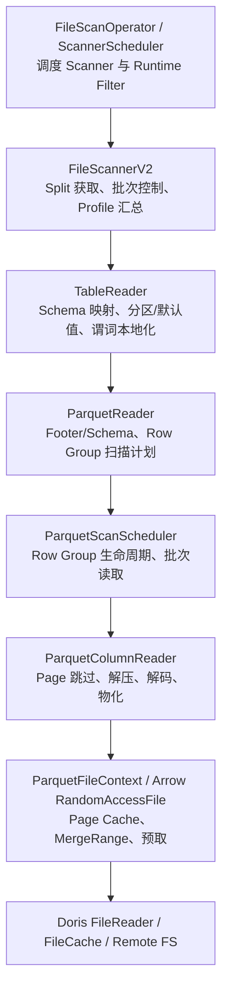

| 层次 | 核心职责 | 不承担的职责 |
| --- | --- | --- |
| FileScannerV2 | Split 生命周期、Reader 复用、动态 batch、统一 Profile | 不理解 Parquet Page/Encoding |
| TableReader | 把表列、分区列、缺失列、默认值和 conjunct 映射到文件局部坐标 | 不直接解析 Parquet footer |
| ParquetReader | 构建文件上下文、Row Group 规划、汇总格式级统计 | 不负责表级 schema 演进语义 |
| ParquetScanScheduler | 按计划打开 Row Group、组织谓词列/输出列读取顺序 | 不重新做全局谓词解析 |
| ColumnReader | Page 定位、跳过、解压、解码、按 Selection 物化 | 不决定 Row Group 是否候选 |
| FileContext / FileReader | 统一随机读、缓存、合并读、远端访问 | 不理解 SQL 谓词 |

> **设计收益：** 表格式、文件格式和存储介质解耦。Parquet 层可以专注使用 footer、page index、
> dictionary 等格式信息，上层仍保持统一扫描语义。

## 3. 从打开文件到生成扫描计划

一个 Split 被交给 Reader 后，首先完成文件打开和扫描计划生成。此阶段决定后续会读哪些 Row
Group、哪些行区间、哪些列块以及是否可以安装 Page Skip Plan。

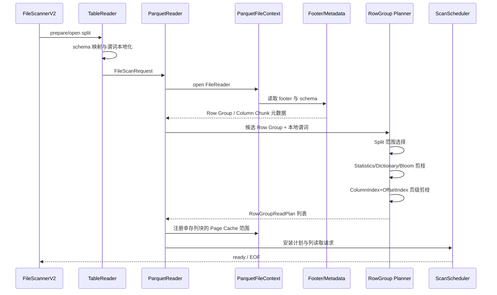

### 计划中的关键对象

- **FileScanRequest：** 包含 predicate_columns、non_predicate_columns、本地化 conjunct、delete
  conjunct 与列位置映射。
- **RowGroupReadPlan：** 记录 Row Group、文件全局起始行、页索引裁出的 selected_ranges，以及
  每个叶子列的 page_skip_plan。
- **ParquetFileContext：** 把 Doris FileReader 适配为 Arrow RandomAccessFile，同时承载 Page
  Cache、FileCache 预取与 MergeRange 路由。

> 规划顺序有意从便宜到昂贵：先用 Split/元数据缩小集合，再为幸存 Row Group 读取更细的索引；
> 避免对注定被裁掉的数据做额外索引 I/O。

## 4. 谓词下推的设计

谓词下推的第一步不是直接交给 Parquet，而是先把“表上的表达式”转换为“当前文件可理解的表达式”。
这一步由 TableReader 与 ColumnMapper 完成。

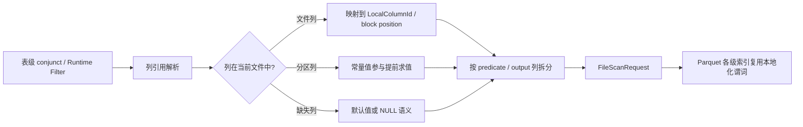

### 设计原则

1. **语义先于优化：** 分区常量、缺失列、默认值、类型映射先确定，再讨论是否可下推。
2. **局部坐标：** Parquet 层只看到当前文件的列编号与 block 位置，避免反复处理表 schema 演进。
3. **能力判定：** ZoneMap、Dictionary、Bloom 只选择自身能安全解释的表达式；其余保留为行级残余谓词。
4. **单列优先：** 可安全拆解的单列谓词适合索引和逐列过滤；多列、带状态或错误语义敏感的表达式保留整体求值。
5. **Runtime Filter 可刷新：** ScannerScheduler 在实际读取前刷新晚到的 Runtime Filter；分区范围
   过滤在 TableReader 的 Split 准备阶段完成，文件内部可下推部分进入本地 conjunct。

> 下推不是“少算一次表达式”，而是把表达式的确定性信息投射到更便宜的数据摘要上。任何不能
> 证明不命中的情况都必须继续扫描。

## 5. 谓词在不同数据粒度上如何生效

同一谓词会在多个粒度尝试生效。每一层的输出都是更小的候选集合，并成为下一层的输入。

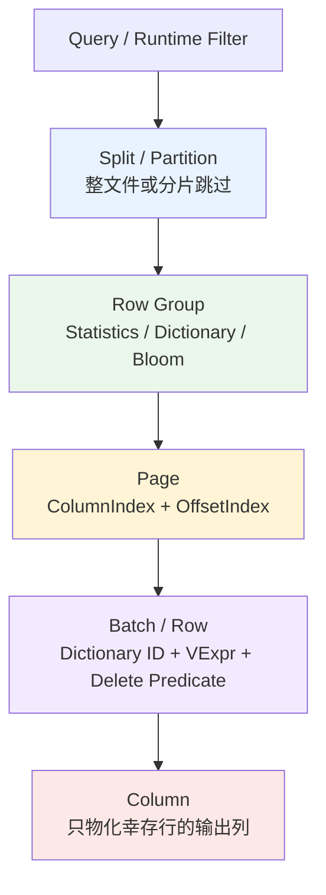

| 粒度 | 输入信息 | 可节省的主要成本 | 保守回退 |
| --- | --- | --- | --- |
| Split / Partition | 分区值、Runtime Filter Range、扫描 byte range | 整个文件/分片打开与读取 | 无法判断则保留 Split |
| Row Group | footer statistics、dictionary、Bloom | 整组列块 I/O 与解码 | 索引缺失/不兼容则保留 Row Group |
| Page | ColumnIndex min/max/null + OffsetIndex | 页 I/O、解压与解码 | 页索引不完整则读取相关范围 |
| Row / Batch | 真实列值、字典 ID、残余 conjunct | 后续谓词列与输出列物化 | 使用完整 VExpr 保证语义 |
| Column | SelectionVector | 非谓词列的读取、解码和内存写入 | 无过滤时顺序读取全部投影列 |

> **关键区别：** Row Group/Page 索引通常做“排除”，不会直接产出最终结果；行级谓词才确认
> 具体行是否满足条件。

## 6. Row Group 规划与索引协同

Row Group Planner 把 footer 中的物理组织信息、Split byte range 和谓词索引能力合成为可执行计划。
核心是稳定的候选集收缩顺序。

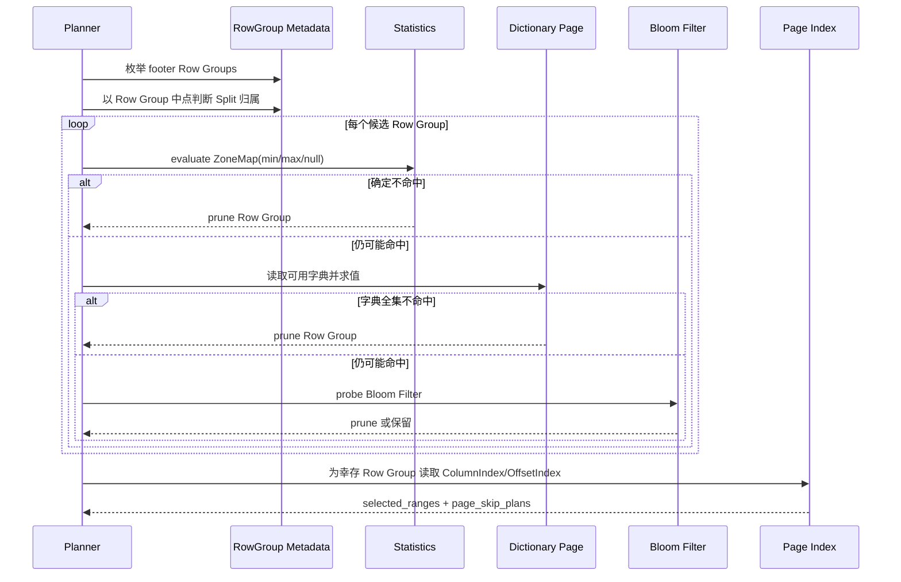

### 为什么按这个顺序

- **Statistics：** 通常已在 footer 中，读取代价最低，适合范围与空值语义。
- **Dictionary：** 需要读字典页，但对低基数字符串列可精确证明整组不命中。
- **Bloom：** 需要读取 Bloom 数据；适合等值/集合类否定判断，命中仍可能是假阳性。
- **Page Index：** 只对幸存 Row Group 构建页级行区间，避免提前为所有组支付索引代价。

### 计划如何驱动物理跳过

ColumnIndex 给出每页的 min/max/null 语义；OffsetIndex 把页映射到 Row Group 内的行号和文件偏移。
多列谓词分别生成候选行区间后取交集，形成 selected_ranges；再按每个叶子列构建
page_skip_plan，使列 Reader 能跳过与幸存行区间不相交的数据页。

> selected_ranges 是逻辑行范围，page_skip_plan 是物理页读取计划。两者分离可让调度器按行批次
> 推进，同时让不同列按照各自 Page 边界跳读。

## 7. 批次读取、字典过滤与延迟物化

执行阶段遵循“先过滤、后物化”。Scheduler 按 selected_ranges 逐段推进，遇到范围间隙先让列
Reader skip，再读取当前 batch。

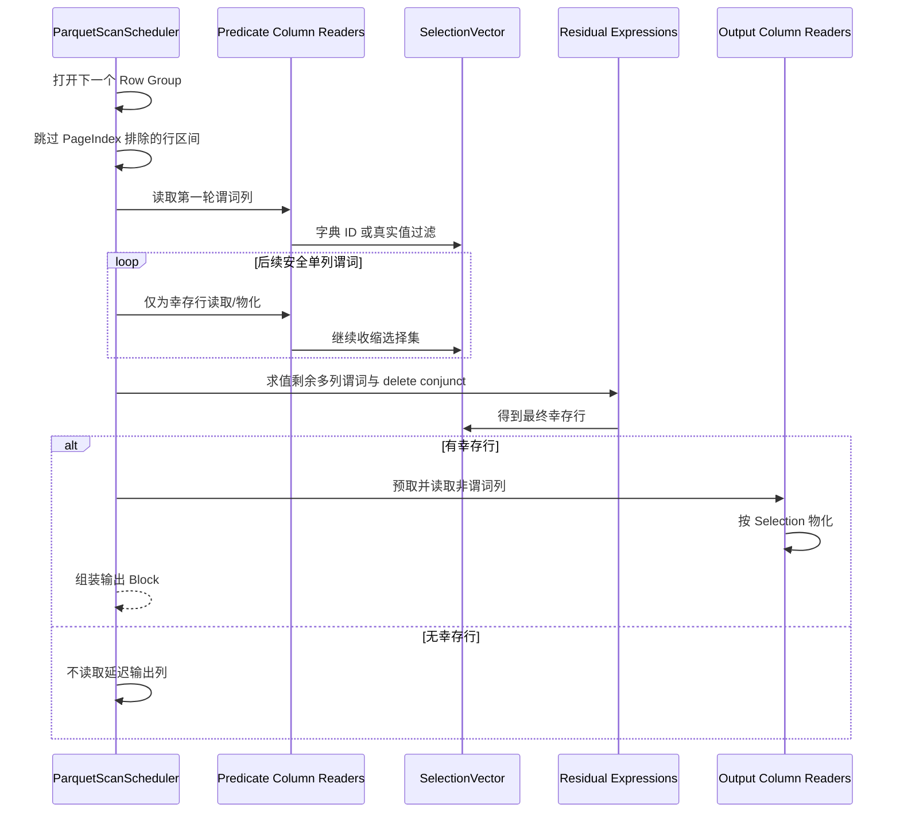

### 行级字典过滤

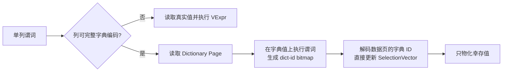

- 适用于非重复、primitive、string-like 的 BYTE_ARRAY / FIXED_LEN_BYTE_ARRAY，并要求 Column
  Chunk 完整使用字典数据编码。
- 安全的 AND 子表达式可以拆出已被字典精确覆盖的部分；OR 或不具备等价性的表达式不会激进改写。
- 带状态、可能抛错或依赖完整批次语义的表达式，禁用逐轮单列调度，回退到读取所需列后整体求值。

> **优化闭环：** 越早缩小 SelectionVector，后续谓词列和非谓词列需要解码、拷贝的值越少；
> 这就是列式存储中延迟物化的主要收益。

## 8. 支持的索引与适用边界

V2 使用的是 Parquet 原生元数据与编码信息，不额外构建 Doris 内部存储索引。下表区分“索引/摘要”、
“作用粒度”和“判断能力”。

| 能力 | 粒度 | 适合谓词 | 结果特性 | 主要限制 |
| --- | --- | --- | --- | --- |
| Footer Statistics / ZoneMap | Row Group | 范围、比较、IS NULL/IS NOT NULL、可转为 ZoneMap 的组合表达式 | 可确定整组不命中 | 依赖有效 min/max/null_count 与类型转换 |
| Dictionary Pruning | Row Group | 可在字典全集上精确求值的单列谓词 | 可确定整组不命中 | 低基数字符串类 primitive，且整块字典编码 |
| Parquet Bloom Filter | Row Group / Column Chunk | 等值、IN 等可做成员否定的谓词 | 不命中可排除；命中仍需验证 | 可配置开关；文件必须携带 Bloom；存在假阳性 |
| ColumnIndex | Page | 可用 min/max/null 评估的谓词 | 产生候选页/行区间 | 要求页索引存在且类型可解码 |
| OffsetIndex | Page → Row Range | 不直接求值谓词 | 把页级结果映射为行号与物理跳页计划 | 通常与 ColumnIndex 配合 |
| Dictionary-ID Filter | Row / Batch | 安全单列字符串类谓词 | 对真实行精确过滤 | 完整字典编码、非 repeated primitive |
| Condition Cache Bitmap | 文件全局 granule | 稳定可缓存条件 | 复用历史过滤结果，先缩小行范围 | 不是 Parquet 原生索引；未覆盖范围保守保留 |

### 索引选择示意

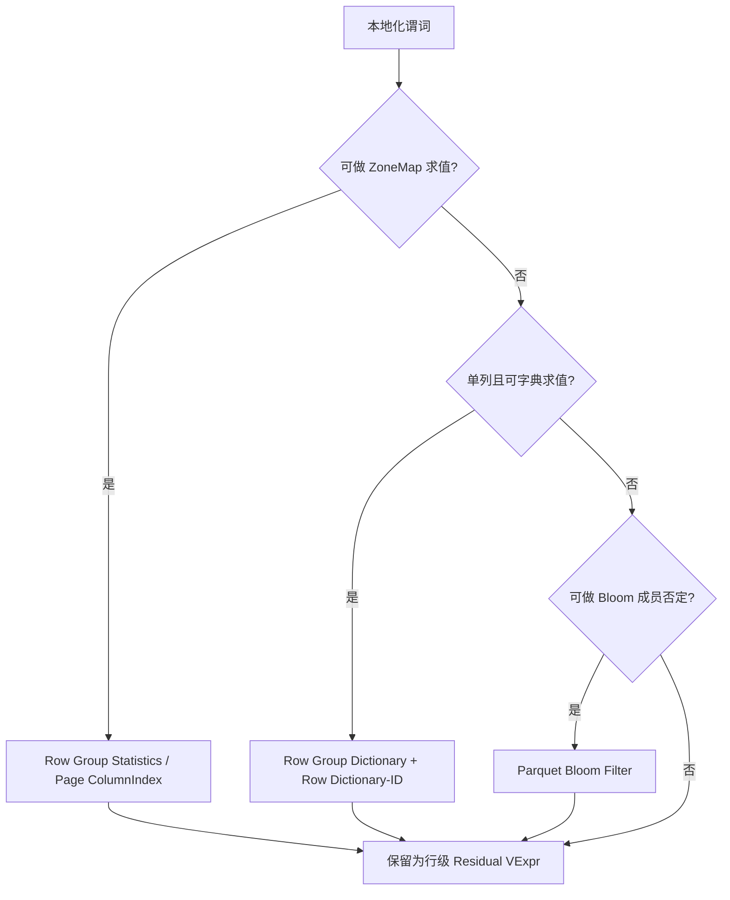

> 多个索引不是互斥选择，而是逐层叠加。索引只能删除已经证明不可能命中的范围，最终仍由残余
> 谓词保证结果正确。

## 9. Cache 与 I/O 优化体系

Parquet V2 的缓存与 I/O 优化分为四条互补路径：缓存远端文件块、缓存 Parquet 范围字节、缓存
谓词结果，以及合并小随机读。

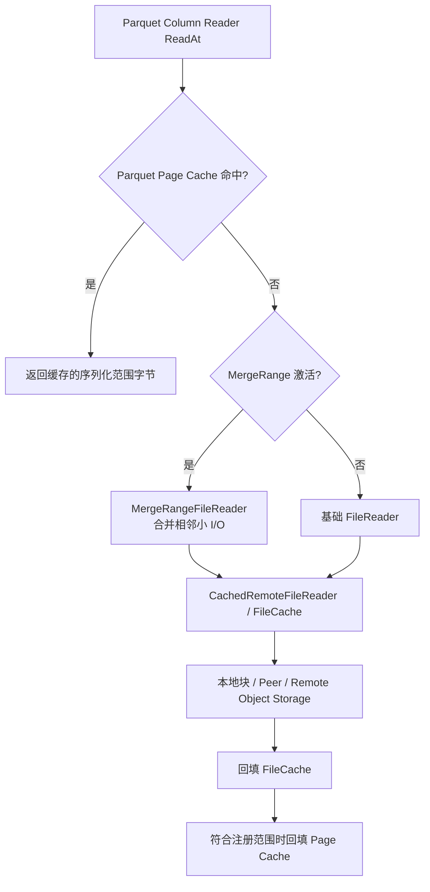

| 机制 | 缓存/优化对象 | 生命周期与 Key | 解决的问题 |
| --- | --- | --- | --- |
| FileCache | 远端文件块 | 文件系统/路径与文件版本相关；可本地或 Peer 命中 | 避免重复访问对象存储，支持后台预取 |
| Parquet Page Cache | 已注册 Column Chunk 范围内的序列化字节 | 稳定文件 key 依赖路径、mtime/version、file size；mtime 不可靠则禁用 | 减少重复页读取；支持精确与子范围覆盖 |
| Condition Cache | 条件命中的 granule bitmap | 由条件与文件范围上下文管理 | 复用过滤结果，在读列前缩小 selected_ranges |
| MergeRangeFileReader | 不是缓存；把多个小范围读合并为较大切片 | 按当前 Row Group 的投影列块临时安装 | 减少远端小随机 I/O 和请求次数 |

### 为什么 Page Cache 只注册幸存列块

Footer 在 Row Group 规划之前读取，此时尚未注册 Page Cache 范围，因此不会把 footer/metadata 混入
Parquet Page Cache。规划完成后只注册幸存 Row Group 的投影 Column Chunk，控制缓存污染和 key 数量。

### 预取与 MergeRange 的关系

- 底层是 CachedRemoteFileReader 时，可对当前 Row Group 的谓词列/输出列范围发起 FileCache 预取。
- 平均投影列块较小且非内存 Reader 时，优先安装 MergeRangeFileReader，让后续 Arrow ReadAt 真正走合并读。
- 有行级过滤时先预取谓词列；只有出现幸存行后才预取非谓词列，避免无效带宽。

## 10. 其他关键优化

### 10.1 Condition Cache：把历史过滤结果前移

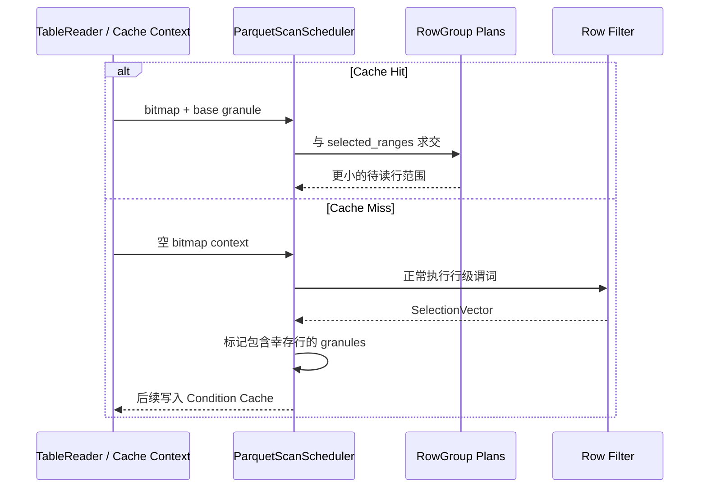

Cache Hit 时，只删除 bitmap 已明确证明不需要读取的 granule；超出 bitmap 覆盖范围的行会被保守
保留。Cache Miss 时按幸存行标记 granule，粒度化结果换取可复用性与较低缓存体积。

### 10.2 自适应 Batch

FileScannerV2 先用较小 probe batch 观察最终表 Block 的 bytes-per-row，再以目标 Block 字节数反推
后续 batch rows，并受系统 batch size 上限约束。宽表减少单批内存，窄表提高吞吐。

### 10.3 聚合下推

当 TableReader 证明不存在会改变结果的过滤、删除语义等条件时，COUNT / MIN / MAX 可直接利用
Parquet 元数据完成或部分完成聚合，避免扫描数据页。它是元数据聚合优化，不应与 Row Group 索引
剪枝混为一谈。

### 10.4 分阶段预取

无行级过滤时可以同时暖输出列；存在过滤时先暖 predicate columns，待至少一行幸存再暖
non-predicate columns，使网络带宽与延迟物化策略一致。

## 11. 正确性、回退原则与能力边界

V2 的优化原则是“能证明才跳过，不能证明就继续读”。任何索引缺失、类型不支持、表达式不可安全
拆分或读取异常，都不应改变查询语义。

> **正确性底线：** 索引结果只用于缩小候选集；所有未被精确覆盖的表达式继续作为 residual
> conjunct 在真实数据上执行。

| 场景 | V2 的处理 |
| --- | --- |
| Statistics 缺失或 min/max 无法安全转换 | 该列 ZoneMap 视为不可用，保留 Row Group/Page |
| Bloom 不存在、关闭或读取失败 | 跳过 Bloom 剪枝，不影响后续扫描 |
| 字典页不完整、混合非字典编码、复杂/重复列 | 不启用字典裁剪或 Dictionary-ID Filter，回退到真实值 |
| ColumnIndex/OffsetIndex 缺失或不一致 | 不做细粒度页裁剪，读取完整候选范围 |
| 表达式含多列、OR、状态或错误顺序敏感 | 保留整体求值，避免改变 SQL 短路/错误语义 |
| Page Cache 无稳定文件版本标识 | 禁用 Parquet Page Cache，防止读到陈旧字节 |
| Condition Cache 覆盖不完整 | 未覆盖范围保守保留并重新计算 |

### 能力边界

- Parquet Reader 使用文件中已经存在的索引与编码元数据，不负责为外部 Parquet 文件构建新索引。
- 嵌套/重复列的 Page 边界、definition/repetition level 更复杂，部分字典和页级优化会选择保守路径。
- Bloom 是概率型索引，只能安全用于“确定不存在”；不能把 Bloom 命中当成结果命中。
- Page Index 的收益受文件写入端是否生成索引、数据排序程度和谓词选择性影响。

## 12. Profile 观测与排障路径

排障建议按“规划是否有效 → 行级过滤是否有效 → 延迟物化是否生效 → I/O/Cache 是否健康”的顺序
观察，避免只看总 ScanTime。

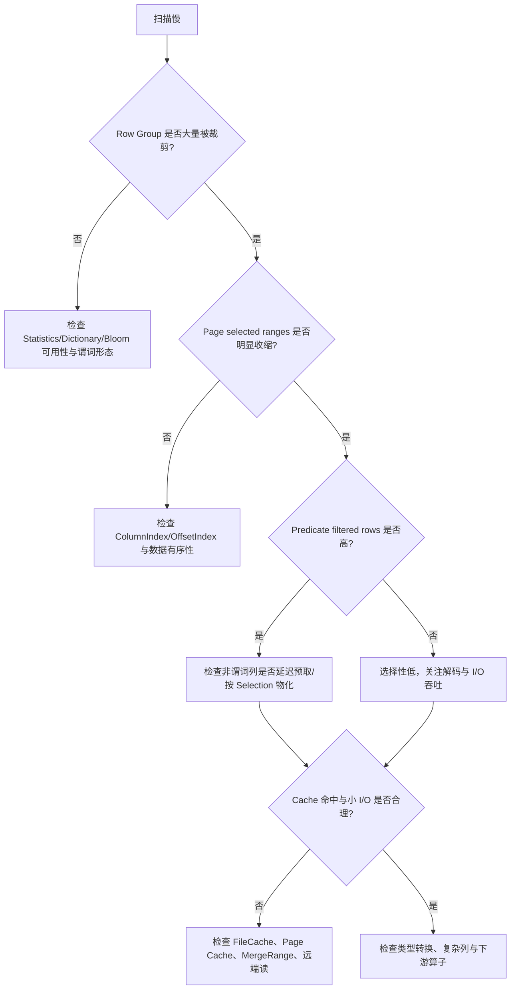

### 建议重点关注的指标族

| 指标族 | 回答的问题 |
| --- | --- |
| Row Group pruning | 总 Row Group、按 Statistics/Dictionary/Bloom 被裁掉多少，以及各阶段耗时 |
| Page index pruning | 页索引检查数量、裁掉的页/行、selected row ranges、Page Skip 效果 |
| Dictionary row filter | 字典重写、字典页读取、bitmap 构建、命中列与失败次数 |
| Predicate / raw rows | 真实读入多少行、行级谓词过滤多少、延迟物化是否值得 |
| Parquet Page Cache | hit/miss/write，以及压缩/解压形态的命中 |
| FileCache Profile | 本地/Peer/远端字节、等待、下载与缓存命中情况 |
| Merge / request I/O | 小 I/O 是否被合并，请求次数与读取放大是否合理 |
| Condition Cache | 缓存命中后提前过滤的行数 |

> 观察剪枝比例时要结合写入布局：无序数据的 min/max 区间宽，即使索引工作正常，Row Group/Page
> 也可能无法排除；这不是 Reader 失效。

## 13. 总结

FileScannerV2 的 Parquet 扫描链路可以概括为三条主线：

1. **语义主线：** TableReader 把表级 schema 与谓词稳定地映射到文件局部语义，保证 schema
   演进、分区列和缺失列正确。
2. **裁剪主线：** Split → Row Group → Page → Row 逐层使用 Runtime Filter、Statistics、
   Dictionary、Bloom、Page Index 和真实值过滤。
3. **I/O 主线：** 谓词列优先、SelectionVector、延迟物化、自适应 batch、FileCache/Page
   Cache/Condition Cache 与 MergeRange 共同降低读取放大。

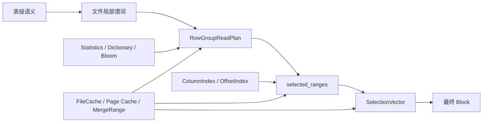

> **最终设计判断：** V2 的价值在于把“格式级知识”变成显式扫描计划，再让执行器严格按计划进行
> 最少必要读取。索引负责安全地缩小候选集，缓存负责复用成本，延迟物化负责避免为失败行读取无关列。

本文基于当前代码链路整理，适合作为架构评审、性能分析和 Profile 排障的统一阅读入口。
