# FileScannerV2 Parquet Scan Pipeline Design

> **Reading goal:** Understand how the FileScannerV2 Parquet Reader progressively pushes
> table-level predicates down to Split, Row Group, Page, and Row granularity, then uses indexes,
> lazy materialization, and layered caches to reduce unnecessary I/O and decoding.

## 1. Design Goals and Core Conclusions

Parquet V2 is not simply a replacement decoder. It divides a file scan into a **planning phase** and
an **execution phase**: first eliminate impossible matches with lightweight metadata, then read only
predicate columns for surviving ranges, and finally defer output-column reads until matches exist.

> **In one sentence:** Scan cost contracts through File and Split → Row Group → Page → Row → Column.
> The earlier a non-match is established, the more remote I/O, decompression, decoding, and
> materialization can be avoided.

- **Uniform entry point:** TableReader maps table semantics to file semantics. ParquetReader handles
  only localized columns and predicates.
- **Planning first:** After opening a file, read footer/schema and build `RowGroupReadPlan` objects
  instead of making ad hoc decisions during reads.
- **Multi-level predicates:** The same table predicate may be reused at several granularities, but
  each layer eliminates data only when it can do so safely. Uncertain cases remain candidates.
- **Predicate columns first:** Read filter columns first and maintain a SelectionVector. Read output
  columns only for surviving rows.
- **Layered caches:** File-block cache, Parquet page cache, condition-result cache, and merged small
  I/O solve different problems and are not interchangeable.

**Scope:** This document covers the FileScannerV2 Parquet Reader pipeline, the native page/decode
kernel, selection-aware materialization, and complex-type reconstruction contracts. Expression
implementation details remain outside its scope.

## 2. Overall Architecture

Responsibilities are divided across scan orchestration, table-semantic adaptation, format planning,
Row Group execution, column decoding, and I/O. Upper layers own correctness semantics; lower layers
own format-aware pruning and reads.

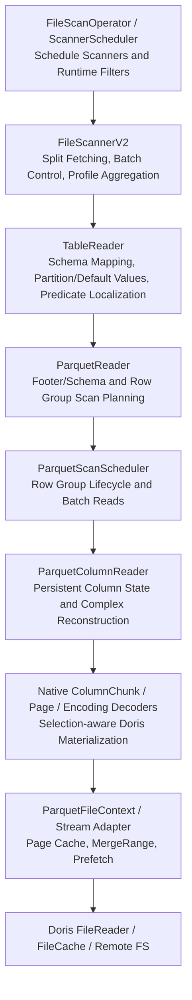

| Layer | Core responsibilities | Responsibilities intentionally excluded |
| --- | --- | --- |
| FileScannerV2 | Split lifecycle, reader reuse, dynamic batches, and unified Profile | Does not understand Parquet pages or encodings |
| TableReader | Map table columns, partition columns, missing columns, defaults, and conjuncts into file-local coordinates | Does not parse the Parquet footer directly |
| ParquetReader | Build file context, plan Row Groups, and aggregate format-level statistics | Does not implement table-level schema-evolution semantics |
| ParquetScanScheduler | Open planned Row Groups and order predicate/output column reads | Does not repeat global predicate analysis |
| ColumnReader | Locate and skip pages, decompress, decode, and materialize by Selection | Does not decide whether a Row Group is a candidate |
| FileContext / FileReader | Provide random reads, caches, merged reads, and remote access | Does not interpret SQL predicates |

> **Design benefit:** Table format, file format, and storage medium remain decoupled. The Parquet
> layer can use footer, page index, dictionary, and other format knowledge while upper layers retain
> uniform scan semantics.

### 2.1 Native Reader Target and Migration State

The target execution path does not use Arrow builders or `ReadRecords` to decode data pages. Doris
owns the Column Chunk, page, level, encoding, selection, conversion, and materialization state, and
writes directly into Doris columns. This follows the same broad separation used by DuckDB: metadata
planning is distinct from a persistent per-column reader, and page/encoding decoders expose narrow
cursor-based contracts rather than an Arrow array as an intermediate result.

V1 remains the differential baseline, but v2 owns an independent reader implementation. Its page
and encoding algorithms started from proven Doris behavior and are maintained under the v2 tree;
the production v2 path never instantiates the v1 `ParquetColumnReader`:

| Stage | State and boundary |
| --- | --- |
| Native encoding kernel | V2 owns the Column Chunk, page, level, and encoding decoders under `be/src/format_v2/parquet/reader/native/`. Decoders expose raw fixed/binary spans, validated dictionary indices, and skip operations; they never write Doris columns. |
| Logical materialization | `DataTypeSerDe` interprets Parquet physical/logical metadata and writes decoded spans directly into the final Doris column. Typed dictionaries and scratch are persistent per leaf reader. |
| Native column reader | `NativeColumnReader` is persistent for one top-level column and Row Group. It owns selection/filter/dictionary scratch and drives the native decoder directly into the final Doris column. |
| Complex reconstruction | Choose a Dremel shape-owning leaf per requested parent-row range; derive parent offsets/nulls once from it and keep sibling leaf streams aligned to the same parent rows. |
| Metadata and planning | Replace Arrow footer/schema/Row Group metadata dependencies with native Thrift-derived objects while preserving the existing planner, index, cache, and split contracts. |
| Compatibility removal | Remove Arrow data-read adapters after type/encoding/page/writer compatibility and performance gates pass. Production v2 never falls back from a selected native reader to Arrow; an unsupported combination returns an explicit error. |

Data-page value scans and levels-only aggregate scans no longer use Arrow `RecordReader`, arrays, or
builders. V2 parses and owns the Thrift footer and physical schema; a lazy Arrow metadata adapter
remains only for planner consumers that have not yet migrated. It is not a runtime fallback: after
a column selects the native reader, decode errors are returned directly. The production target
eventually removes that remaining planner adapter; tests may also use Arrow as a fixture writer or
oracle.

All new integration remains in `be/src/format_v2/parquet/`. V1 is kept unchanged as the correctness
and performance control. Compatibility is demonstrated through differential tests and the explicit
type/encoding matrix, not through a runtime dependency on v1 code.

### 2.2 Native Interface Ownership

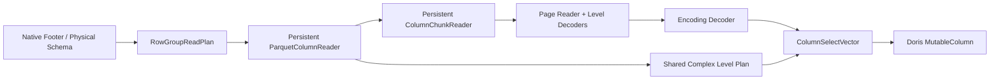

- **Physical schema contract:** Immutable physical type, fixed length, maximum definition and
  repetition levels, and repeated-parent definition threshold. It owns no Arrow descriptor and
  borrows no temporary table-schema object.
- **Persistent column state:** Page/decompress buffers, dictionary decoder, SerDe/conversion state,
  null maps, selection ranges, binary-value references, and builder capacity live with the column
  reader and are logically reset rather than recreated for each batch.
- **Decoder contract:** Consume a known number of logical level entries and encoded payload values,
  then materialize only selected rows. Decoders do not decide table projection, predicate meaning,
  or parent complex offsets.
- **Complex plan contract:** The shape-owning leaf's definition/repetition levels are parsed once
  into parent-row boundaries and child-presence/null decisions. Sibling physical streams consume
  the same parent-row range and validate their counts so offsets and null maps cannot drift.

## 3. From File Open to Scan Plan

After a reader receives a Split, it opens the file and builds the scan plan. This phase determines
which Row Groups, row ranges, column chunks, and Page Skip Plans will be used later.

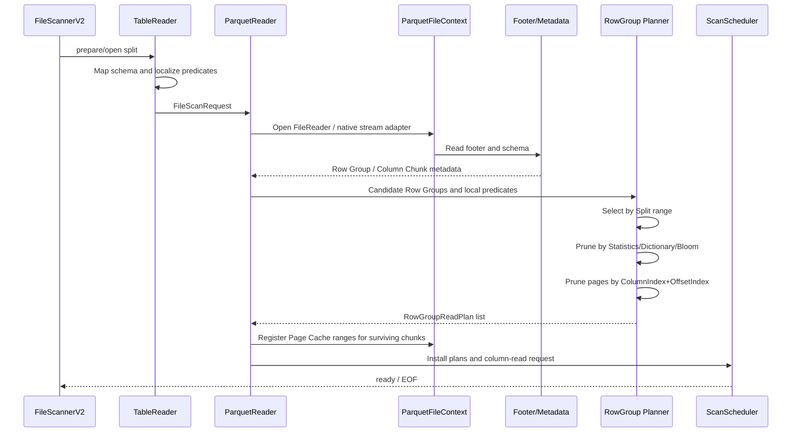

### Key planning objects

- **FileScanRequest:** Contains `predicate_columns`, `non_predicate_columns`, localized conjuncts,
  delete conjuncts, and local column-position mappings.
- **RowGroupReadPlan:** Records the Row Group, its file-global starting row, `selected_ranges`
  produced by page-index pruning, and the `page_skip_plan` for each leaf column.
- **ParquetFileContext:** Adapts Doris FileReader to the active metadata/data stream interface and
  owns Page Cache, FileCache prefetch, and MergeRange routing. During migration this may still
  expose an Arrow adapter for metadata consumers, but native page decoding reads the same stable
  Doris byte ranges without producing Arrow arrays. The immutable native footer owns one
  thread-safe, lazily constructed Arrow metadata adapter at the footer-cache lifecycle, so repeated
  v2 opens neither re-read the footer nor serialize and parse the same metadata again.

For every selected Row Group, dictionary/index probes finish on the metadata adapter first. The
scheduler then computes projected physical Column Chunk ranges and installs one shared native
`MergeRangeFileReader` when their average size is below v1's small-I/O threshold. All predicate and
lazy output readers share that wrapper; their internal `BufferedFileStreamReader` prefetch is
disabled in this mode, avoiding duplicate buffers. Large chunks and in-memory files use the base
reader, while remote FileCache prefetch remains the non-MergeRange path.

> Planning intentionally proceeds from cheap to expensive. Split and metadata pruning reduce the
> candidate set before finer indexes are read for surviving Row Groups, avoiding index I/O for data
> that is already known to be irrelevant.

## 4. Predicate Pushdown Design

Predicate pushdown does not begin by passing table expressions directly to Parquet. TableReader and
ColumnMapper first translate a table expression into an expression understood by the current file.

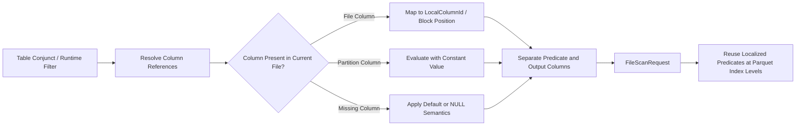

### Design principles

1. **Semantics before optimization:** Resolve partition constants, missing columns, defaults, and
   type mappings before deciding whether pushdown is safe.
2. **Local coordinates:** Parquet sees only the current file's column IDs and block positions, so it
   does not repeatedly interpret table-schema evolution.
3. **Capability checks:** ZoneMap, Dictionary, and Bloom use only expressions they can interpret
   safely. All others remain row-level residual predicates.
4. **Prefer safe single-column predicates:** Single-column predicates can drive indexes and staged
   filtering. Multi-column, stateful, or error-sensitive expressions retain whole-expression
   evaluation.
5. **Runtime Filters can refresh:** ScannerScheduler refreshes late Runtime Filters before reading.
   TableReader handles partition-range pruning during Split preparation, and passes file-pushable
   parts as localized conjuncts.

> Pushdown is not merely avoiding another expression evaluation. It projects deterministic facts
> from the expression onto cheaper data summaries. Any case that cannot prove a non-match must
> continue scanning.

## 5. Predicate Evaluation at Different Granularities

The same predicate may be attempted at several granularities. Each layer produces a smaller
candidate set that becomes the next layer's input.

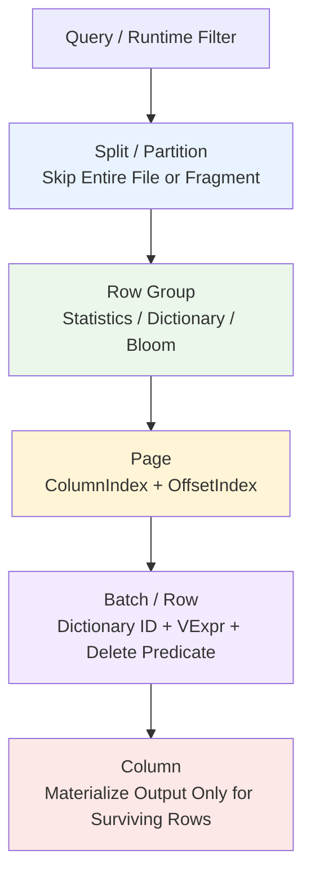

| Granularity | Input information | Main cost avoided | Conservative fallback |
| --- | --- | --- | --- |
| Split / Partition | Partition values, Runtime Filter range, scan byte range | Opening and reading an entire file or fragment | Retain the Split when uncertain |
| Row Group | Footer statistics, dictionary, Bloom filter | I/O and decoding for all column chunks in the group | Retain the Row Group when an index is missing or incompatible |
| Page | ColumnIndex min/max/null data and OffsetIndex | Page I/O, decompression, and decoding | Read the affected range when page indexes are incomplete |
| Row / Batch | Actual column values, dictionary IDs, residual conjuncts | Later predicate-column and output-column materialization | Evaluate full VExpr semantics |
| Column | SelectionVector | Reads, decoding, and memory writes for non-predicate columns | Read all projected columns sequentially when no filtering applies |

> **Key distinction:** Row Group and Page indexes generally eliminate impossible candidates; they
> do not produce final query results. Row-level predicates determine whether individual rows match.

## 6. Row Group Planning and Index Coordination

The Row Group Planner combines physical layout from the footer, the Split byte range, and predicate
index capabilities into an executable plan. The key property is a stable candidate-reduction order.

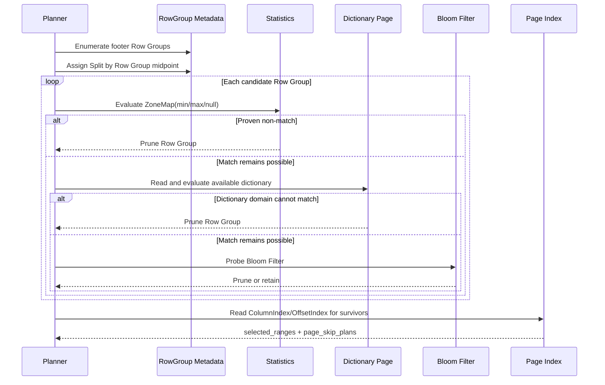

### Why this order is used

- **Statistics:** Usually already in the footer, making them the lowest-cost option for range and
  null semantics.
- **Dictionary:** Requires reading the dictionary page, but can prove a complete non-match for
  low-cardinality string columns.
- **Bloom:** Requires Bloom data I/O and is useful for negative membership tests. A positive result
  may be a false positive.
- **Page Index:** Builds page-level row ranges only for surviving Row Groups, avoiding index cost for
  groups already eliminated.

### How the plan drives physical skips

ColumnIndex provides min/max/null semantics for each page. OffsetIndex maps pages to Row Group row
numbers and file offsets. Candidate ranges from multiple predicate columns are intersected into
`selected_ranges`; a `page_skip_plan` is then built for each leaf so its column reader can skip pages
that do not overlap surviving rows.

> `selected_ranges` represents logical row ranges, while `page_skip_plan` represents physical page
> reads. Keeping them separate allows the scheduler to advance by row batch while each column skips
> according to its own page boundaries.

## 7. Batch Reads, Dictionary Filtering, and Lazy Materialization

Execution follows a filter-first, materialize-later strategy. The scheduler advances through
`selected_ranges`, asks column readers to skip gaps, and then reads the current batch.

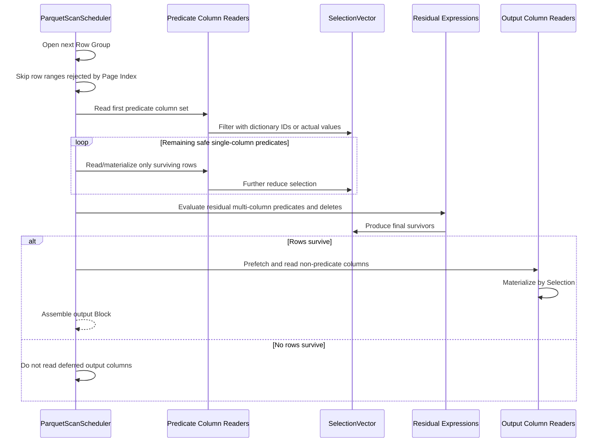

### Row-level dictionary filtering

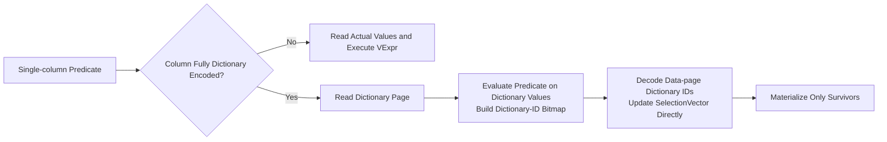

- Applies to non-repeated primitive, string-like BYTE_ARRAY / FIXED_LEN_BYTE_ARRAY columns whose
  complete Column Chunk uses dictionary data encoding.
- Safe AND subexpressions may remove components exactly covered by dictionary evaluation. OR or
  non-equivalent expressions are not rewritten aggressively.
- Stateful, potentially throwing, or whole-batch-sensitive expressions disable staged
  single-column scheduling and fall back to reading required columns before whole-expression
  evaluation.

> **Optimization loop:** The earlier SelectionVector shrinks, the fewer values later predicate and
> output columns must decode and copy. This is the main benefit of lazy materialization in a
> columnar format.

### 7.1 Selection and Cursor Contract

The native decoder receives a sorted selection over logical rows. Logical positions include nulls;
they are not offsets into the encoded non-null payload. Definition levels and selection are merged
as two ordered streams into four run types:

| Run | Consume logical level entries | Consume encoded payload | Append output |
| --- | --- | --- | --- |
| Selected non-null (`CONTENT`) | Yes | Yes | Value |
| Selected null (`NULL_DATA`) | Yes | No | Default plus null-map bit |
| Filtered non-null (`FILTERED_CONTENT`) | Yes | Yes or decoder-native skip | No |
| Filtered null (`FILTERED_NULL`) | Yes | No | No |

The contract keeps three counts explicit: logical level entries consumed, encoded non-null values
consumed, and Doris output values appended. The page reader may cross page boundaries while
satisfying one batch, but all three counts must be aligned when it returns. A dense identity
selection, an empty selection, and an arbitrary fragmented selection use the same decoder API.
Selection inputs are borrowed only for the duration of the decode call.

For a flat leaf, the fast path is valid only when the maximum repetition level is zero. It decodes
definition-level runs and builds the four-way selection plan in persistent scratch whose capacity
survives adaptive batch changes. When a filtered page fragment contains no definition-level NULL,
the plan is normalized to sorted physical ranges and enters `DataTypeSerDe` and the encoding
decoder once. This is the hybrid selection path: it keeps the dense direct-materialization path,
but moves sparse range traversal inside the concrete decoder instead of repeatedly constructing a
SerDe consumer for every selected run.

The encoding chooses the cheapest inner loop. PLAIN fixed-width values gather ranges with bulk
copies; PLAIN BYTE_ARRAY scans every length once and publishes compact source offsets, cumulative
output offsets, and coalesced surviving spans directly to the SerDe; dictionary
encoding decodes and validates the complete ID batch before gathering selected IDs; BOOLEAN,
DELTA, and BYTE_STREAM_SPLIT batch-decode or reconstruct their stateful stream and compact selected
values. This follows DuckDB's vector-at-a-time principle while preserving Doris's separate
Decoder/SerDe ownership boundary. A filtered non-null value always advances and validates encoding
state even when it is not copied, preventing the next batch from decoding shifted values.

If selected NULL slots must be interleaved with values, v2 currently retains the four-run cursor
path so defaults and null-map bits are appended at the exact logical positions without a decoded
intermediate column. `HybridSelectionNullFallbackBatches` makes that conservative path visible;
it is a correctness boundary, not an Arrow fallback.

### 7.2 Page and Encoding Kernel

The native page reader parses Page V1 and Page V2 headers, obtains level streams and payload bytes,
decompresses only the required region, and installs a decoder selected from physical type plus data
encoding. Page V1 and V2 differ in where levels are stored and which bytes are compressed; after
that parsing step both feed the same level and value-decoder contracts.

| Encoding family | Native responsibility |
| --- | --- |
| PLAIN | Fixed-width little-endian primitives, BOOLEAN bit packing, BYTE_ARRAY lengths, and FIXED_LEN_BYTE_ARRAY widths; identical POD types append by bulk copy, dense fixed-length strings use one byte-span copy plus offset synthesis, sparse fixed-width ranges consume contiguous spans directly, and variable strings reuse decoder-produced offsets without a `StringRef[]` staging pass |
| RLE_DICTIONARY / PLAIN_DICTIONARY | Persist dictionary values for the Column Chunk, decode and validate the complete ID batch, then gather selected IDs |
| RLE / BIT_PACKED levels | Decode definition/repetition levels and preserve runs across page and batch boundaries |
| DELTA_BINARY_PACKED | Preserve block/mini-block state, decode one page-fragment batch, and compact selected values in-place |
| DELTA_LENGTH_BYTE_ARRAY | Decode lengths and byte payload in lockstep, then retain selected references only |
| DELTA_BYTE_ARRAY | Reconstruct prefix/suffix values with persistent previous-value state, then retain selected references only |
| BYTE_STREAM_SPLIT | Reassemble selected primitive lane ranges directly into one compact batch without an Arrow intermediate |

Unsupported physical-type/encoding combinations return an explicit error. They never fall back to
Arrow and never produce a plausible result through a decoder selected only by logical Doris type.
Dictionary-to-plain transitions, multiple data pages, Page V1/V2, truncated
payloads, integer overflow, and invalid lengths/IDs are part of the unit-test matrix.

Read and skip are the same trust boundary. Every decoder validates the requested count against its
declared/remaining values before pointer advancement, allocation, multiplication, or integer
narrowing. BYTE_ARRAY dictionaries bound the entry count by the available four-byte length prefixes
before reserving storage and validate every decoded ID. DELTA_BYTE_ARRAY requires each prefix to fit
the preceding reconstructed value and checks the reconstructed and aggregate byte lengths. BOOLEAN
RLE and DELTA skip paths operate in bounded chunks and reject short streams instead of advancing a
partially consumed cursor as if the request succeeded.

Level bit width is only a storage bound: for a schema maximum of 2, two bits can still encode the
invalid value 3. Batch, run, and single-value level cursors therefore reject every decoded value
above the schema maximum. Nested page traversal reserves only the requested parent-row frontier;
an untrusted Page V1/V2 `num_values` cannot trigger an eager page-sized allocation before the level
payload proves those entries exist.

Compression has an exact-size contract. Snappy's encoded uncompressed length is checked against the
destination capacity before decompression; Page V1, Page V2, and dictionary decode must then produce
exactly the size declared in the page header. For the UNCOMPRESSED codec, dictionary compressed and
uncompressed sizes must be equal. These rules turn malformed size metadata into corruption instead
of a buffer overrun, silent truncation, or plausible shifted values.

Before a stream is created, scalar and levels-only readers call one signed, file-bounded Column
Chunk range validator. Writer compatibility derived from `created_by` may add at most 100 bytes of
file-bounded PARQUET-816 padding, or override the pre-Arrow-3 Data Page V2 compressed flag. Page
iteration ignores auxiliary `INDEX_PAGE`/unknown pages without consuming a logical data-page
ordinal. OffsetIndex is published only when its rows and non-overlapping physical page ranges are
strictly increasing, its first location equals the owning `data_page_offset`, and every location
remains inside that validated Column Chunk. The metadata anchor rejects uniformly shifted indexes
that row monotonicity alone cannot detect; otherwise sequential traversal preserves correctness.

### 7.3 Direct Materialization and Scratch Reuse

Encoding decoders expose contiguous physical spans and advance encoded-stream cursors. The selected
`DataTypeSerDe` consumes those spans and writes directly into the Doris mutable column. Fixed-width
types append contiguous runs. PLAIN BYTE_ARRAY publishes payload offsets, cumulative destination
offsets, and coalesced survivor spans so string columns perform larger range copies without a
`StringRef[]` staging array. Other binary encodings may use persistent references that remain valid
only while the page or dictionary buffer is pinned by the persistent leaf reader.

The direct path covers identical logical types, string-family compatibility, decimal
precision/scale changes, integer changes, and FLOAT-to-DOUBLE widening. Less common table-schema
changes such as STRING-to-DATE or DECIMAL-to-STRING keep the generic `ColumnTypeConverter`: the
file logical SerDe first fills a reusable source Doris column, then the generic cast appends to the
requested column.
This compatibility path is deliberately separate from the decoder ABI and does not reintroduce a
physical-value batch or `PhysicalToLogicalConverter` into ordinary Parquet reads.

`DecodedColumnView` is not the native Parquet decoder output ABI. It describes already decoded
physical values and is useful to generic format conversion code, but routing every Parquet value
through it would recreate an intermediate materialization layer. The v2 native path does not use it:
ColumnReader handles levels/selection, Decoder parses encoding streams, and DataTypeSerDe performs
physical/logical conversion while appending to the final column.

Decimal and FIXED_LEN_BYTE_ARRAY direct paths validate the physical byte width, decode big-endian
two's-complement values with correct sign extension, and apply precision/scale conversion exactly
once. Decimal integer and binary inputs stay in a 256-bit intermediate through exact scale-down,
scale-up overflow, and target-precision checks; discarded non-zero digits are conversion failures,
and narrowing happens only after success. Date, timestamp, INT96, unsigned annotations,
CHAR/VARCHAR, and timezone conversions retain
the same semantic checks as the general conversion path. A fast path is enabled only when those
checks prove the result is equivalent. In particular, legacy converted `TIMESTAMP_MILLIS` and
`TIMESTAMP_MICROS` are UTC-adjusted, while an unannotated INT64 timestamp has distinct
local/unspecified semantics; data decode and statistics pruning share this interpretation.
Timestamp conversion validates millisecond scaling before multiplication, validates INT96
nanos-of-day before widened Julian-day arithmetic, and rejects values outside Doris years
0001-9999. Plain, dictionary, and decoded-value inputs share these bounds.

Direct conversion also preserves load-mode error semantics. A nullable target in non-strict mode
stores the nested default and marks the exact output row NULL for numeric, date/time, timestamp, and
decimal conversion failures. Strict mode and non-nullable targets return the error. Typed
dictionary materialization records failing dictionary entries once and propagates those failures
through decoded dictionary IDs, so dictionary and plain pages have identical behavior.

The typed dictionary is materialized through the logical SerDe once per decoder dictionary
generation. Dictionary-entry predicate evaluation, dictionary-ID row filtering, and surviving
row-value flattening reuse that same Doris column. A Row Group, file, type, or dictionary-generation
change invalidates it, and every ID is checked before access.

The persistent leaf reader owns reusable conversion objects, null map, selection ranges,
definition/repetition levels, binary references, dictionary state, decompression buffers, and Doris
column capacity. Logical sizes are reset at batch boundaries and normal-size capacity is retained.
After the top-level complex reader has consumed the level plan, retained capacity above the 4 MiB
high-water limit becomes eligible for release. The reader accounts separately for active and
retained bytes, including decoder-owned buffers: active oversized scratch is never released, and
eligible capacity is released only after three consecutive ordinary/idle batches. This hysteresis
prevents a repeated-value outlier from being pinned for the Row Group without turning a legitimate
large steady-state batch into allocate/free thrash. The native path does not create an Arrow
builder or Arrow array.

### 7.4 Complex Types and Parent Shape Plans

Repeated Parquet leaves cannot interpret a requested parent-row count as a leaf-value count. One
parent row may contain zero, one, or many level entries, and its final entry can reside on the next
page. The complex reader therefore builds a parent shape plan from one owning leaf with:

- parent-row start/end boundaries derived from repetition levels;
- ancestor-null, collection-null, empty-collection, element-null, and present-value decisions from
  definition thresholds;
- child payload positions and selected parent rows;
- cross-page continuation state for an unfinished parent row.

ARRAY and MAP offsets and null maps are derived from that plan. Parquet stores separate level
streams for separate physical leaves, so sibling readers still consume their own streams; they must
advance over the same parent-row range and validate their payload counts instead of redefining the
parent shape. STRUCT uses a representative present leaf for its null map and parent count. MAP uses
the key leaf as the entry-shape owner, requires the materialized key and value columns to match that
outer entry count, and validates Parquet's non-null key requirement rather than repairing it. Raw
key/value repetition vectors are intentionally not compared because a nested MAP value owns
additional repetition levels. STRUCT siblings similarly normalize repetition to the current parent
boundary; deeper child collection repetition cannot redefine or invalidate the sibling shape.

Level scratch grows with level entries that were actually decoded, while its initial reservation is
bounded by the requested parent-row frontier rather than the page header's untrusted value count.
Long repeated rows can still grow incrementally beyond that frontier, and long null/non-null runs
are split into representable internal runs without introducing a new row boundary. Tests cover null
ancestors, empty collections, null elements/values, nested
STRUCT-in-ARRAY and ARRAY-in-STRUCT shapes, sibling page misalignment, and rows spanning pages and
batches.

#### Complex-reader interface and materialization cost

The original v2 prototype placed an Arrow-decoded leaf batch and separate load/build/consume phases
between encoded pages and Doris columns. That design required implicit phase ordering, duplicated
level traversal in ARRAY/MAP/STRUCT wrappers, and retained decoded binary payload even when a caller
needed only nullability. The prototype hierarchy and its batch container have been removed.

The production boundary is now the same compact cursor contract used for scalar columns:
`NativeColumnReader::read/select/skip`. Its persistent native reader owns page, decoder, level,
conversion, and complex-column state and materializes the complete result directly into the caller's
Doris column. No Arrow value reader, intermediate decoded leaf container, temporary nested Doris
column, or public load-before-build protocol participates in predicate or output scans.

Internally, complex decoding still has to solve the parent-shape problem. For example, levels
representing `[["a", "b"], NULL, []]` produce entry counts `[2, 0, 0]`, parent nulls `[0, 1, 0]`,
and string payload ordinals `[0, 1]`. MAP uses the key leaf as the entry-shape owner and validates
the value leaf against it; STRUCT children advance in parent-row lockstep. This state belongs behind
the native reader boundary rather than in caller-visible phases.

When schema evolution makes every projected STRUCT child missing, the native reader retains one
physical reference leaf solely for shape. Its levels-only interface advances definition,
repetition, and encoded payload cursors (including dictionary-index validation), counts STRUCT
instances from the parent thresholds, and discards the payload without allocating a temporary
string or nested Doris column.

`CountColumnReader` selects one representative leaf (the key for MAP) and uses the v2 native
`LevelReader` to consume definition/repetition levels without decoding payload values. It exposes
neither decoded values nor the ordinary scan-reader API, so COUNT pushdown cannot become a value
fallback and large complex payloads never enter aggregate state.

Doris v1 remains the behavior/performance baseline: `read_column_data()` owns physical decode and
the collection reader consumes persistent level buffers. DuckDB provides the same useful design
principle through its single `Read(input, vector)` boundary and reusable child vectors. See DuckDB's
official [LIST reader](https://github.com/duckdb/duckdb/blob/main/extension/parquet/reader/list_column_reader.cpp),
[STRUCT reader](https://github.com/duckdb/duckdb/blob/main/extension/parquet/reader/struct_column_reader.cpp),
and [base column reader](https://github.com/duckdb/duckdb/blob/main/extension/parquet/column_reader.cpp).

### 7.5 Index Coordinate Domains and Composition

Index correctness depends on keeping its coordinate systems separate:

| Identity | Scope | Must not be confused with |
| --- | --- | --- |
| Table/local column ID | Current file request and Doris block | Physical Parquet leaf ordinal |
| Physical leaf-column ID | Footer Row Group Column Chunk array | Logical parent STRUCT/ARRAY/MAP ordinal |
| Row Group ID | File metadata | Split ordinal or batch ordinal |
| Data-page ordinal | One Column Chunk, excluding dictionary pages | PageHeader sequence including dictionary page |
| OffsetIndex row ordinal | Logical row inside a Row Group | Encoded non-null value position |
| Selection index | Logical row inside the current batch, nulls included | Dictionary ID or compact output position |
| Dictionary-entry ID | One Column Chunk dictionary | Row ordinal, global dictionary ID, or the next Row Group's dictionary |

Row Group statistics, dictionary pruning, Bloom, ColumnIndex/OffsetIndex, page skip plans, cache
ranges, row selection, and lazy predicate/output readers are composed in that order. Each stage may
only remove candidates already expressed in the same Row Group logical-row domain. Page ordinals
from ColumnIndex and OffsetIndex are validated together before they become `selected_ranges` and a
per-leaf physical page-skip plan.

Dictionary row filtering starts only when metadata proves every data page in the Column Chunk uses
a dictionary encoding. The predicate is evaluated against the current dictionary to produce an
entry bitmap; decoded IDs are checked against both dictionary length and bitmap length. A mixed
dictionary/plain transition falls back before consuming data. Once selected dictionary reading has
advanced a page cursor, loss of dictionary output is corruption rather than a retry through another
path with shifted state.

Missing optional indexes or unsupported predicate/type combinations retain rows. Malformed
offsets, inconsistent page counts, out-of-range dictionary IDs, overlapping/unsorted invalid ranges,
or an impossible cursor relationship are reported as corruption. Cache hits and misses do not
change any page, level, value, or dictionary cursor.

## 8. Supported Indexes and Their Boundaries

V2 uses native Parquet metadata and encoding information. It does not construct Doris-internal
storage indexes for external Parquet files.

| Capability | Granularity | Suitable predicates | Result property | Main limitations |
| --- | --- | --- | --- | --- |
| Footer Statistics / ZoneMap | Row Group | Ranges, comparisons, IS NULL/IS NOT NULL, and expressions safely convertible to ZoneMap | Can prove the entire group cannot match | Requires valid min/max/null_count and safe type conversion |
| Dictionary Pruning | Row Group | Single-column predicates exactly evaluable over the dictionary domain | Can prove the entire group cannot match | Low-cardinality string-like primitive with complete dictionary encoding |
| Parquet Bloom Filter | Row Group / Column Chunk | Equality and IN membership-negation predicates | Negative result can prune; positive result requires verification | Controlled by configuration; file must contain Bloom data; false positives are possible |
| ColumnIndex | Page | Predicates evaluable from min/max/null | Produces candidate pages and row ranges | Requires an index and decodable compatible types |
| OffsetIndex | Page → Row Range | Does not evaluate predicates directly | Maps page results to row numbers and physical skip plans | Normally used with ColumnIndex |
| Dictionary-ID Filter | Row / Batch | Safe single-column string-like predicates | Exact filtering of actual rows | Complete dictionary encoding and non-repeated primitive only |
| Condition Cache Bitmap | File-global granule | Stable cacheable conditions | Reuses previous filtering to reduce row ranges | Not a native Parquet index; uncovered ranges remain candidates |

### Index-selection overview

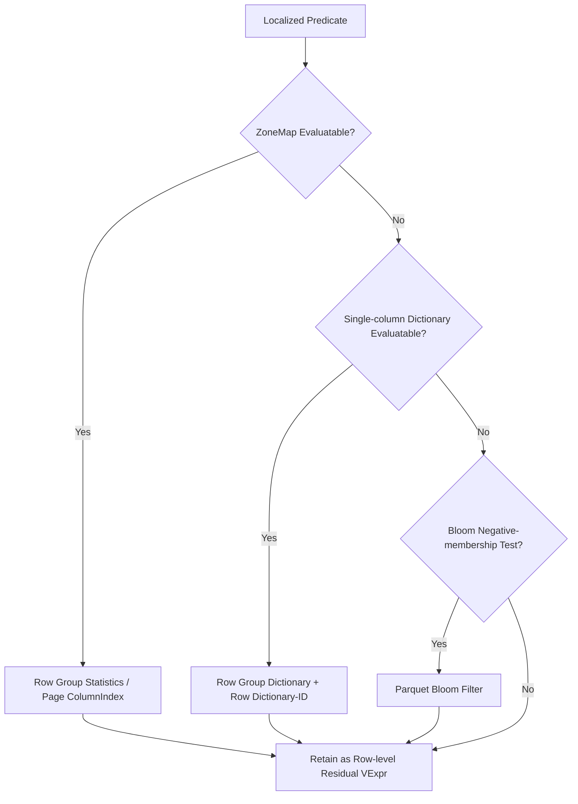

> Indexes are layered rather than mutually exclusive. An index may remove only ranges already
> proven impossible; residual predicates still guarantee final correctness.

## 9. Cache and I/O Optimization

Parquet V2 has five complementary cache and I/O paths: cache footer/parsed metadata, cache remote
file blocks, cache serialized Parquet ranges, cache predicate results, and merge small random reads.

| Mechanism | Cached or optimized object | Lifecycle and key | Problem addressed |
| --- | --- | --- | --- |
| Footer metadata cache | V2-owned immutable Thrift metadata, v2 physical schema, and the serialized footer bytes already fetched from storage | Stable base file identity plus a v2 type discriminator and schema-affecting mapping options | Avoid repeated footer I/O, Thrift parsing, schema construction, unsafe cross-version cache casts, and Thrift re-serialization before Arrow metadata adaptation |
| Small HTTP object staging | Complete object bytes for files at or below `in_memory_file_size` | Per-reader v2 wrapper; loaded once from byte zero and released with the file context | Collapse cold small-file requests and keep footer-cache-hit scans independent of server-specific near-EOF Range behavior |
| FileCache | Remote file blocks | Related to filesystem/path and file version; may hit locally or through a peer | Avoid repeated object-storage access and support background prefetch |
| Parquet Page Cache | Serialized bytes within registered Column Chunk ranges | Stable file key depends on path, mtime/version, and file size; disabled when mtime is unreliable | Reduce repeated page reads and support exact/subrange coverage |
| Condition Cache | Condition-surviving granule bitmap | Managed by condition and file-range context | Reuse filtering results before reading columns |
| MergeRangeFileReader | Not a cache; merges small ranges into larger slices | Installed temporarily for projected chunks of the current Row Group | Reduce remote small-I/O count and request overhead |

### Footer Cache Parity with V1

V2 reuses the common stable file identity policy, but owns its footer parser, schema lifecycle,
metadata payload type, and cache-key suffix entirely under `format_v2`. A v2 cache entry can be
shared by v2 readers but can never be cast as a v1 metadata object. Mutable Row Group, selection,
decoder, and scratch state remains per reader. Path-only keys are insufficient. Parse failures,
short files, unsupported metadata, and schema-affecting option changes cannot populate or reuse a
successful entry. No change to the v1 parser or metadata cache behavior is required.

On a v2 cold miss, the parser retains the exact serialized footer bytes already in memory, and the
lazy Arrow planner adapter parses those bytes directly instead of serializing the Thrift object
again. The adapter is cached inside the v2 footer-object lifecycle; it is never the cache payload
type and its lifetime does not enter the native decoder. Production ColumnIndex/OffsetIndex planning reads and
parses Compact Thrift indexes natively; adjacent per-leaf serialized ranges are coalesced, and the
validated OffsetIndex objects are transferred into Row Group execution instead of being fetched a
second time. The Arrow PageIndexReader path remains only as a test oracle. Until the remaining
row-group metadata planner adapter is removed, its construction cost and retained tree size are
visible as `ArrowMetadataAdapterTime/Bytes`.

Before the footer lookup, v2 wraps bounded HTTP Parquet objects in an in-memory reader. The wrapper
loads from byte zero on its first physical access, whether that access is a cold footer read or a
warm data-page read after a footer-cache hit. This preserves identical cold/warm behavior for HTTP
servers that advertise Range support but answer an overlong near-EOF range with HTTP 200, and keeps
the compatibility policy out of the v1 reader.

### Page Cache Parity with V1

The native path uses v1's page-cache semantics as its minimum contract: the same stable file
identity, Column Chunk/page byte ranges, compressed versus decompressed entry distinction, checksum
and decompression ownership, subrange coverage, invalidation, admission, and fallback I/O rules.
Mutable decoder and dictionary state is never cached. A hit returns immutable bytes and advances the
reader exactly as the corresponding base read would; a miss performs normal I/O before optional
admission. An alternative policy is accepted only with correctness coverage plus warm/cold,
selective/dense, local/remote benchmarks showing it is no worse than v1.

### Why Page Cache registers only surviving chunks

The footer is read before Row Group planning and before Page Cache ranges are registered, so
footer/metadata bytes never enter the Parquet Page Cache. After planning, only projected Column
Chunks from surviving Row Groups are registered, limiting pollution and key count.

### Relationship between prefetch and MergeRange

- When the base reader is CachedRemoteFileReader, predicate/output ranges for the current Row Group
  may be prefetched into FileCache.
- After dictionary probing, small projected chunks share one Row-Group-scoped
  MergeRangeFileReader on the native data-page path. Large chunks and in-memory files keep the base
  reader. The remaining Arrow metadata/index adapter has an independent wrapper and never owns the
  native decoder's stream cursor.
- With row-level filters, prefetch predicate columns first. Prefetch non-predicate columns only after
  at least one row survives, avoiding unnecessary bandwidth.

## 10. Other Key Optimizations

### 10.1 Condition Cache: Move Historical Filter Results Earlier

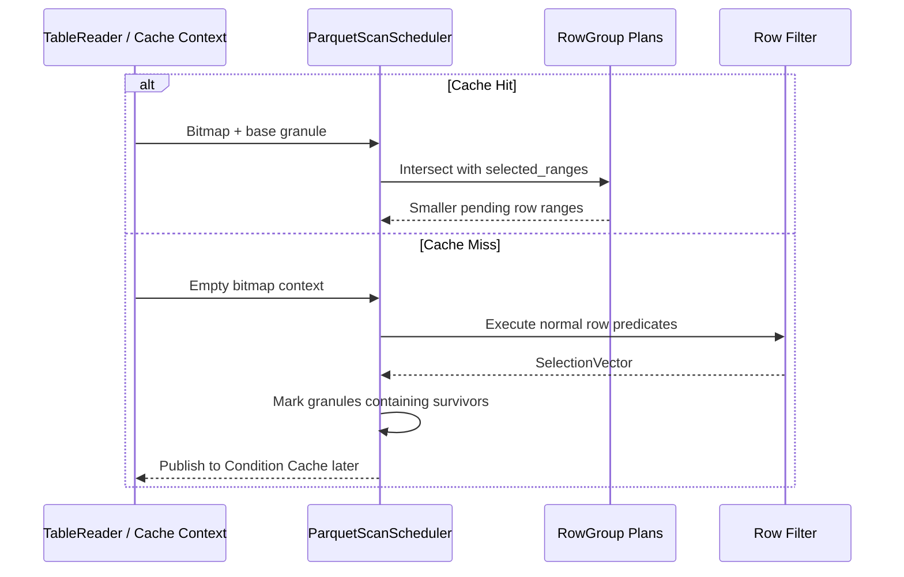

On a hit, only granules explicitly proven unnecessary by the bitmap are removed. Rows outside
bitmap coverage remain candidates. On a miss, granules containing surviving rows are marked,
trading granularity for reuse and smaller cache entries.

### 10.2 Adaptive Batches

FileScannerV2 uses a small probe batch to measure bytes per row in the final table Block. It derives
later batch rows from a target Block size, bounded by the system batch-size limit. Wide rows use
smaller batches to reduce memory peaks; narrow rows use larger batches for throughput.

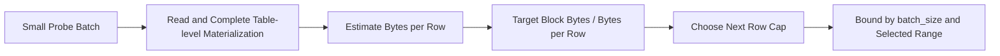

Changing the requested row cap changes only the amount of work performed by the persistent reader.
It does not recreate Column Readers, Column Chunk readers, dictionaries, SerDe/conversion objects,
builders, or scratch. The probe is charged as a normal batch and estimates completed Doris rows and
bytes after table-level materialization, matching v1's measurement point. Empty or highly filtered
probes do not permanently collapse the batch size; the scheduler retains enough evidence before
updating its estimate and respects page/range boundaries without turning each fragment into a new
reader lifecycle.

### 10.3 Aggregate Pushdown

When TableReader proves that no filter or delete semantics can change the result, COUNT / MIN / MAX
may use Parquet metadata to compute all or part of an aggregate without scanning data pages. This is
a metadata aggregation optimization and is distinct from Row Group index pruning.

### 10.4 Staged Prefetch

Without row-level filtering, output columns may be warmed together. With filtering, warm predicate
columns first and defer non-predicate columns until at least one row survives, aligning network
bandwidth with lazy materialization.

For safe single-column conjuncts, the scheduler records an exponentially weighted cost per input
row and survival ratio. Cold batches preserve declaration order; after every candidate has a sample,
the next batch orders predicates by cost per rejected row. The same learned order limits predicate
prefetch to the prefix with a meaningful probability of being reached, and a sustained high overall
survival ratio estimate may warm output chunks early. This retains correctness because only
independently safe conjuncts move and all readers still advance over the same logical batch.

Selection state is scheduler-owned across adaptive batches. Its dense filter bitmap is cached by
selection generation and batch shape, so every lazily materialized output reader consumes the same
bitmap without rebuilding an O(batch-size) array. Logical sizes reset per batch while ordinary
capacity remains reusable.

Fully rejected batches accumulate a logical lag for lazy columns. When a later batch survives, each
lazy reader consumes that lag in at most 65,535-row dense-filter chunks. This keeps the scheduler's
single logical skip while bounding adapter-owned bitmap capacity independently of prefix length and
lazy projection width.

## 11. Correctness, Fallback, and Capability Boundaries

V2 follows a prove-before-skip rule. Missing indexes, unsupported types, expressions that cannot be
split safely, or read anomalies must never change query semantics.

> **Correctness baseline:** Index results only reduce candidate sets. Every expression not exactly
> covered remains a residual conjunct evaluated against actual data.

| Scenario | V2 behavior |
| --- | --- |
| Missing Statistics or unsafe min/max conversion | Treat the column's ZoneMap as unavailable and retain the Row Group/Page |
| Bloom missing, disabled, or unreadable | Skip Bloom pruning and continue with later scan stages |
| Incomplete dictionary page, mixed non-dictionary encoding, complex/repeated column | Disable dictionary pruning and Dictionary-ID Filter; use actual values |
| Missing or inconsistent ColumnIndex/OffsetIndex | Disable fine-grained page pruning and read the full candidate range |
| Multi-column, OR, stateful, or error-order-sensitive expression | Preserve whole-expression evaluation to avoid changing SQL short-circuit or error semantics |
| No stable file-version identity for Page Cache | Disable Parquet Page Cache to prevent stale-byte reads |
| Incomplete Condition Cache coverage | Retain and recompute uncovered ranges |

### Capability boundaries

- Parquet Reader uses indexes and encoding metadata already present in the file; it does not build
  new indexes for external files.
- Page boundaries and definition/repetition levels are more complex for nested/repeated columns, so
  some dictionary and page-level optimizations conservatively fall back.
- Bloom is probabilistic and is safe only for proving absence. A positive Bloom result is not a row
  match.
- Page Index benefit depends on whether the writer produced indexes, data ordering, and predicate
  selectivity.

## 12. Profile Observation and Troubleshooting

Troubleshoot in this order: verify planning effectiveness, row filtering, lazy materialization, and
then I/O/cache health. Total ScanTime alone does not identify the cause.

The visible timer hierarchy is `FileScannerV2 -> TableReader -> FileReader -> IO`; the
format-specific `ParquetReader` subtree belongs to `FileReader`. Scanner lifecycle and Split work,
table-semantic restoration, format metadata/index/decode/materialization, and physical I/O are
charged to their owning layer. Native child-reader statistics accumulate in plain integers and are
published every 16 batches. Row Group reset, EOF, and reader close force the final delta before
destroying the reader tree, so short files retain complete attribution without paying recursive
profile publication on every tiny batch. Retained-scratch inspection uses the same amortized cadence
and a Row Group remains its hard lifetime bound.

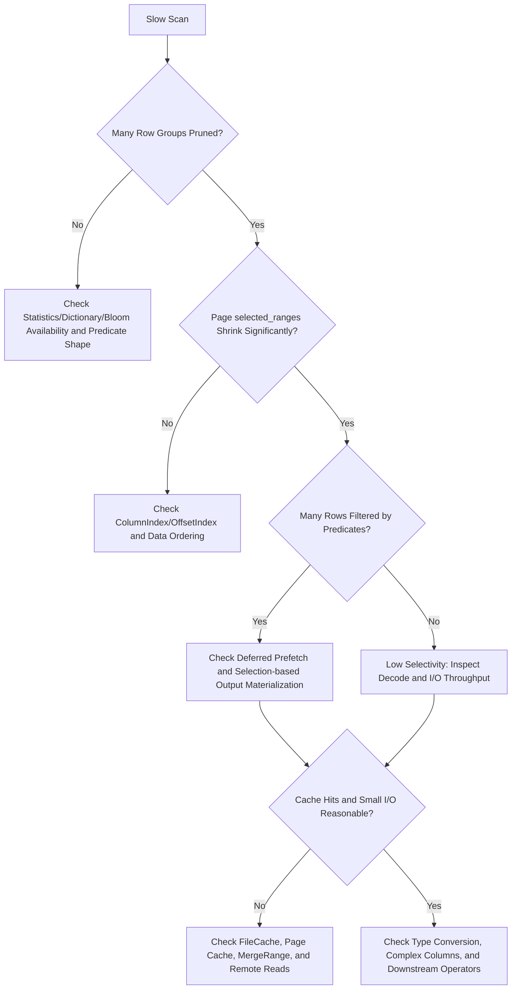

### Important metric families

| Metric family | Question answered |
| --- | --- |
| Row Group pruning | How many total Row Groups were pruned by Statistics/Dictionary/Bloom, and how much time did each stage take? |
| Page index pruning | How many indexes were checked, pages/rows were pruned, ranges selected, and pages skipped? |
| Dictionary row filter | How often were predicates rewritten, dictionaries read, bitmaps built, and attempts successful or rejected? |
| Predicate / raw rows | How many rows were read and rejected, and was lazy materialization worthwhile? |
| Predicate compaction | Did selection-first evaluation avoid repeated movement? Inspect `PredicateCompactionTime/Bytes/Count`; single-column rounds retain row mappings and compact at multi-column/delete/output boundaries. |
| Avoided projected I/O | How many compressed bytes from projected physical chunks were avoided? `FilteredBytes` deliberately excludes unprojected nested children. |
| Metadata lifecycle | How much time was spent reading the footer, adapting remaining Arrow planner metadata (`ArrowMetadataAdapterTime/Bytes`), natively reading/parsing page indexes, and evaluating page-index predicates? |
| Parquet Page Cache | What were hit/miss/write counts and compressed/decompressed hit shapes? |
| FileCache Profile | How many local/peer/remote bytes, waits, downloads, and hits occurred? |
| Merge / request I/O | Were small reads merged, and were request count and read amplification reasonable? |
| Condition Cache | How many rows were skipped early after a cache hit? |
| Native decode | How much time is spent in page parsing, decompression, levels, encoding, selection, conversion, string/fixed-binary materialization, and scratch growth? Compare `HybridSelectionBatches`, `HybridSelectionRanges`, and `HybridSelectionNullFallbackBatches` to distinguish batched sparse decode from NULL-interleaving fallback. |
| Batch fragmentation | How does `TotalBatches` divide into adaptive probes, dense, selected, empty, page-crossing, and nested/fragmented batches? |
| Index decisions | How often were statistics, dictionary, Bloom, ColumnIndex/OffsetIndex, and page skips attempted, accepted, conservatively rejected, or rejected as corrupt? |
| Cache lifecycle | For footer/page/file/condition caches, what were request, hit, miss, bypass, admission/write, byte, wait, and underlying-I/O counts using v1-compatible meanings? |

> Interpret pruning ratios in the context of write layout. Unsorted data produces wide min/max
> ranges, so Row Group/Page pruning may be ineffective even when the reader and indexes work
> correctly.

## 13. Summary

The FileScannerV2 Parquet scan pipeline has four primary threads:

1. **Semantic thread:** TableReader maps table schema and predicates into stable file-local
   semantics, preserving schema evolution, partition columns, and missing columns.
2. **Pruning thread:** Split → Row Group → Page → Row progressively applies Runtime Filters,
   Statistics, Dictionary, Bloom, Page Index, and actual-value filters.
3. **Decode thread:** Persistent native page/encoding readers merge Dremel levels with Selection,
   reuse scratch, reconstruct complex values from shared plans, and materialize directly to Doris.
4. **I/O thread:** Predicate-first reads, adaptive batches, Footer/File/Page/Condition caches, and
   MergeRange reduce read amplification together.

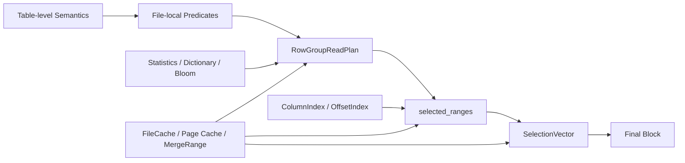

> **Final design criterion:** V2 turns format knowledge into an explicit scan plan and requires the
> executor to perform only the minimum necessary reads. Indexes safely reduce candidates, caches
> reuse cost, and lazy materialization avoids reading irrelevant columns for rejected rows.

This document reflects the current code pipeline and is intended as a common reference for
architecture reviews, performance analysis, and Profile troubleshooting.
