# FileScannerV2 Parquet Scan Pipeline Design

> **Reading goal:** Understand how the FileScannerV2 Parquet Reader progressively pushes
> table-level predicates down to Split, Row Group, Page, and Row granularity, then uses indexes,
> lazy materialization, and layered caches to reduce unnecessary I/O and decoding.

## 1. Design Goals and Core Conclusions

Parquet V2 is not simply a replacement decoder. It divides a file scan into a **planning phase** and
an **execution phase**: first eliminate impossible matches with lightweight metadata, then read only
predicate columns for surviving ranges, and finally defer output-column reads until matches exist.

> **In one sentence:** Scan cost contracts through File and Split → Row Group → Page → Row → Column.
> The earlier a non-match is established, the more remote I/O, decompression, decoding, and
> materialization can be avoided.

- **Uniform entry point:** TableReader maps table semantics to file semantics. ParquetReader handles
  only localized columns and predicates.
- **Planning first:** After opening a file, read footer/schema and build `RowGroupReadPlan` objects
  instead of making ad hoc decisions during reads.
- **Multi-level predicates:** The same table predicate may be reused at several granularities, but
  each layer eliminates data only when it can do so safely. Uncertain cases remain candidates.
- **Predicate columns first:** Read filter columns first and maintain a SelectionVector. Read output
  columns only for surviving rows.
- **Layered caches:** File-block cache, Parquet page cache, condition-result cache, and merged small
  I/O solve different problems and are not interchangeable.

**Scope:** This document focuses on the FileScannerV2 Parquet Reader design and core pipeline. It
does not cover Arrow decoder internals, complex-type reconstruction, or expression implementation.

## 2. Overall Architecture

Responsibilities are divided across scan orchestration, table-semantic adaptation, format planning,
Row Group execution, column decoding, and I/O. Upper layers own correctness semantics; lower layers
own format-aware pruning and reads.

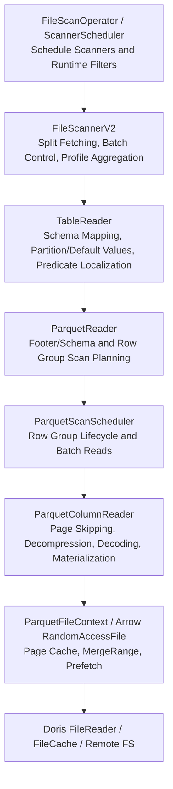

| Layer | Core responsibilities | Responsibilities intentionally excluded |
| --- | --- | --- |
| FileScannerV2 | Split lifecycle, reader reuse, dynamic batches, and unified Profile | Does not understand Parquet pages or encodings |
| TableReader | Map table columns, partition columns, missing columns, defaults, and conjuncts into file-local coordinates | Does not parse the Parquet footer directly |
| ParquetReader | Build file context, plan Row Groups, and aggregate format-level statistics | Does not implement table-level schema-evolution semantics |
| ParquetScanScheduler | Open planned Row Groups and order predicate/output column reads | Does not repeat global predicate analysis |
| ColumnReader | Locate and skip pages, decompress, decode, and materialize by Selection | Does not decide whether a Row Group is a candidate |
| FileContext / FileReader | Provide random reads, caches, merged reads, and remote access | Does not interpret SQL predicates |

> **Design benefit:** Table format, file format, and storage medium remain decoupled. The Parquet
> layer can use footer, page index, dictionary, and other format knowledge while upper layers retain
> uniform scan semantics.

## 3. From File Open to Scan Plan

After a reader receives a Split, it opens the file and builds the scan plan. This phase determines
which Row Groups, row ranges, column chunks, and Page Skip Plans will be used later.

### Key planning objects

- **FileScanRequest:** Contains `predicate_columns`, `non_predicate_columns`, localized conjuncts,
  delete conjuncts, and local column-position mappings.
- **RowGroupReadPlan:** Records the Row Group, its file-global starting row, `selected_ranges`
  produced by page-index pruning, and the `page_skip_plan` for each leaf column.
- **ParquetFileContext:** Adapts Doris FileReader to Arrow RandomAccessFile and owns Page Cache,
  FileCache prefetch, and MergeRange routing.

> Planning intentionally proceeds from cheap to expensive. Split and metadata pruning reduce the
> candidate set before finer indexes are read for surviving Row Groups, avoiding index I/O for data
> that is already known to be irrelevant.

## 4. Predicate Pushdown Design

Predicate pushdown does not begin by passing table expressions directly to Parquet. TableReader and
ColumnMapper first translate a table expression into an expression understood by the current file.

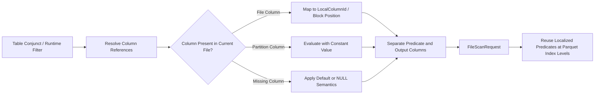

### Design principles

1. **Semantics before optimization:** Resolve partition constants, missing columns, defaults, and
   type mappings before deciding whether pushdown is safe.
2. **Local coordinates:** Parquet sees only the current file's column IDs and block positions, so it
   does not repeatedly interpret table-schema evolution.
3. **Capability checks:** ZoneMap, Dictionary, and Bloom use only expressions they can interpret
   safely. All others remain row-level residual predicates.
4. **Prefer safe single-column predicates:** Single-column predicates can drive indexes and staged
   filtering. Multi-column, stateful, or error-sensitive expressions retain whole-expression
   evaluation.
5. **Runtime Filters can refresh:** ScannerScheduler refreshes late Runtime Filters before reading.
   TableReader handles partition-range pruning during Split preparation, and passes file-pushable
   parts as localized conjuncts.

> Pushdown is not merely avoiding another expression evaluation. It projects deterministic facts
> from the expression onto cheaper data summaries. Any case that cannot prove a non-match must
> continue scanning.

## 5. Predicate Evaluation at Different Granularities

The same predicate may be attempted at several granularities. Each layer produces a smaller
candidate set that becomes the next layer's input.

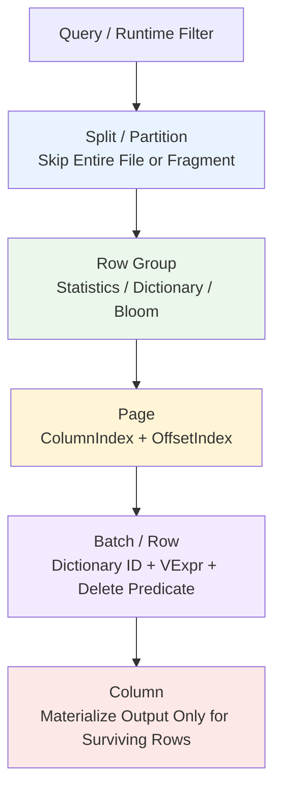

| Granularity | Input information | Main cost avoided | Conservative fallback |
| --- | --- | --- | --- |
| Split / Partition | Partition values, Runtime Filter range, scan byte range | Opening and reading an entire file or fragment | Retain the Split when uncertain |
| Row Group | Footer statistics, dictionary, Bloom filter | I/O and decoding for all column chunks in the group | Retain the Row Group when an index is missing or incompatible |
| Page | ColumnIndex min/max/null data and OffsetIndex | Page I/O, decompression, and decoding | Read the affected range when page indexes are incomplete |
| Row / Batch | Actual column values, dictionary IDs, residual conjuncts | Later predicate-column and output-column materialization | Evaluate full VExpr semantics |
| Column | SelectionVector | Reads, decoding, and memory writes for non-predicate columns | Read all projected columns sequentially when no filtering applies |

> **Key distinction:** Row Group and Page indexes generally eliminate impossible candidates; they
> do not produce final query results. Row-level predicates determine whether individual rows match.

## 6. Row Group Planning and Index Coordination

The Row Group Planner combines physical layout from the footer, the Split byte range, and predicate
index capabilities into an executable plan. The key property is a stable candidate-reduction order.

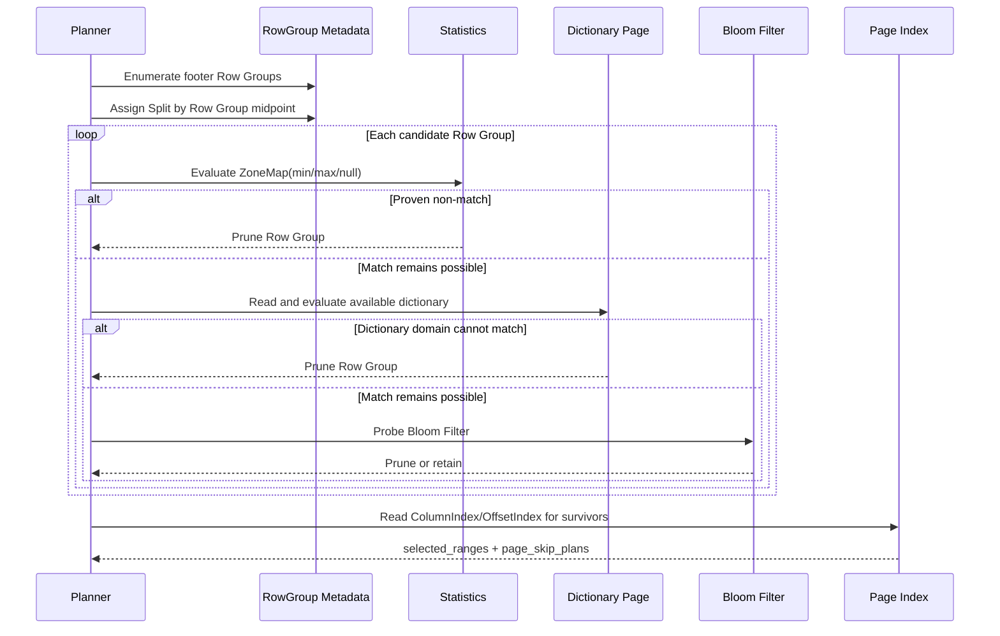

### Why this order is used

- **Statistics:** Usually already in the footer, making them the lowest-cost option for range and
  null semantics.
- **Dictionary:** Requires reading the dictionary page, but can prove a complete non-match for
  low-cardinality string columns.
- **Bloom:** Requires Bloom data I/O and is useful for negative membership tests. A positive result
  may be a false positive.
- **Page Index:** Builds page-level row ranges only for surviving Row Groups, avoiding index cost for
  groups already eliminated.

### How the plan drives physical skips

ColumnIndex provides min/max/null semantics for each page. OffsetIndex maps pages to Row Group row
numbers and file offsets. Candidate ranges from multiple predicate columns are intersected into
`selected_ranges`; a `page_skip_plan` is then built for each leaf so its column reader can skip pages
that do not overlap surviving rows.

> `selected_ranges` represents logical row ranges, while `page_skip_plan` represents physical page
> reads. Keeping them separate allows the scheduler to advance by row batch while each column skips
> according to its own page boundaries.

## 7. Batch Reads, Dictionary Filtering, and Lazy Materialization

Execution follows a filter-first, materialize-later strategy. The scheduler advances through
`selected_ranges`, asks column readers to skip gaps, and then reads the current batch.

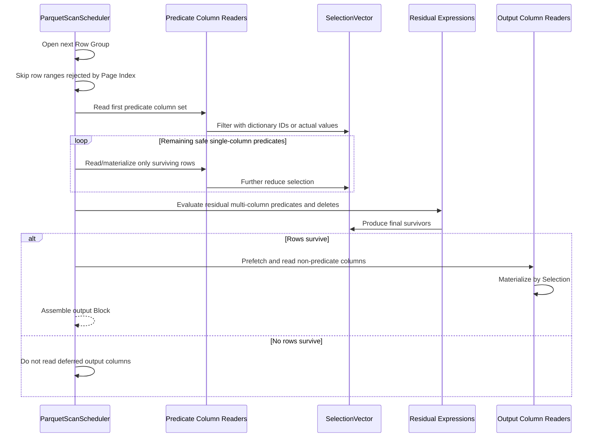

### Row-level dictionary filtering

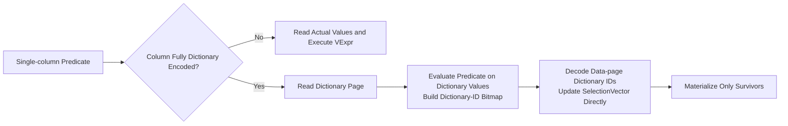

- Applies to non-repeated primitive, string-like BYTE_ARRAY / FIXED_LEN_BYTE_ARRAY columns whose
  complete Column Chunk uses dictionary data encoding.
- Safe AND subexpressions may remove components exactly covered by dictionary evaluation. OR or
  non-equivalent expressions are not rewritten aggressively.
- Stateful, potentially throwing, or whole-batch-sensitive expressions disable staged
  single-column scheduling and fall back to reading required columns before whole-expression
  evaluation.

> **Optimization loop:** The earlier SelectionVector shrinks, the fewer values later predicate and
> output columns must decode and copy. This is the main benefit of lazy materialization in a
> columnar format.

## 8. Supported Indexes and Their Boundaries

V2 uses native Parquet metadata and encoding information. It does not construct Doris-internal
storage indexes for external Parquet files.

| Capability | Granularity | Suitable predicates | Result property | Main limitations |
| --- | --- | --- | --- | --- |
| Footer Statistics / ZoneMap | Row Group | Ranges, comparisons, IS NULL/IS NOT NULL, and expressions safely convertible to ZoneMap | Can prove the entire group cannot match | Requires valid min/max/null_count and safe type conversion |
| Dictionary Pruning | Row Group | Single-column predicates exactly evaluable over the dictionary domain | Can prove the entire group cannot match | Low-cardinality string-like primitive with complete dictionary encoding |
| Parquet Bloom Filter | Row Group / Column Chunk | Equality and IN membership-negation predicates | Negative result can prune; positive result requires verification | Controlled by configuration; file must contain Bloom data; false positives are possible |
| ColumnIndex | Page | Predicates evaluable from min/max/null | Produces candidate pages and row ranges | Requires an index and decodable compatible types |
| OffsetIndex | Page → Row Range | Does not evaluate predicates directly | Maps page results to row numbers and physical skip plans | Normally used with ColumnIndex |
| Dictionary-ID Filter | Row / Batch | Safe single-column string-like predicates | Exact filtering of actual rows | Complete dictionary encoding and non-repeated primitive only |
| Condition Cache Bitmap | File-global granule | Stable cacheable conditions | Reuses previous filtering to reduce row ranges | Not a native Parquet index; uncovered ranges remain candidates |

### Index-selection overview

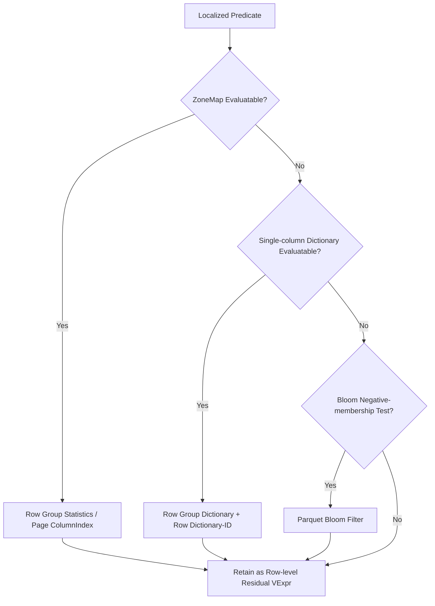

> Indexes are layered rather than mutually exclusive. An index may remove only ranges already
> proven impossible; residual predicates still guarantee final correctness.

## 9. Cache and I/O Optimization

Parquet V2 has four complementary cache and I/O paths: cache remote file blocks, cache serialized
Parquet ranges, cache predicate results, and merge small random reads.

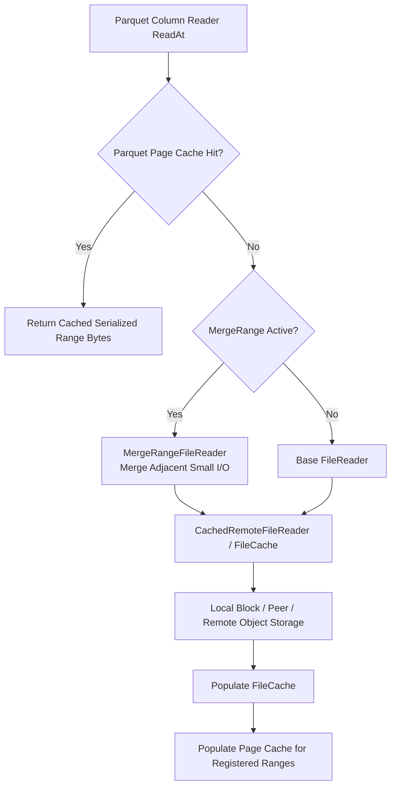

| Mechanism | Cached or optimized object | Lifecycle and key | Problem addressed |
| --- | --- | --- | --- |
| FileCache | Remote file blocks | Related to filesystem/path and file version; may hit locally or through a peer | Avoid repeated object-storage access and support background prefetch |
| Parquet Page Cache | Serialized bytes within registered Column Chunk ranges | Stable file key depends on path, mtime/version, and file size; disabled when mtime is unreliable | Reduce repeated page reads and support exact/subrange coverage |
| Condition Cache | Condition-surviving granule bitmap | Managed by condition and file-range context | Reuse filtering results before reading columns |
| MergeRangeFileReader | Not a cache; merges small ranges into larger slices | Installed temporarily for projected chunks of the current Row Group | Reduce remote small-I/O count and request overhead |

### Why Page Cache registers only surviving chunks

The footer is read before Row Group planning and before Page Cache ranges are registered, so
footer/metadata bytes never enter the Parquet Page Cache. After planning, only projected Column
Chunks from surviving Row Groups are registered, limiting pollution and key count.

### Relationship between prefetch and MergeRange

- When the base reader is CachedRemoteFileReader, predicate/output ranges for the current Row Group
  may be prefetched into FileCache.
- When average projected chunks are small and the reader is not in-memory, install
  MergeRangeFileReader so subsequent Arrow `ReadAt` calls actually use merged reads.
- With row-level filters, prefetch predicate columns first. Prefetch non-predicate columns only after
  at least one row survives, avoiding unnecessary bandwidth.

## 10. Other Key Optimizations

### 10.1 Condition Cache: Move Historical Filter Results Earlier

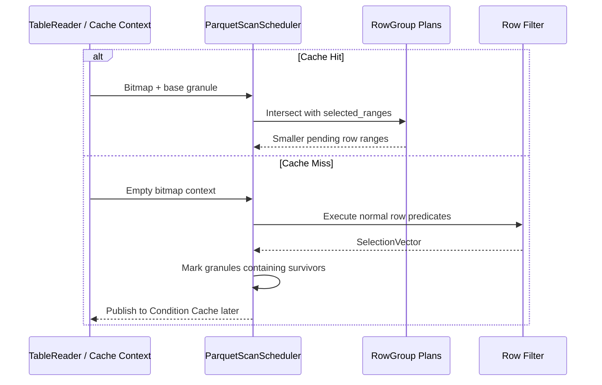

On a hit, only granules explicitly proven unnecessary by the bitmap are removed. Rows outside
bitmap coverage remain candidates. On a miss, granules containing surviving rows are marked,
trading granularity for reuse and smaller cache entries.

### 10.2 Adaptive Batches

FileScannerV2 uses a small probe batch to measure bytes per row in the final table Block. It derives
later batch rows from a target Block size, bounded by the system batch-size limit. Wide rows use
smaller batches to reduce memory peaks; narrow rows use larger batches for throughput.

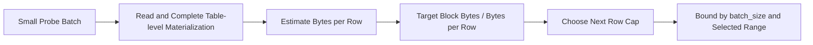

### 10.3 Aggregate Pushdown

When TableReader proves that no filter or delete semantics can change the result, COUNT / MIN / MAX
may use Parquet metadata to compute all or part of an aggregate without scanning data pages. This is
a metadata aggregation optimization and is distinct from Row Group index pruning.

### 10.4 Staged Prefetch

Without row-level filtering, output columns may be warmed together. With filtering, warm predicate
columns first and defer non-predicate columns until at least one row survives, aligning network
bandwidth with lazy materialization.

## 11. Correctness, Fallback, and Capability Boundaries

V2 follows a prove-before-skip rule. Missing indexes, unsupported types, expressions that cannot be
split safely, or read anomalies must never change query semantics.

> **Correctness baseline:** Index results only reduce candidate sets. Every expression not exactly
> covered remains a residual conjunct evaluated against actual data.

| Scenario | V2 behavior |
| --- | --- |
| Missing Statistics or unsafe min/max conversion | Treat the column's ZoneMap as unavailable and retain the Row Group/Page |
| Bloom missing, disabled, or unreadable | Skip Bloom pruning and continue with later scan stages |
| Incomplete dictionary page, mixed non-dictionary encoding, complex/repeated column | Disable dictionary pruning and Dictionary-ID Filter; use actual values |
| Missing or inconsistent ColumnIndex/OffsetIndex | Disable fine-grained page pruning and read the full candidate range |
| Multi-column, OR, stateful, or error-order-sensitive expression | Preserve whole-expression evaluation to avoid changing SQL short-circuit or error semantics |
| No stable file-version identity for Page Cache | Disable Parquet Page Cache to prevent stale-byte reads |
| Incomplete Condition Cache coverage | Retain and recompute uncovered ranges |

### Capability boundaries

- Parquet Reader uses indexes and encoding metadata already present in the file; it does not build
  new indexes for external files.
- Page boundaries and definition/repetition levels are more complex for nested/repeated columns, so
  some dictionary and page-level optimizations conservatively fall back.
- Bloom is probabilistic and is safe only for proving absence. A positive Bloom result is not a row
  match.
- Page Index benefit depends on whether the writer produced indexes, data ordering, and predicate
  selectivity.

## 12. Profile Observation and Troubleshooting

Troubleshoot in this order: verify planning effectiveness, row filtering, lazy materialization, and
then I/O/cache health. Total ScanTime alone does not identify the cause.

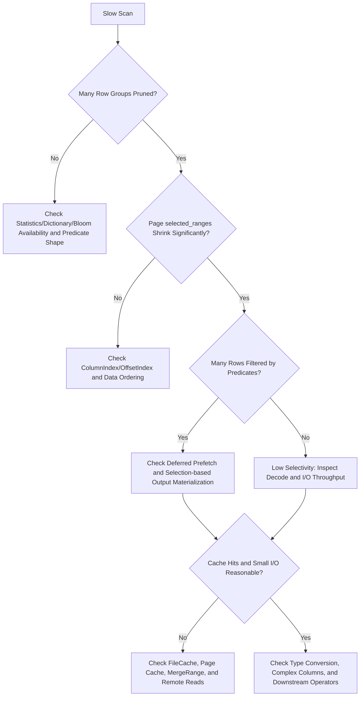

### Important metric families

| Metric family | Question answered |
| --- | --- |
| Row Group pruning | How many total Row Groups were pruned by Statistics/Dictionary/Bloom, and how much time did each stage take? |
| Page index pruning | How many indexes were checked, pages/rows were pruned, ranges selected, and pages skipped? |
| Dictionary row filter | How often were predicates rewritten, dictionaries read, bitmaps built, and attempts successful or rejected? |
| Predicate / raw rows | How many rows were read and rejected, and was lazy materialization worthwhile? |
| Parquet Page Cache | What were hit/miss/write counts and compressed/decompressed hit shapes? |
| FileCache Profile | How many local/peer/remote bytes, waits, downloads, and hits occurred? |
| Merge / request I/O | Were small reads merged, and were request count and read amplification reasonable? |
| Condition Cache | How many rows were skipped early after a cache hit? |

> Interpret pruning ratios in the context of write layout. Unsorted data produces wide min/max
> ranges, so Row Group/Page pruning may be ineffective even when the reader and indexes work
> correctly.

## 13. Summary

The FileScannerV2 Parquet scan pipeline has three primary threads:

1. **Semantic thread:** TableReader maps table schema and predicates into stable file-local
   semantics, preserving schema evolution, partition columns, and missing columns.
2. **Pruning thread:** Split → Row Group → Page → Row progressively applies Runtime Filters,
   Statistics, Dictionary, Bloom, Page Index, and actual-value filters.
3. **I/O thread:** Predicate-first reads, SelectionVector, lazy materialization, adaptive batches,
   FileCache/Page Cache/Condition Cache, and MergeRange reduce read amplification together.

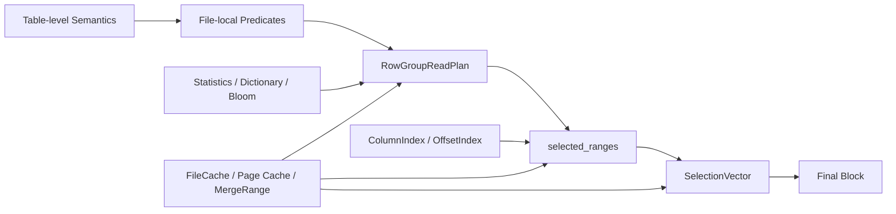

> **Final design criterion:** V2 turns format knowledge into an explicit scan plan and requires the
> executor to perform only the minimum necessary reads. Indexes safely reduce candidates, caches
> reuse cost, and lazy materialization avoids reading irrelevant columns for rejected rows.

This document reflects the current code pipeline and is intended as a common reference for
architecture reviews, performance analysis, and Profile troubleshooting.
