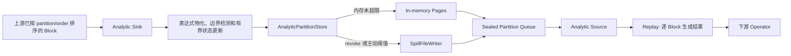
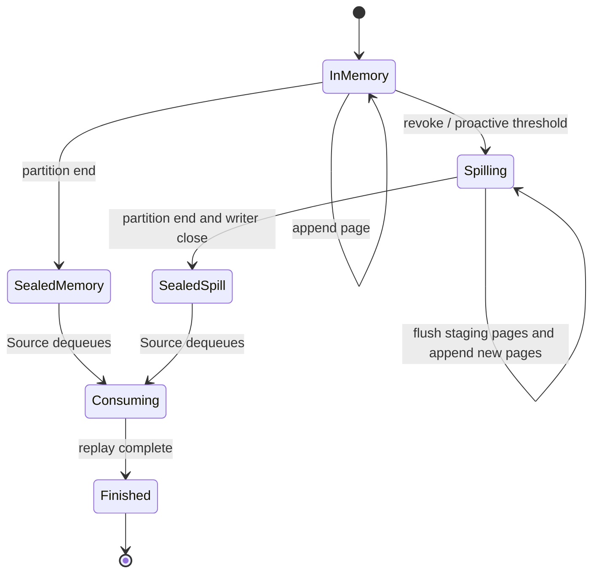

# Window Function 非流式窗口 Spill 开发方案

> **核心结论：**第一阶段只为“必须等到整个 partition 结束后才能产生结果”的窗口计算提供
> spill。能够在输入过程中持续产出结果、且工作集大小不随 partition 总行数增长的流式窗口，
> 不进入 spill 路径，继续使用现有内存执行器。

## 1. 背景

当前 Analytic Operator 会保留原始输入 Block，同时把窗口函数参数、`PARTITION BY`、
`ORDER BY` 以及 RANGE 边界表达式的结果追加到累计 Column 中。对于非流式窗口，只有发现
partition 结束后才能开始计算和输出，因此当前 partition 的数据不能提前释放。

当以下任一场景形成超大 partition 时，内存占用会随 partition 大小线性增长，并可能触发
OOM：

- 没有 `PARTITION BY`，全部输入属于同一个 partition；
- `PARTITION BY` 数据严重倾斜；
- frame 覆盖整个 partition，例如
  `ROWS/RANGE BETWEEN UNBOUNDED PRECEDING AND UNBOUNDED FOLLOWING`；
- `ntile`、`percent_rank`、`cume_dist` 等函数需要先获得 partition 行数或 peer group
  完整信息。

现有 Analytic Operator 没有实现 `revocable_mem_size()` 和 `revoke_memory()`，也没有设置
`_spillable`。因此 `enable_spill` 打开后，内存仲裁器仍然不能回收 Analytic Operator 占用的
partition 数据。

Doris 已具备可复用的 spill 基础设施：

- `SpillFile` / `SpillFileWriter` / `SpillFileReader` 支持 Block 序列化、分片文件、顺序读取和
  按 Block 索引 seek；
- Pipeline Operator 已有 revocable memory 和 revoke 回调；
- Sort、Aggregation、Hash Join 已提供 spill 的 Profile、文件生命周期和错误处理范例；
- `enable_spill`、`enable_force_spill`、`min_revocable_mem` 和
  `spill_buffer_size_bytes` 可以直接复用。

## 2. 术语和范围

### 2.1 流式与非流式的定义

本方案不直接以当前实现中的 `_streaming_mode` 布尔值作为 spill 判定条件，而使用更明确的
执行属性：

- **流式窗口：**在 partition 尚未结束时即可持续输出，并且所需历史数据由固定 frame、
  固定 look-ahead 或常量状态界定，不随 partition 总行数增长。
- **非流式窗口：**在 partition 结束前不能产生当前 partition 的正确结果，必须保留或重放
  partition 数据。

当前 `_streaming_mode` 更接近“是否可以在 partition 结束前输出”。它不必然代表严格的常量
内存，例如很大的 `ROWS N FOLLOWING` 或跨越大量行的 peer group 仍可能保留较多数据。这类
问题属于流式执行器的工作集优化，不纳入第一阶段 window spill。

### 2.2 第一阶段范围

第一阶段仅处理满足以下全部条件的 Analytic Node：

1. `enable_spill = true`；
2. 窗口执行需要等待完整 partition；
3. Node 中每个窗口函数都声明了明确的 spill capability；
4. spill 算法能够在有限内存内通过一次顺序收集和一次重放完成，并保持现有结果语义。

首期支持矩阵：

| 类别 | 首期函数/Frame | 执行方法 |
| --- | --- | --- |
| 整个 partition 的归约 | `sum`/`sum0`、`count`、定长状态的 `min`/`max`、`avg`，Frame 为 `UNBOUNDED PRECEDING ... UNBOUNDED FOLLOWING` | Sink 收集时按原始顺序得到最终状态，重放时向每行填充同一结果 |
| 依赖 partition 行数 | `ntile` | partition seal 时已知总行数，重放时按全局行号计算 bucket |
| 依赖 partition 行数和 peer group | `percent_rank`、`cume_dist` | Sink 收集时生成可流式读取的 peer group 元数据，重放时计算结果 |

同一个 Analytic Node 中存在任一不支持的函数时，首期整个 Node 回退到现有内存路径，不进行
部分函数 spill，避免一份 partition 同时由两套生命周期管理。

### 2.3 非目标

第一阶段明确不处理：

- 已经可以稳定流式执行的窗口；
- 任意 RANGE offset frame；
- `lead`、`lag`、`first_value`、`last_value`、`nth_value` 的通用 spill；
- Java/Python UDAF 和没有声明 spill capability 的聚合函数；
- 通过序列化并 merge 多个部分聚合状态来实现通用窗口 spill；
- 需要从 Arena 持续分配替换值的变长 `min`/`max` 状态；
- 对一个 partition 做并行归约或改变输入行的累计顺序；
- 将整个已 spill partition 一次性重新加载到内存。

这些限制必须反映在 Profile 中。遇到不支持的函数时不能宣称窗口已经获得 spill 保护。

## 3. 设计目标

### 3.1 功能目标

- 超大非流式 partition 的输入数据可以被回收并落盘；
- spill 前后结果与现有内存执行逐行一致；
- 支持在 partition 中途收到 revoke 请求，后续数据直接追加到同一个逻辑 spill 文件；
- 支持一个输入 Block 内包含多个 partition 边界；
- Source 按原始顺序、按 Block 输出，不把完整 partition 恢复到内存；
- spill 文件在正常完成、失败、取消和 Local State 提前关闭时都能回收。

### 3.2 资源目标

对于已经 spill 的 partition，峰值内存只由以下有界工作集构成：

- 一个写入 staging buffer；
- 一个读取 Block；
- 一个输出 Block；
- 有界窗口状态；
- 有界 peer group 元数据 buffer。

内存上界不能再与 partition 总行数相关。`revocable_mem_size()` 只能上报 revoke 后确实能够释放
的字节，不能把不可回收的函数状态或正在被 Source 使用的 Block 计入其中。

### 3.3 兼容性目标

- `enable_spill = false` 时完全保留现有执行路径；
- 流式窗口完全保留现有执行路径；
- 不支持 spill 的非流式函数保持现有行为；
- 不新增 FE 规划语义，不改变排序、partition 分布和窗口结果类型；
- Block 边界允许变化，但行顺序、行数、值、NULL 语义和浮点结果必须保持一致。

## 4. 总体架构

### 4.1 执行路径选择

Analytic Operator 在初始化完成后构造一组不可变的 spill capability 信息。该信息包含：

- 窗口是否需要完整 partition；
- 每个函数的 spill strategy；
- 窗口参数的标量值；
- 结果类型和 nullable 转换信息。

执行路径选择如下：

```text
enable_spill = false                         -> 现有 Analytic 路径
窗口可流式执行                              -> 现有 Analytic 路径
非流式，但任一函数不支持 spill              -> 现有 Analytic 路径
非流式，且全部函数支持 spill                -> Partition Store + Spill Evaluator 路径
```

不要继续扩大 `PARTITION_FUNCTION_SET` 这类按函数名维护的分支。应在聚合函数接口中增加默认
为“不支持”的 capability，由具体函数或 nullable adapter 显式声明，避免 Operator 根据字符串
推断函数语义。

建议的 capability 形态：

```cpp
enum class WindowSpillStrategy {
    UNSUPPORTED,
    PARTITION_REDUCE,
    PARTITION_CARDINALITY,
    PEER_GROUP,
};
```

capability 只说明函数访问模式。最终是否可 spill 还必须结合 frame 类型判断。例如 `sum` 只在
首期支持整个 partition 的 frame，不因此获得任意滑动 frame 的 spill 能力。

### 4.2 Sink 和 Source 职责



**Sink 负责：**

- 只计算一次窗口参数、partition key 和 order key；
- 检测 partition 边界；
- 按原始行顺序更新有界归约状态，并生成 peer group end 元数据；
- 将原始输出列写入 `AnalyticPartitionStore`；
- 响应内存 revoke，将当前 partition 的内存页写入 spill 文件并真实释放容量；
- partition 结束后关闭 writer，发布不可变的 partition descriptor。

**Source 负责：**

- 按队列顺序获取 sealed partition；
- 从 descriptor 读取最终归约值、partition 行数和 peer group 元数据；
- 按原始顺序重放输入；
- 每次 `get_block()` 最多向下游返回一个输出 Block；
- 在 partition 消费完成后释放内存页、reader 和 `SpillFileSPtr`。

Sink 在每次 `sink()` 调用中只顺序处理当前输入 Block，不会因超大 partition 长时间占用一次
调度；Source 负责按需重放，可以直接利用下游拉取形成反压，不需要 Sink 一次性产生整个
partition 的结果 Block，也避免现有按 Block 数量缓存输出时无法精确控制字节数的问题。

### 4.3 Shared State

`AnalyticSharedState` 在 spill 路径中增加：

- 一个按输入顺序排列的 sealed partition descriptor 队列；
- 队列锁和 Sink/Source dependency；
- Sink EOS 状态；
- Sink/Source 共用的 spill execution mode 标记。

执行错误继续通过 Operator 的 `Status` 和 pipeline cancellation 传播，不在 Shared State 中维护
第二套错误状态。队列只允许一个 Sink 调用产生的批次滞留，因此首版也不额外维护队列字节数。

首期通常只允许一个 `sink()` 调用产生的 descriptor 批次处于队列中。一个输入 Block 内可能
包含多个 partition，因此该批次可以包含多个 descriptor，但其内存总量受单个输入 Block 和
主动阈值约束。Source 清空队列后才唤醒 Sink。已经 spill 的 descriptor 仅持有文件句柄，不
保留完整输入数据。

descriptor 发布后不可修改。Sink 必须先关闭 `SpillFileWriter`，再将 descriptor 放入队列；
Source 不得读取仍有 active writer 的 `SpillFile`。

## 5. AnalyticPartitionStore

### 5.1 原始 Block 与旁路状态

存储 Block 只保留上游原始输出列：

```text
[原始输出列]
```

窗口参数、partition key 和 order key 在当前输入 Block 上临时物化。partition key 只用于
Sink 检测边界；order key 只用于增量检测 peer group；`ntile` 的常量参数在 partition 开始时
保存为标量。临时列不会进入 spill Block，也不会泄漏给下游。

### 5.2 partition 边界

上游已经保证 partition/order 排序。Sink 复用现有 Column 比较语义检测相邻行是否属于同一
partition，并保留上一批最后一行的 key 作为跨 Block 比较基准。

一个输入 Block 可以被切分成多个 row range：

1. 当前 partition 的尾部 range 追加到当前 Store；
2. seal 当前 partition；
3. 为下一个 partition 创建 Store；
4. 继续处理 Block 中剩余 range。

切分必须保持 NULL、字符串、Decimal、复杂类型和 nullable wrapper 的现有比较语义。不能为
spill 重新实现一套相等判断。

### 5.3 内存和磁盘状态

Store 的状态机：



一个已 spill partition 首期对应一个逻辑 `SpillFile`。`SpillFileWriter` 可以在物理文件达到
阈值后自动生成多个 part，因此不会产生单个无限大的物理文件。writer 在 partition 中途
revoke 后保持打开；后续输入按 `spill_buffer_size_bytes` 聚合成小批次继续写入，在 partition
结束时统一 close。

首期不把多个小 partition 合并到同一个逻辑 spill 文件：超过主动阈值、被内存仲裁器 revoke，
或 seal 时仍大于 `spill_min_revocable_mem` 的 partition 会落盘，避免发布后失去 revoke 入口。
后续根据 `SpilledPartitions` 和
文件数指标决定是否增加多 partition run。

## 6. Spill 触发和内存回收

### 6.1 Operator 接口

仅 spill-eligible 的非流式路径设置 `_spillable = true`，并实现：

- `revocable_mem_size()`：返回当前 partition 内存页和可释放 staging page 的实际 allocated
  bytes；低于 `spill_min_revocable_mem()` 时返回 0；
- `revoke_memory()`：创建 writer、写出当前所有页、清空页容器并释放 Column capacity；
- `get_reserve_mem_size()`：包含下一批表达式物化、Block 切分和 spill 序列化所需的峰值临时
  内存。

`revoke_memory()` 返回成功后，相关 revocable bytes 必须接近 0。只把计数器减为 0、但保留
Column capacity 或仍被共享指针持有，不算完成内存回收。

### 6.2 主动阈值

建议新增与 Sort/Aggregation 对齐的查询选项：

```text
spill_analytic_sink_mem_limit_bytes
```

默认值 64 MB，并限制在 1 MB 到 4 GB。行为如下：

- 第一次 spill 前，内存仲裁器可以通过 `revoke_memory()` 触发 spill；
- 当前 partition 超过主动阈值时，Sink 主动触发 spill，避免在无全局压力时仍无限增长；
- partition 已经进入 spill 状态后，staging bytes 达到 `spill_buffer_size_bytes` 即写盘；
- `enable_force_spill` 用于测试强制覆盖 spill 分支，不新增测试专用用户语义。

### 6.3 峰值内存模型

假设主动阈值为 `L`、spill buffer 为 `B`、执行 Block 最大内存为 `R`，一个并行实例的主要
上界为：

```text
未 spill 且 Sink/Source 并行：约 2 * L + O(R)
已 spill：约 2 * B + O(R + bounded function state)
```

实际实现需要用 MemTracker/Profile 验证，而不能只根据容器的逻辑行数推算。若单个上游
Block 已大于 `B`，写入前应按 row range 切成接近 `B` 的子 Block，避免序列化时同时保留超大
Block、PBlock 和压缩 buffer。

## 7. 分函数执行算法

### 7.1 整个 partition 的归约

适用：`sum`/`sum0`、`count`、定长状态的 `min`/`max`、`avg`，且 frame 为整个 partition。

执行过程：

1. Sink 为每个函数维护一个跨 Block 的聚合状态；
2. 每批按原始行顺序更新状态，同时将原始输出列写入 partition store；
3. partition seal 时取得最终值并写入不可变 descriptor；
4. Source 重放原始列，并将最终值填充到该 Block 的每一行。

不能把 partition 划分为多个部分状态后再 merge。特别是浮点 `sum`/`avg`，merge 会改变加法
顺序和舍入结果。首期必须保持与现有 `add_range_single_place()` 相同的逐行累计顺序，并为
浮点、Decimal 和 nullable 输入增加精确结果对照测试。

函数只有在满足以下条件时才能声明 `PARTITION_REDUCE`：

- 状态大小有界，或状态自身另有经过验证的 spill 实现；
- 分 Block 顺序更新与当前整列更新语义完全一致；
- 重复读取最终状态不会破坏状态；
- NULL 和空 partition 行为与现有窗口实现一致。

`collect_list`、精确 distinct、可能随输入增长的 percentile 状态等不能因为支持
serialize/merge 就自动加入该能力。

变长 `min`/`max` 的现有单值状态在每次出现更优值时从 Arena 分配新空间，旧空间在 partition
结束前不能回收，因此首版不声明该能力；后续只有在实现状态 compact/rebase 后才能开放。

### 7.2 `ntile`

partition seal 时 descriptor 已记录总行数 `N`。Source 重放时维护从 0 开始的全局行号，按
现有大 bucket/小 bucket 公式计算结果。bucket 参数必须沿用现有常量参数检查和 NULL 语义，
不能在 spill 路径增加新的隐式转换。

`ntile` 不需要额外预扫描输入内容；若 descriptor 已有准确行数，可以直接进入 Replay。

### 7.3 `percent_rank` 和 `cume_dist`

两个函数同时依赖 partition 总行数和完整 peer group。为避免一个超大 peer group 本身造成
内存增长，不能在 Source 中缓存整个 group。

Sink 收集阶段顺序比较 order key，并生成紧凑的 peer group 元数据：

```text
PeerGroupEnd = end_row
```

元数据先在一个有界 buffer 中累计，达到 `spill_buffer_size_bytes` 后写入辅助 `SpillFile`。
Replay 阶段同时顺序读取输入 Block 和 `PeerGroupEnd`，当前 group 的 start 由上一 group 的 end
推导：

- `percent_rank = (rank - 1) / (partition_rows - 1)`，单行 partition 返回 0；
- `cume_dist = peer_group_end / partition_rows`；
- 一个 group 跨越多个输入 Block 时复用同一组计算结果，不缓存 group 的所有原始行。

如果一个 Node 同时包含 `percent_rank` 和 `cume_dist`，两者共享同一份 peer group 元数据。

### 7.4 后续函数

第二阶段可增加：

- 整个 partition frame 下的 `first_value`、`last_value`、`nth_value`：预扫描定位目标值，重放
  时填充；必须覆盖 `IGNORE NULLS`、负 offset 和 nullable 默认值；
- 需要固定 look-ahead 的函数：优先完善流式有界 ring buffer，而不是引入 partition spill；
- 通用 UDAF：只有在定义了状态大小、序列化、merge 顺序以及 bit-exact 要求后才能支持。

## 8. Source 协作式执行与反压

归约和 peer group 检测随 Sink 输入 Block 增量完成，因此 Source 不需要在一次 `get_block()`
中同步预扫描完整文件。Source 使用以下状态：

```text
WAIT_PARTITION -> OPEN_READER -> REPLAY -> FINISH_PARTITION
```

- Sink 每次调用只处理当前输入 Block；
- REPLAY 每次最多返回一个输出 Block；
- Source 取走 descriptor 后通知 Sink 可以继续写入队列；
- descriptor 队列已满时 Sink dependency 进入 blocked；
- Sink EOS 且队列和当前 Source partition 都为空时，Source 才返回最终 EOS。

该模型同时解决 CPU 调度公平性、输出反压和结果 Block 大量堆积的问题，也避免了同一
partition 的二次预扫描 I/O。

## 9. 正确性、错误和生命周期

### 9.1 正确性不变量

- 每个输入行只属于一个 partition descriptor；
- descriptor 的 row count 等于其所有 Block 的行数之和；
- SpillFile 中 Block 顺序与上游输入顺序一致；
- 任何结果输出前，当前 partition 的有界状态和 peer group 元数据已经封存；
- 输出只保留原始列并追加窗口结果，隐藏列不得泄漏到下游；
- 所有函数结果列行数必须与输出 Block 行数一致；
- nullable 包装和 `_change_to_nullable_flags` 与现有路径一致；
- 浮点归约不改变输入累计顺序；
- 一个 Analytic Node 内的多个函数共享同一 partition 行号和边界。

### 9.2 错误处理

- spill 目录容量不足、序列化失败、写入失败、读取失败和元数据损坏直接返回错误；
- 已经开始 spill 后不能静默回退到内存路径；
- 内部状态不变量使用 `DORIS_CHECK`/`DCHECK`，I/O 和用户数据错误使用 `Status`；
- Source 或 Sink 任一侧失败后必须唤醒另一侧，避免 dependency 永久阻塞；
- cancellation 在写盘循环、Sink 增量计算循环和重放循环中都要检查。

### 9.3 文件生命周期

- active writer 只由 Sink Store 持有；
- sealed descriptor 持有 `SpillFileSPtr`；
- Source 完成 partition 后释放最后一个引用，由 `SpillFile` 负责 GC；
- Shared State close 时清空尚未消费的 descriptor；
- writer close 失败时仍需释放引用，并依靠 QueryContext 的 spill 目录清理兜底；
- fault injection 测试必须验证失败和取消后没有遗留 query spill 目录。

## 10. Profile 和可观测性

复用通用 spill counters：

- `SpillWriteFileTime`
- `SpillWriteSerializeBlockTime`
- `SpillWriteBlockCount`
- `SpillWriteBlockBytes`
- `SpillWriteRows`
- `SpillWriteFileBytes`
- `SpillReadFileTime`
- `SpillReadDeserializeBlockTime`
- `SpillReadBlockCount`
- `SpillReadRows`

Analytic 额外增加：

| Counter/Info | 含义 |
| --- | --- |
| `WindowSpillMode` | `Disabled`、`Streaming`、`Unsupported`、`Eligible`、`Spilled` |
| `WindowSpillUnsupportedReason` | frame 或首个不支持函数的原因 |
| `SpilledPartitions` | 实际落盘的 partition 数 |
| `InMemoryPartitions` | 未落盘、直接交给 Source 的 partition 数 |
| `MaxPartitionRows` | 最大 partition 行数 |
| `PeakPartitionBufferedBytes` | Sink 当前 partition 的内存峰值 |
| `PartitionReplayTime` | Source 重放和结果生成耗时 |
| `PeerGroupMetadataBytes` | peer group 辅助元数据字节数 |

测试和线上诊断必须同时观察 `SpillWriteRows/Bytes` 与 Operator 内存峰值。仅出现 spill counter，
但内存没有实际下降，不能视为功能完成。

## 11. 代码改动规划

### 11.1 BE Operator

主要修改：

- `be/src/exec/operator/analytic_sink_operator.h/.cpp`
  - 选择 spill execution mode；
  - 物化临时表达式列并检测 partition 边界；
  - 实现 revocable memory、主动 spill 和 descriptor 发布。
- `be/src/exec/operator/analytic_source_operator.h/.cpp`
  - 增加 partition reader/REPLAY 状态；
  - 按需读取内存页或 SpillFile；
  - 逐 Block 构造结果。
- `be/src/exec/pipeline/dependency.h`
  - 为 `AnalyticSharedState` 增加 sealed partition 队列和生命周期状态。

建议新增独立组件，避免继续扩大 Sink Local State：

- `be/src/exec/operator/analytic_spill.h/.cpp`
  - partition page、descriptor、writer 和 memory accounting。

现有流式和不支持 spill 的分支仍调用当前 `_add_input_block()` / `_execute_impl()`，避免首期
重写稳定路径。

### 11.2 Aggregate Function capability

修改：

- `be/src/exprs/aggregate/aggregate_function.h`
  - 增加默认 `UNSUPPORTED` 的 window spill capability；
- `sum`、`count`、`min/max`、`avg` 和 window function 实现文件
  - 显式声明支持的 strategy；
- nullable aggregate adapter
  - 仅在 nested function capability 和 wrapper 语义都满足时转发能力。

capability 接口属于 hub header 变更。实现时应优先使用前置声明或轻量 enum，运行
`check-build-hygiene.sh`，并检查 include closure/reach budget，不能为方便直接引入重量级
spill/operator header。

### 11.3 Query option

如果采用独立主动阈值，需要修改：

- `gensrc/thrift/PaloInternalService.thrift`
- `fe/fe-core/src/main/java/org/apache/doris/qe/SessionVariable.java`
- `be/src/runtime/runtime_state.h`

变量命名和 clamp 规则与现有 sort/aggregation spill sink memory limit 保持一致。

## 12. 分阶段开发计划

### 阶段 A：基础抽象和不落盘等价性

1. 增加函数 capability 和 Operator 侧 strategy 信息；
2. 实现窗口表达式的临时物化和旁路状态；
3. 实现 `AnalyticPartitionStore` 的纯内存模式和跨 Block partition 切分；
4. 实现 Sink 有界状态收集和 Source REPLAY，但暂不启用磁盘写入；
5. 用现有内存路径做 differential test，确认结果和行顺序一致。

完成标准：支持矩阵内所有 case 在新路径和旧路径逐行一致，且流式/不支持函数没有进入新
路径。

### 阶段 B：Spill 存储和内存回收

1. 接入 `SpillFileWriter/Reader`；
2. 实现 `revocable_mem_size()`、`revoke_memory()` 和主动阈值；
3. 支持 partition 中途 spill、后续直写和 partition seal；
4. 实现 descriptor 队列、dependency、EOS、取消和错误传播；
5. 增加 Profile 和 fault injection。

完成标准：强制 spill 后结果一致，revoke 后实际 tracked memory 明显下降，超大单 partition 的
峰值内存不再随行数增长。

### 阶段 C：partition-size 和 peer-group 函数

1. 实现 `ntile` 的直接 Replay；
2. 实现 peer group 增量检测和有界元数据 spill；
3. 实现 `percent_rank`、`cume_dist`；
4. 覆盖 peer group 跨 Block、单个超大 peer group 和 NULL order key。

完成标准：peer group 元数据本身也不会造成 OOM，多个相关函数共享一次增量检测结果。

### 阶段 D：扩展与优化

按收益和风险评估后再进行：

- `first_value`、`last_value`、`nth_value`；
- 多 partition spill run，减少逻辑文件数量；
- 表达式结果去重和更精确的 byte-based batch sizing；
- peer group 元数据编码压缩；
- 对流式大 look-ahead/大 peer group 使用独立的有界 buffer 方案。

## 13. 测试方案

### 13.1 BE Unit Test

在 `be/test/exec/operator/analytic_sink_operator_test.cpp` 基础上补充，必要时新增
`analytic_spill_operator_test.cpp`：

- 单个超大 partition，中途一次和多次 revoke；
- 无 `PARTITION BY`；
- 一个 Block 内多个 partition；
- partition 边界跨 Block；
- 高基数小 partition 和严重倾斜 partition；
- 内存 partition 与 spill partition 交替；
- nullable、全 NULL、String、Decimal 和宽列；
- 浮点 `sum/avg` 与旧路径 bit-exact 对比；
- 多个函数混合以及一个不支持函数导致整体回退；
- `ntile` 的 bucket 数大于、等于、小于 partition 行数；
- `percent_rank/cume_dist` 的单行 partition、全部同 key、每行不同 key、peer group 跨 Block；
- revoke 后 `revocable_mem_size()` 和 MemTracker 实际下降；
- Source 每次调用最多返回一个 Block，Sink 跨输入 Block 保持有界状态；
- 写入、close、读取、反序列化和 GC fault injection；
- cancellation、early close 和 descriptor 尚未消费时的文件清理。

### 13.2 Regression Test

在 `regression-test/suites/spill_p0` 下增加独立 suite：

- 同一组 SQL 分别以 spill 关闭和强制 spill 执行，使用 `order_qt` 生成确定结果；
- 整个 partition frame 的聚合窗口；
- `ntile`、`percent_rank`、`cume_dist`；
- 无 partition、大 partition、多个 partition 和倾斜数据；
- 多窗口函数同 Node；
- 验证流式窗口结果不变且没有产生 window spill 文件；
- 验证不支持函数使用旧路径，并在 Profile 中给出原因。

预期输出必须由回归脚本生成，不手写 `.out`。

### 13.3 压力和性能验证

- 固定单行宽度，逐步把 partition 从 10 万行扩大到 1 亿行；
- 记录 Operator peak memory、Query peak memory、spill bytes、spill throughput 和总耗时；
- 证明 spill 模式峰值内存趋于稳定，而不是仅延后 OOM；
- 对小 partition 比较 `enable_spill=false/true`，确认 capability 检查和新路径没有不可接受的
  固定开销；
- 对浮点归约比较原始二进制结果，不使用 epsilon 掩盖舍入差异。

## 14. 验证命令

实现阶段至少执行：

```shell
build-support/clang-format.sh
build-support/check-format.sh
build-support/check-build-hygiene.sh
./build.sh --be
./run-be-ut.sh --run Analytic
./run-regression-test.sh -d spill_p0 -s window_function_spill
build-support/run-clang-tidy.sh
git diff --check
```

具体 BE UT filter 以最终测试 binary/test suite 名称为准。涉及 Header、include 或新增测试源文件
时，必须在编译前先运行 build hygiene 检查。

## 15. 风险和决策点

| 风险 | 处理原则 |
| --- | --- |
| 通用聚合状态可能随 partition 增长 | capability 默认关闭，只允许证明状态有界的函数加入 |
| 浮点 partial merge 改变结果 | 不做 partial merge，保持原始行顺序单状态累计 |
| peer group 元数据数量达到 O(N) | 元数据也使用有界 buffer 和 SpillFile |
| 超大 partition 计算长时间占用线程 | 计算随上游 Block 增量完成，每次 `sink()` 不跨越当前 Block |
| 单个输入 Block 过大导致序列化峰值 | 写入前按目标字节切分 row range，并计入 reserve memory |
| 输出和 Sink 并发导致多份 partition 驻留 | descriptor 按输入 Block 批次反压，采用 byte-based accounting |
| spill 文件过多 | 首期只 spill 大 partition；用指标决定是否实现 multi-partition run |
| 新路径与旧路径 NULL/类型语义不同 | 复用现有函数实现和比较逻辑，强制 differential test |
| unsupported fallback 仍可能 OOM | Profile 明确原因，不把 fallback 误报为已支持 spill |

## 16. 验收标准

第一阶段可以合入的最低条件：

1. `enable_spill=false`、流式窗口和 unsupported 窗口保持原执行路径；
2. 支持矩阵中的窗口在强制 spill 和不 spill 时结果逐行一致；
3. 一个远大于内存阈值的单 partition 查询能够完成，不再因保留完整 partition OOM；
4. 实测峰值内存受配置阈值和 spill buffer 控制，不随 partition 行数线性增长；
5. `SpillWriteRows/Bytes`、`SpilledPartitions` 和内存计数互相一致；
6. 中途 revoke、多次 revoke、取消和 I/O 失败均不会死锁或遗留 spill 文件；
7. 浮点结果 bit-exact，NULL、Decimal、定长 `min/max` 和跨 Block peer group 测试通过；
8. BE build、focused UT、spill regression、format、build hygiene 和 clang-tidy 全部通过。
