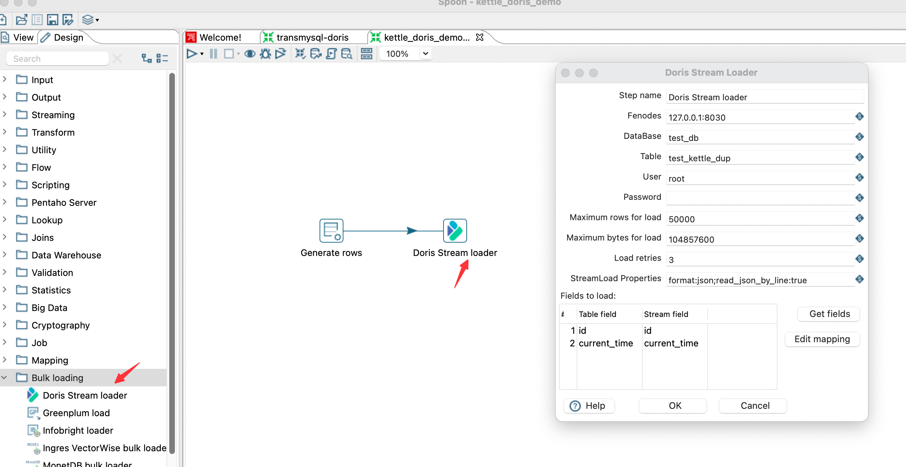
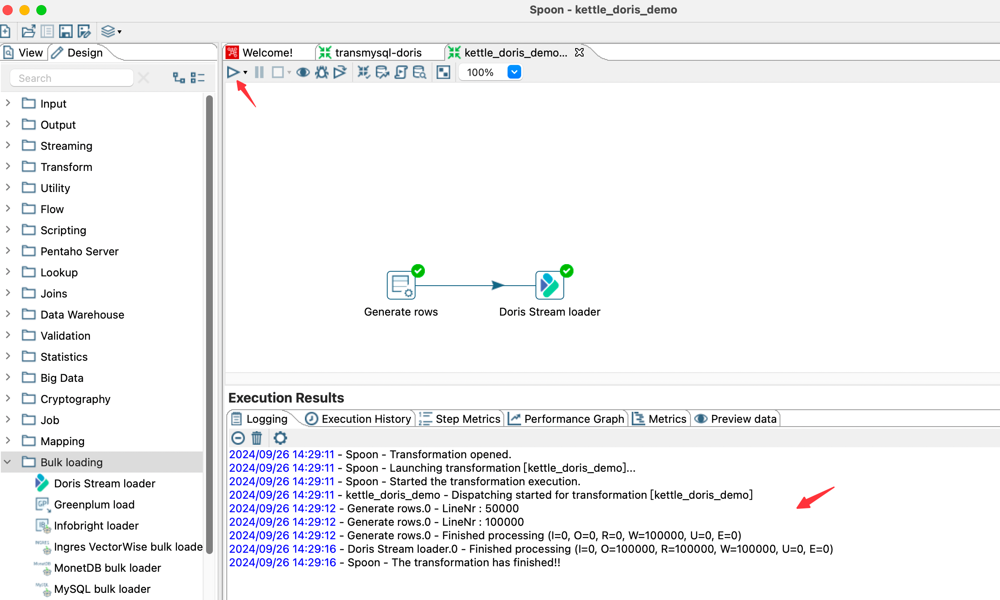

# kettle-plugin

1. Download and install kettle
Download: https://pentaho.com/download/#download-pentaho

After downloading, unzip it and run spoon.sh to start kettle.

You can also compile it yourself, refer to the [compilation section](https://github.com/pentaho/pentaho-kettle?tab=readme-ov-file#how-to-build)

2. Compile doris stream load plugin
```shell
cd doris/extension/kettle
mvn clean package -DskipTests
```
After the compilation is complete, unzip the plugin package and copy it to the plugins directory of kettle
```shell
cd assemblies/plugin/target
unzip doris-stream-loader-plugins-9.4.0.0-343.zip 
cp -r doris-stream-loader ${KETTLE_HOME}/plugins/
mvn clean package -DskipTests
```
3. Build job
Find Doris Stream Loader in Batch Loading in Kettle and build the job


4. Click Start to run the job to complete data synchronization


5. Configuration

| Key                           | Default Value  | Required | Comment                                                                 |
|-------------------------------|----------------| -------- |-------------------------------------------------------------------------|
| Step name                     | --             | Y        | Step name                                                               |
| fenodes                       | --             | Y        | Doris FE http address, supports multiple addresses, separated by commas |
| DataBase                      | --             | Y        | Doris's write database                                                  |
| Table                         | --             | Y        | Doris's write table                                                     |
| User                          | --             | Y        | Username to access Doris                                                |
| Password                      | --             | N        | Password to access Doris                                                |
| Maximum rows for load | 10000          | N        | Maximum number of rows to load at a time                                |
| Maximum bytes for load | 10485760(10MB) | N        | Maximum size in bytes of a single load                                  |
| Load retries                  | 3              | N        | Number of retries after load failure                                    |
| StreamLoad Properties         | --             | N        | Streamload http header for request                                      |
