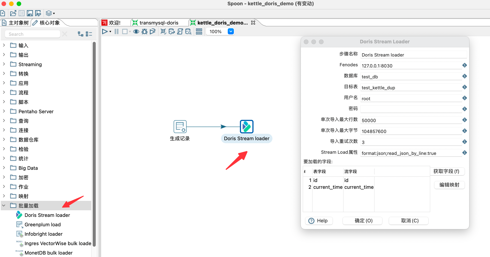
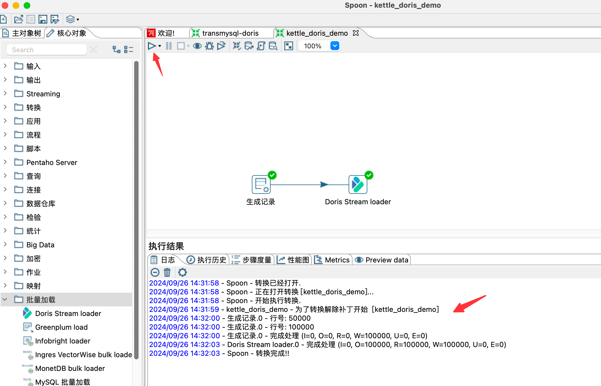

# kettle-plugin

1. 下载安装kettle
下载地址： https://pentaho.com/download/#download-pentaho

下载后解压，运行spoon.sh即可启动kettle

也可以自行编译，参考[编译章节](https://github.com/pentaho/pentaho-kettle?tab=readme-ov-file#how-to-build)

2. 编译Doris的stream load插件
```shell
cd doris/extension/kettle
mvn clean package -DskipTests
```
编译完成后，将插件包解压后拷贝到kettle的plugins目录下
```shell
cd assemblies/plugin/target
unzip doris-stream-loader-plugins-9.4.0.0-343.zip 
cp -r doris-stream-loader ${KETTLE_HOME}/plugins/
mvn clean package -DskipTests
```
3. 构建作业
在Kettle中的批量加载中找到Doris Stream Loader，构建作业


4. 点击开始运行作业即可完成数据同步


5. 参数说明

| Key          | Default Value  | Required | Comment                        |
|--------------|----------------| -------- |--------------------------------|
| Step name         | --             | Y        | 步骤名称                           |
| fenodes      | --             | Y        | Doris FE http 地址，支持多个地址，使用逗号分隔 |
| 数据库          | --             | Y        | Doris 的写入数据库                   |
| 目标表          | --             | Y        | Doris 的写入表                     |
| 用户名          | --             | Y        | 访问 Doris 的用户名                  |
| 密码           | --             | N        | 访问 Doris 的密码                   |
| 单次导入最大行数     | 10000          | N        | 单次导入的最大行数                      |
| 单次导入最大字节     | 10485760(10MB) | N        | 单次导入的最大字节大小                    |
| 导入重试次数       | 3              | N        | 导入失败之后的重试次数                    |
| StreamLoad属性 | --             | N        | Streamload的请求头                 |
