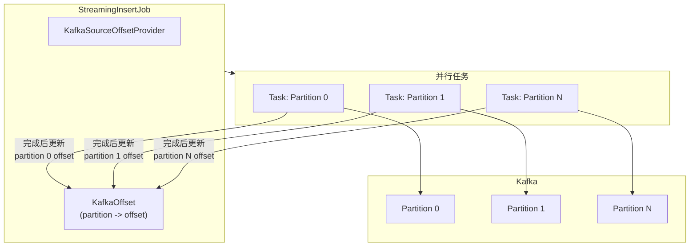
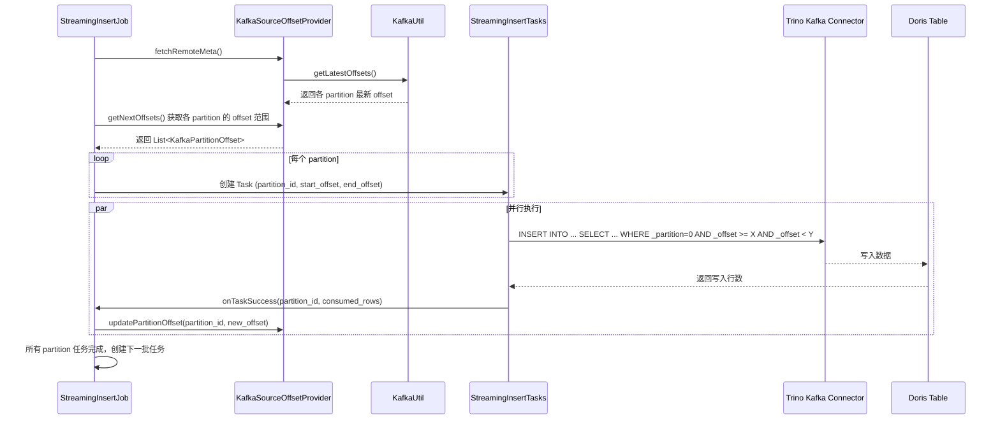

# Kafka StreamingInsertJob 功能设计方案

## 1. 功能概述

### 1.1 需求描述

通过创建 KafkaStreamingJob，可以订阅 Kafka 数据，并持续通过 INSERT 操作将数据从 Kafka 写入到 Doris 表，支持 **exactly-once** 精准一次消费语义。

### 1.2 使用方式

#### 基本语法

```sql
CREATE JOB my_kafka_job 
ON STREAMING
DO 
INSERT INTO doris_tbl
SELECT * FROM kafka(
    "catalog" = "kafka_catalog",
    "database" = "kafka_db",
    "table" = "kafka_tbl",
    "kafka_default_offsets" = "OFFSET_BEGINNING",
    "max_batch_rows" = "100000"
);
```

#### 支持列选择

除了 `SELECT *` 外，还可以指定具体的列名。列名来自于 Trino Kafka Catalog 中定义的表 schema：

```sql
-- 选择指定列
CREATE JOB my_kafka_job 
ON STREAMING
DO 
INSERT INTO doris_tbl (col1, col2, col3)
SELECT col1, col2, col3 FROM kafka(
    "catalog" = "kafka_catalog",
    "database" = "kafka_db",
    "table" = "kafka_tbl",
    "kafka_default_offsets" = "OFFSET_BEGINNING",
    "max_batch_rows" = "100000"
);

-- 支持表达式和列别名
CREATE JOB my_kafka_job 
ON STREAMING
DO 
INSERT INTO doris_tbl
SELECT 
    col1,
    col2,
    CAST(col3 AS INT) as col3_int,
    NOW() as load_time
FROM kafka(
    "catalog" = "kafka_catalog",
    "database" = "kafka_db",
    "table" = "kafka_tbl"
);
```

**说明**：
- 可选择的列名取决于 Trino Kafka Connector 解析 Kafka 消息后暴露的列
- 支持使用 SQL 表达式进行数据转换
- 隐藏列 `_partition` 和 `_offset` 在修改 TrinoConnectorExternalTable 后也可在 SELECT 中使用

### 1.3 前置依赖

**重要**: `kafka()` TVF 的实现依赖于 **TrinoConnectorExternalCatalog** 中配置的 Kafka Connector。

用户需要先创建一个 Trino Kafka Catalog：

```sql
CREATE CATALOG kafka_catalog PROPERTIES (
    "type" = "trino-connector",
    "trino.connector.name" = "kafka",
    "kafka.nodes" = "broker1:9092,broker2:9092",
    "kafka.table-names" = "topic1,topic2",
    "kafka.hide-internal-columns" = "false"
    -- 其他 Kafka connector 配置
);
```

然后才能使用 `kafka()` TVF 引用该 Catalog 中的表。

### 1.4 Kafka 参数转换

由于 `KafkaUtil` 原本是为 `KafkaRoutineLoadJob` 设计的，其参数格式与 TrinoConnectorExternalCatalog 的属性格式不同，需要进行转换。

#### 1.4.1 参数格式对比

| 参数 | KafkaUtil 格式 | Trino Catalog 格式 | 说明 |
|------|---------------|-------------------|------|
| Broker 列表 | `brokerList` (String) | `trino.kafka.nodes` | host1:9092,host2:9092 |
| Topic 名称 | `topic` (String) | 表名（从 TVF 参数获取） | 每个 topic 对应一个表 |
| 客户端属性 | `convertedCustomProperties` (Map) | `trino.kafka.*` | 需要去除前缀并转换 |

#### 1.4.2 Trino Kafka Connector 常用属性

```properties
# 在 Doris Catalog 中的配置（带 trino. 前缀）
trino.connector.name=kafka
trino.kafka.nodes=broker1:9092,broker2:9092
trino.kafka.default-schema=default
trino.kafka.table-names=topic1,topic2
trino.kafka.hide-internal-columns=false

# 认证相关（如果启用 SASL）
trino.kafka.config.resources=/path/to/kafka.properties
# 或者直接配置
trino.kafka.security.protocol=SASL_PLAINTEXT
trino.kafka.sasl.mechanism=PLAIN
trino.kafka.sasl.jaas.config=...
```

#### 1.4.3 参数转换逻辑

在 `KafkaSourceOffsetProvider` 中实现参数转换：

```java
/**
 * 从 TrinoConnectorExternalCatalog 提取 Kafka 连接参数
 * 转换为 KafkaUtil 所需的格式
 */
public class KafkaPropertiesConverter {
    
    private static final String TRINO_PREFIX = "trino.";
    private static final String KAFKA_PREFIX = "kafka.";
    
    /**
     * 从 Catalog 属性中提取 broker 列表
     * trino.kafka.nodes -> brokerList
     */
    public static String extractBrokerList(Map<String, String> catalogProps) {
        // 优先从 trino.kafka.nodes 获取
        String brokers = catalogProps.get("trino.kafka.nodes");
        if (brokers == null) {
            // 兼容：尝试从 kafka.nodes 获取
            brokers = catalogProps.get("kafka.nodes");
        }
        if (brokers == null) {
            throw new IllegalArgumentException("Missing required property: kafka.nodes");
        }
        return brokers;
    }
    
    /**
     * 提取并转换 Kafka 客户端属性
     * 用于 KafkaUtil.getLatestOffsets() 等方法
     * 
     * 转换规则：
     * - trino.kafka.xxx -> xxx (去除 trino.kafka. 前缀)
     * - 保留 security.protocol, sasl.* 等认证相关属性
     */
    public static Map<String, String> convertToKafkaClientProperties(
            Map<String, String> catalogProps) {
        Map<String, String> kafkaProps = new HashMap<>();
        
        String fullPrefix = TRINO_PREFIX + KAFKA_PREFIX;
        
        for (Map.Entry<String, String> entry : catalogProps.entrySet()) {
            String key = entry.getKey();
            String value = entry.getValue();
            
            if (key.startsWith(fullPrefix)) {
                // trino.kafka.xxx -> xxx
                String kafkaKey = key.substring(fullPrefix.length());
                
                // 过滤掉 Trino 特有的配置，保留 Kafka 客户端配置
                if (isKafkaClientProperty(kafkaKey)) {
                    kafkaProps.put(kafkaKey, value);
                }
            }
        }
        
        return kafkaProps;
    }
    
    /**
     * 判断是否为 Kafka 客户端属性（非 Trino 特有属性）
     */
    private static boolean isKafkaClientProperty(String key) {
        // Trino 特有属性，不需要传递给 Kafka 客户端
        Set<String> trinoOnlyProps = Set.of(
            "nodes",              // broker 列表，单独处理
            "default-schema",     // Trino schema 配置
            "table-names",        // Trino 表名列表
            "table-description-dir",
            "hide-internal-columns",
            "timestamp-upper-bound-force-push-down-enabled"
        );
        
        return !trinoOnlyProps.contains(key);
    }
}
```

#### 1.4.4 使用示例

```java
// 在 KafkaSourceOffsetProvider 中使用
public class KafkaSourceOffsetProvider implements SourceOffsetProvider {
    
    private String brokerList;
    private String topic;
    private Map<String, String> kafkaClientProps;
    
    /**
     * 初始化 Kafka 连接参数
     * @param catalog TrinoConnectorExternalCatalog 实例
     * @param tableName Kafka topic 对应的表名
     */
    public void initFromCatalog(TrinoConnectorExternalCatalog catalog, String tableName) {
        Map<String, String> catalogProps = catalog.getCatalogProperty().getProperties();
        
        // 提取 broker 列表
        this.brokerList = KafkaPropertiesConverter.extractBrokerList(catalogProps);
        
        // topic 名称就是表名
        this.topic = tableName;
        
        // 转换 Kafka 客户端属性
        this.kafkaClientProps = KafkaPropertiesConverter
            .convertToKafkaClientProperties(catalogProps);
    }
    
    @Override
    public void fetchRemoteMeta(Map<String, String> properties) throws Exception {
        // 获取所有分区
        List<Integer> partitionIds = KafkaUtil.getAllKafkaPartitions(
            brokerList, topic, kafkaClientProps);
        
        // 获取各分区最新 offset
        List<Pair<Integer, Long>> offsets = KafkaUtil.getLatestOffsets(
            jobId, UUID.randomUUID(), brokerList, topic, kafkaClientProps, partitionIds);
        
        // 更新 latestOffsets
        this.latestOffsets = offsets.stream()
            .collect(Collectors.toMap(p -> p.first, p -> p.second));
    }
}
```

## 2. 整体架构

### 2.1 核心设计原则

为了实现 **exactly-once** 语义：

1. **每个 Partition 独立任务**: 每个 Kafka partition 对应一个独立的 `StreamingInsertTask`
2. **精确 offset 追踪**: 每个任务完成后，通过事务机制精确记录该 partition 的消费进度
3. **原子性保证**: 数据写入和 offset 更新在同一个事务中完成

### 2.2 架构图



### 2.3 数据流程



## 3. 详细设计

### 3.1 核心组件

| 组件 | 位置 | 职责 |

|------|------|------|

| `Kafka` (TVF) | `nereids/trees/expressions/functions/table/` | Kafka TVF 定义，解析参数 |

| `KafkaTableValuedFunction` | `tablefunction/` | Catalog 层 TVF 实现 |

| `KafkaSourceOffsetProvider` | `job/offset/kafka/` | 多分区 offset 管理 |

| `KafkaOffset` | `job/offset/kafka/` | 整体 offset 状态（所有分区） |

| `KafkaPartitionOffset` | `job/offset/kafka/` | 单分区 offset 范围 |

| `TrinoConnectorExternalTable` | `datasource/trinoconnector/` | 修改以支持暴露隐藏列 |

| `StreamingInsertJob` | `job/extensions/insert/streaming/` | 改造支持多任务并行 |

### 3.2 Offset 数据结构

#### 3.2.1 KafkaPartitionOffset（单分区 offset）

```java
// fe-core/src/main/java/org/apache/doris/job/offset/kafka/KafkaPartitionOffset.java
public class KafkaPartitionOffset implements Offset {
    private int partitionId;      // 分区 ID
    private long startOffset;     // 本次任务起始 offset（包含）
    private long endOffset;       // 本次任务结束 offset（不包含）
    private long consumedRows;    // 实际消费的行数（任务完成后填充）
    
    @Override
    public String showRange() {
        return String.format("{partition=%d, range=[%d, %d)}", 
            partitionId, startOffset, endOffset);
    }
}
```

#### 3.2.2 KafkaOffset（全局 offset 状态）

```java
// fe-core/src/main/java/org/apache/doris/job/offset/kafka/KafkaOffset.java
public class KafkaOffset implements Offset {
    // 各分区当前已消费的 offset（下次消费的起始位置）
    @SerializedName("partitionOffsets")
    private Map<Integer, Long> partitionOffsets;
    
    // topic 名称
    @SerializedName("topic")
    private String topic;
    
    // 用于持久化和恢复
    @Override
    public String toSerializedJson() {
        return GsonUtils.GSON.toJson(this);
    }
    
    // 更新单个分区的 offset
    public void updatePartitionOffset(int partitionId, long newOffset) {
        partitionOffsets.put(partitionId, newOffset);
    }
}
```

### 3.3 KafkaSourceOffsetProvider

```java
// fe-core/src/main/java/org/apache/doris/job/offset/kafka/KafkaSourceOffsetProvider.java
public class KafkaSourceOffsetProvider implements SourceOffsetProvider {
    
    // 当前消费位置（各分区）
    private KafkaOffset currentOffset;
    
    // Kafka 最新位置（各分区）
    private Map<Integer, Long> latestOffsets;
    
    // Kafka 连接信息（从 TVF 参数或 Catalog 获取）
    private String brokerList;
    private String topic;
    private Map<String, String> kafkaProps;
    
    // 每批最大行数
    private long maxBatchRows;
    
    /**
     * 获取各分区下一批要消费的 offset 范围
     * @return 每个分区的 offset 范围列表
     */
    public List<KafkaPartitionOffset> getNextOffsets(StreamingJobProperties jobProps) {
        List<KafkaPartitionOffset> offsets = new ArrayList<>();
        for (Map.Entry<Integer, Long> entry : currentOffset.getPartitionOffsets().entrySet()) {
            int partitionId = entry.getKey();
            long currentPos = entry.getValue();
            long latestPos = latestOffsets.getOrDefault(partitionId, currentPos);
            
            if (currentPos < latestPos) {
                // 计算本次要读取的范围
                long endOffset = Math.min(currentPos + maxBatchRows, latestPos);
                offsets.add(new KafkaPartitionOffset(partitionId, currentPos, endOffset));
            }
        }
        return offsets;
    }
    
    /**
     * 重写 SQL：将 kafka() TVF 重写为对 Trino Kafka 表的查询
     * 
     * 原始: SELECT * FROM kafka("catalog"="xxx", "table"="yyy", ...)
     * 重写: SELECT * FROM xxx.default.yyy WHERE _partition = ? AND _offset >= ? AND _offset < ?
     */
    @Override
    public InsertIntoTableCommand rewriteTvfParams(
            InsertIntoTableCommand originCommand, 
            Offset runningOffset) {
        KafkaPartitionOffset partitionOffset = (KafkaPartitionOffset) runningOffset;
        
        // 构建新的 SQL:
        // SELECT * FROM catalog.database.table 
        // WHERE _partition = {partitionId} 
        //   AND _offset >= {startOffset} 
        //   AND _offset < {endOffset}
        
        // ... 实现 plan 重写逻辑
    }
    
    /**
     * 通过 KafkaUtil 获取各分区的最新 offset
     */
    @Override
    public void fetchRemoteMeta(Map<String, String> properties) throws Exception {
        List<Integer> partitionIds = KafkaUtil.getAllKafkaPartitions(
            brokerList, topic, kafkaProps);
        
        List<Pair<Integer, Long>> offsets = KafkaUtil.getLatestOffsets(
            jobId, taskId, brokerList, topic, kafkaProps, partitionIds);
        
        this.latestOffsets = offsets.stream()
            .collect(Collectors.toMap(p -> p.first, p -> p.second));
    }
    
    /**
     * 更新指定分区的 offset
     */
    public void updatePartitionOffset(int partitionId, long newOffset) {
        currentOffset.updatePartitionOffset(partitionId, newOffset);
    }
    
    @Override
    public boolean hasMoreDataToConsume() {
        for (Map.Entry<Integer, Long> entry : currentOffset.getPartitionOffsets().entrySet()) {
            int partitionId = entry.getKey();
            long currentPos = entry.getValue();
            long latestPos = latestOffsets.getOrDefault(partitionId, currentPos);
            if (currentPos < latestPos) {
                return true;
            }
        }
        return false;
    }
}
```

### 3.4 StreamingInsertJob 多任务改造

现有的 `StreamingInsertJob` 只维护一个 `runningStreamTask`，需要改造为支持多任务并行：

```java
// StreamingInsertJob.java 改造要点

public class StreamingInsertJob extends AbstractJob<...> {
    
    // 原有：单任务
    // AbstractStreamingTask runningStreamTask;
    
    // 改造后：多任务映射 (partitionId -> task)
    Map<Integer, AbstractStreamingTask> runningPartitionTasks = new ConcurrentHashMap<>();
    
    // 当前批次已完成的分区数
    AtomicInteger completedPartitionCount = new AtomicInteger(0);
    
    // 当前批次总分区数
    int currentBatchPartitionCount = 0;
    
    /**
     * 创建多个分区任务
     */
    protected List<AbstractStreamingTask> createKafkaPartitionTasks() {
        KafkaSourceOffsetProvider provider = (KafkaSourceOffsetProvider) offsetProvider;
        List<KafkaPartitionOffset> partitionOffsets = provider.getNextOffsets(jobProperties);
        
        List<AbstractStreamingTask> tasks = new ArrayList<>();
        for (KafkaPartitionOffset partitionOffset : partitionOffsets) {
            StreamingInsertTask task = new StreamingInsertTask(
                getJobId(), 
                Env.getCurrentEnv().getNextId(),
                getExecuteSql(),
                offsetProvider,
                getCurrentDbName(),
                jobProperties,
                originTvfProps,
                getCreateUser(),
                partitionOffset  // 新增：分区 offset 信息
            );
            tasks.add(task);
            runningPartitionTasks.put(partitionOffset.getPartitionId(), task);
        }
        
        currentBatchPartitionCount = tasks.size();
        completedPartitionCount.set(0);
        return tasks;
    }
    
    /**
     * 单个分区任务成功回调
     */
    public void onPartitionTaskSuccess(StreamingInsertTask task, int partitionId, long consumedRows) {
        writeLock();
        try {
            // 更新该分区的 offset
            KafkaSourceOffsetProvider provider = (KafkaSourceOffsetProvider) offsetProvider;
            KafkaPartitionOffset partitionOffset = (KafkaPartitionOffset) task.getRunningOffset();
            long newOffset = partitionOffset.getStartOffset() + consumedRows;
            provider.updatePartitionOffset(partitionId, newOffset);
            
            // 从运行中任务移除
            runningPartitionTasks.remove(partitionId);
            
            // 检查是否所有分区都完成
            int completed = completedPartitionCount.incrementAndGet();
            if (completed >= currentBatchPartitionCount) {
                // 所有分区完成，创建下一批任务
                createKafkaPartitionTasks();
            }
        } finally {
            writeUnlock();
        }
    }
}
```

### 3.5 StreamingInsertTask 改造

```java
// StreamingInsertTask.java 改造要点

public class StreamingInsertTask extends AbstractStreamingTask {
    
    // 新增：分区 offset 信息（Kafka 场景使用）
    private KafkaPartitionOffset partitionOffset;
    
    // 新增构造函数
    public StreamingInsertTask(..., KafkaPartitionOffset partitionOffset) {
        // ...
        this.partitionOffset = partitionOffset;
    }
    
    @Override
    public void before() throws Exception {
        // ...
        
        if (partitionOffset != null) {
            // Kafka 场景：使用分区 offset
            this.runningOffset = partitionOffset;
        } else {
            // 原有 S3 场景
            this.runningOffset = offsetProvider.getNextOffset(jobProperties, originTvfProps);
        }
        
        // 重写 TVF 参数
        this.taskCommand = offsetProvider.rewriteTvfParams(baseCommand, runningOffset);
        // ...
    }
    
    @Override
    public boolean onSuccess() throws JobException {
        // ...
        
        StreamingInsertJob job = (StreamingInsertJob) Env.getCurrentEnv()
            .getJobManager().getJob(getJobId());
        
        if (partitionOffset != null) {
            // Kafka 场景：获取实际消费行数并回调
            long consumedRows = getConsumedRowCount();
            job.onPartitionTaskSuccess(this, partitionOffset.getPartitionId(), consumedRows);
        } else {
            // 原有场景
            job.onStreamTaskSuccess(this);
        }
        return true;
    }
    
    /**
     * 获取本次任务实际消费的行数
     */
    private long getConsumedRowCount() {
        // 从 LoadJob 统计信息中获取
        List<LoadJob> loadJobs = Env.getCurrentEnv().getLoadManager()
            .queryLoadJobsByJobIds(Arrays.asList(this.getTaskId()));
        if (!loadJobs.isEmpty()) {
            return loadJobs.get(0).getLoadStatistic().getScannedRows();
        }
        return 0;
    }
}
```

### 3.6 修改 TrinoConnectorExternalTable

```java
// TrinoConnectorExternalTable.java

@Override
public Optional<SchemaCacheValue> initSchema() {
    // ...
    
    for (ColumnHandle columnHandle : columnHandleMap.values()) {
        ColumnMetadata columnMetadata = connectorMetadata.getColumnMetadata(...);
        
        // 修改：增加对 Kafka 隐藏列的支持
        if (columnMetadata.isHidden() && !shouldIncludeHiddenColumns()) {
            continue;
        }
        
        // ... 其余逻辑不变
    }
}

/**
 * 判断是否需要包含隐藏列
 * Kafka connector 需要暴露 _partition, _offset 等隐藏列
 */
private boolean shouldIncludeHiddenColumns() {
    String connectorName = catalog.getConnectorName();
    // Kafka connector 需要暴露隐藏列以支持 offset 过滤
    if ("kafka".equalsIgnoreCase(connectorName)) {
        return true;
    }
    // 或者通过 catalog 属性配置
    return "true".equalsIgnoreCase(
        catalog.getProperties().get("include_hidden_columns"));
}
```

### 3.7 kafka() TVF 实现

```java
// fe-core/src/main/java/org/apache/doris/nereids/trees/expressions/functions/table/Kafka.java

/**
 * kafka() TVF - 用于 StreamingInsertJob 从 Kafka 读取数据
 * 
 * 注意：此 TVF 依赖于预先配置的 TrinoConnectorExternalCatalog (Kafka Connector)
 */
public class Kafka extends TableValuedFunction {
    
    public Kafka(Properties properties) {
        super("kafka", properties);
    }
    
    @Override
    protected TableValuedFunctionIf toCatalogFunction() {
        try {
            Map<String, String> arguments = getTVFProperties().getMap();
            return new KafkaTableValuedFunction(arguments);
        } catch (Throwable t) {
            throw new AnalysisException("Can not build kafka(): " + t.getMessage(), t);
        }
    }
    
    @Override
    public <R, C> R accept(ExpressionVisitor<R, C> visitor, C context) {
        return visitor.visitKafka(this, context);
    }
}
```
```java
// fe-core/src/main/java/org/apache/doris/tablefunction/KafkaTableValuedFunction.java

/**
 * Kafka TVF 实现
 * 
 * 参数：
 * - catalog: Trino Kafka Catalog 名称（必填）
 * - database: 数据库名称，默认 "default"
 * - table: Kafka topic 对应的表名（必填）
 * - kafka_default_offsets: 初始 offset，OFFSET_BEGINNING 或 OFFSET_END
 * - max_batch_rows: 每批最大读取行数
 */
public class KafkaTableValuedFunction extends TableValuedFunctionIf {
    
    public static final String CATALOG = "catalog";
    public static final String DATABASE = "database";
    public static final String TABLE = "table";
    public static final String KAFKA_DEFAULT_OFFSETS = "kafka_default_offsets";
    public static final String MAX_BATCH_ROWS = "max_batch_rows";
    
    private String catalogName;
    private String databaseName;
    private String tableName;
    private String defaultOffsets;
    private long maxBatchRows;
    
    public KafkaTableValuedFunction(Map<String, String> params) throws AnalysisException {
        // 解析参数
        this.catalogName = getRequiredParam(params, CATALOG);
        this.databaseName = params.getOrDefault(DATABASE, "default");
        this.tableName = getRequiredParam(params, TABLE);
        this.defaultOffsets = params.getOrDefault(KAFKA_DEFAULT_OFFSETS, "OFFSET_END");
        this.maxBatchRows = Long.parseLong(params.getOrDefault(MAX_BATCH_ROWS, "100000"));
        
        // 验证 Catalog 存在且为 Kafka Connector
        validateKafkaCatalog();
    }
    
    private void validateKafkaCatalog() throws AnalysisException {
        CatalogIf catalog = Env.getCurrentEnv().getCatalogMgr().getCatalog(catalogName);
        if (catalog == null) {
            throw new AnalysisException("Catalog not found: " + catalogName);
        }
        if (!(catalog instanceof TrinoConnectorExternalCatalog)) {
            throw new AnalysisException("Catalog must be a Trino Connector catalog: " + catalogName);
        }
        TrinoConnectorExternalCatalog trinoCatalog = (TrinoConnectorExternalCatalog) catalog;
        if (!"kafka".equalsIgnoreCase(trinoCatalog.getConnectorName())) {
            throw new AnalysisException("Catalog must be a Kafka connector: " + catalogName);
        }
    }
}
```

## 4. 执行示例

### 4.1 场景描述

- Kafka topic: `my_topic`，3 个分区
- 初始 offset: OFFSET_BEGINNING
- max_batch_rows: 100000

### 4.2 执行过程

**第一轮调度**:

1. 获取各分区最新 offset: `{0: 500000, 1: 300000, 2: 400000}`
2. 当前 offset: `{0: 0, 1: 0, 2: 0}`
3. 创建 3 个任务，每个任务的 SQL:
```sql
-- Task 1 (Partition 0)
INSERT INTO doris_tbl 
SELECT * FROM kafka_catalog.default.my_topic 
WHERE _partition = 0 AND _offset >= 0 AND _offset < 100000;

-- Task 2 (Partition 1)
INSERT INTO doris_tbl 
SELECT * FROM kafka_catalog.default.my_topic 
WHERE _partition = 1 AND _offset >= 0 AND _offset < 100000;

-- Task 3 (Partition 2)
INSERT INTO doris_tbl 
SELECT * FROM kafka_catalog.default.my_topic 
WHERE _partition = 2 AND _offset >= 0 AND _offset < 100000;
```

4. 任务完成后，假设各任务实际消费行数: `{0: 100000, 1: 100000, 2: 100000}`
5. 更新 offset: `{0: 100000, 1: 100000, 2: 100000}`

**第二轮调度**:

1. 当前 offset: `{0: 100000, 1: 100000, 2: 100000}`
2. 创建下一批任务...

## 5. 开发步骤

### 步骤 1: 修改 TrinoConnectorExternalTable

- 文件: [`TrinoConnectorExternalTable.java`](fe-core/src/main/java/org/apache/doris/datasource/trinoconnector/TrinoConnectorExternalTable.java)
- 添加 `shouldIncludeHiddenColumns()` 方法
- 修改 `initSchema()` 支持 Kafka 隐藏列

### 步骤 2: 创建 Kafka Offset 类

- 文件: `fe-core/src/main/java/org/apache/doris/job/offset/kafka/KafkaPartitionOffset.java`
- 文件: `fe-core/src/main/java/org/apache/doris/job/offset/kafka/KafkaOffset.java`

### 步骤 3: 创建 KafkaSourceOffsetProvider

- 文件: `fe-core/src/main/java/org/apache/doris/job/offset/kafka/KafkaSourceOffsetProvider.java`
- 实现多分区 offset 管理
- 实现 `rewriteTvfParams()` 生成带 partition 和 offset 过滤的 SQL

### 步骤 4: 创建 kafka() TVF

- 文件: `fe-core/src/main/java/org/apache/doris/nereids/trees/expressions/functions/table/Kafka.java`
- 文件: `fe-core/src/main/java/org/apache/doris/tablefunction/KafkaTableValuedFunction.java`
- 验证依赖的 Trino Kafka Catalog

### 步骤 5: 改造 StreamingInsertJob 支持多任务

- 文件: [`StreamingInsertJob.java`](fe-core/src/main/java/org/apache/doris/job/extensions/insert/streaming/StreamingInsertJob.java)
- 添加 `runningPartitionTasks` 映射
- 实现 `createKafkaPartitionTasks()` 方法
- 实现 `onPartitionTaskSuccess()` 回调

### 步骤 6: 改造 StreamingInsertTask

- 文件: [`StreamingInsertTask.java`](fe-core/src/main/java/org/apache/doris/job/extensions/insert/streaming/StreamingInsertTask.java)
- 添加 `KafkaPartitionOffset` 支持
- 修改 `onSuccess()` 回调逻辑

### 步骤 7: 注册 Provider

- 文件: [`SourceOffsetProviderFactory.java`](fe-core/src/main/java/org/apache/doris/job/offset/SourceOffsetProviderFactory.java)
- 添加 `map.put("kafka", KafkaSourceOffsetProvider.class)`

### 步骤 8: 添加单元测试

- 测试 KafkaOffset 序列化/反序列化
- 测试多分区 offset 计算逻辑
- 测试多任务并行执行

## 6. 注意事项

### 6.1 Exactly-Once 保证

- 数据写入和 offset 更新在同一个 Doris 事务中完成
- 通过 `StreamingTaskTxnCommitAttachment` 将 offset 附加到事务
- 事务回滚时 offset 不会更新，确保不丢数据

### 6.2 依赖关系

- `kafka()` TVF 依赖 TrinoConnectorExternalCatalog 的 Kafka Connector
- 用户必须先创建 Trino Kafka Catalog
- Kafka Connector 必须配置 `kafka.hide-internal-columns=false` 以暴露隐藏列

### 6.3 性能考虑

- 多分区并行执行可以提高吞吐量
- `max_batch_rows` 应根据实际情况调整
- 过大的批次可能导致单次任务执行时间过长

### 6.4 错误处理（第一期简化）

- 任何分区任务失败，整个 Job 进入 PAUSED 状态
- 可通过 `RESUME JOB` 手动恢复
- 失败的分区会从上次成功的 offset 重新开始