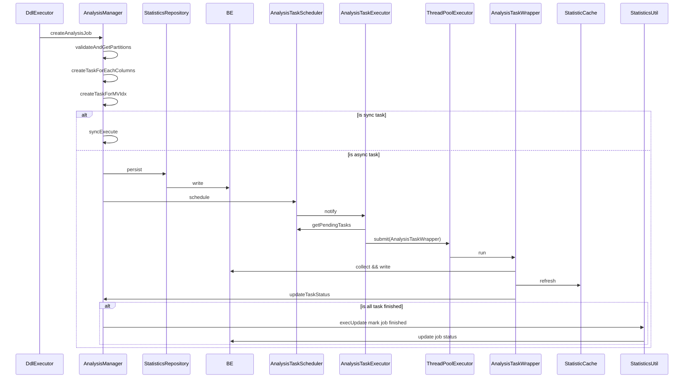
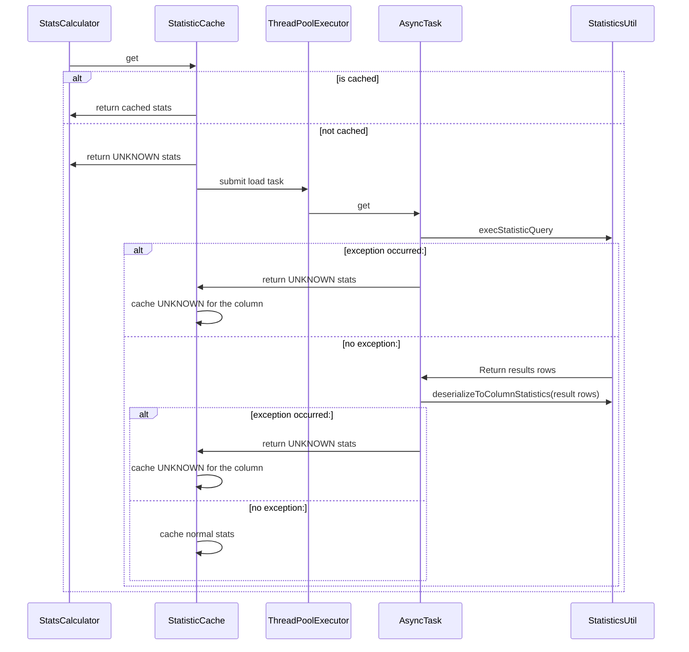

- [Requiredments](#requiredments)
    - [Basic](#basic)
    - [Adavanced(Not finished yet)](#adavancednot-finished-yet)
    - [Specification](#specification)
    - [Compatibility](#compatibility)
        - [Function compatibility](#function-compatibility)
        - [Version compatibility](#version-compatibility)
- [Implementation](#implementation)
    - [Main class](#main-class)
    - [Analyze execution flow](#analyze-execution-flow)
    - [Load execution flow](#load-execution-flow)
- [Configure options](#configure-options)
- [User interface](#user-interface)
- [Test](#test)

# Requiredments

## Basic

Provide necessary data for the optimizer to calculate and compare various plans. This includes count, ndv, null_count, min, max, data_size, histogram for each column, as well as the number of rows in the table.

## Adavanced(Not finished yet)

Support incremental collectio and auto collection

## Specification

## Compatibility

### Function compatibility

No conflicts with any other function.

### Version compatibility

There may be compatibility issues if there are changes to the schema of the stats table in the future.

# Implementation

## Main class

|Class name|Function|
|---|---|
|AnalyzeStmt|Constructed by parsing user-input SQL, each AnalyzeStmt corresponds to a Job, and a Job can have multiple Tasks, with each Task responsible for collecting statistics information on a column.|
|AnalysisManager|Mainly responsible for managing Analyze Jobs/Tasks, including creation, execution, cancellation, and status updates, etc.|
|StatisticCache|The collected statistical information is cached here on demand.|
|StatisticCacheLoader|When `StatsCalculator#computeScan` fails to find the corresponding stats for a column in the cache, the load logic will be triggered, which is implemented in this class.|
|AnalysisTaskExecutor|Used to excute AnalyzeJob|
|AnalysisTaskWrapper|This class encapsulates an `AnalysisTask` and extends `FutureTask`. It overrides some methods for state updates.|
|AnalysisTaskScheduler|AnalysisTaskExecutor retrieves jobs from here for execution. Manually submitted jobs always have higher priority than automatically triggered ones.|
|StatisticsCleaner|Responsible for cleaning up expired statistics and job information.|
|StatisticsAutoAnalyzer|Mainly responsible for automatically analysing statistics. Generate analysis job info for AnalysisManager to execute, including periodic and automatic analysis jobs.|
|StatisticsRepository|Most of the related SQL is defined here.|
|StatisticsUtil|Mainly consists of helper methods, such as checking the status of stats-related tables.|

## Analyze execution flow

## Load execution flow

# Configure options

# User interface

# Test

# Feature note

20230508:
1. Add table level statistics, support `SHOW TABLE STATS` statement to show table level statistics.
2. Implement automatically analyze statistics, support `ANALYZE... WITH AUTO ...` statement to automatically analyze statistics.