# Iceberg 元数据缓存架构图

## 1. 整体架构图

```mermaid
graph TB
    subgraph "查询层"
        Query[查询请求]
        IcebergScanNode[IcebergScanNode]
        IcebergSource[IcebergSource]
    end
    
    subgraph "缓存管理层"
        ExternalMetaCacheMgr[ExternalMetaCacheMgr<br/>统一缓存管理器]
        IcebergMetadataCacheMgr[IcebergMetadataCacheMgr<br/>Iceberg 缓存管理器]
        ExternalSchemaCache[ExternalSchemaCache<br/>Schema 缓存]
    end
    
    subgraph "核心缓存层"
        IcebergMetadataCache[IcebergMetadataCache]
        
        subgraph "四种缓存"
            TableCache[tableCache<br/>Table 缓存]
            SnapshotListCache[snapshotListCache<br/>Snapshot 列表缓存]
            SnapshotCache[snapshotCache<br/>Snapshot 值缓存<br/>MTMV 用]
            ViewCache[viewCache<br/>View 缓存]
        end
        
        SchemaCache[schemaCache<br/>Schema 缓存]
    end
    
    subgraph "元数据操作层"
        IcebergMetadataOps[IcebergMetadataOps<br/>元数据操作]
        IcebergCatalog[Iceberg Catalog<br/>HMS/REST/Glue/DLF]
    end
    
    subgraph "外部存储"
        MetaStore[(元数据存储<br/>HMS/REST)]
        DataFiles[(数据文件<br/>HDFS/S3/OSS)]
    end
    
    Query --> IcebergScanNode
    IcebergScanNode --> IcebergSource
    IcebergSource --> ExternalMetaCacheMgr
    
    ExternalMetaCacheMgr --> IcebergMetadataCacheMgr
    ExternalMetaCacheMgr --> ExternalSchemaCache
    
    IcebergMetadataCacheMgr --> IcebergMetadataCache
    ExternalSchemaCache --> SchemaCache
    
    IcebergMetadataCache --> TableCache
    IcebergMetadataCache --> SnapshotListCache
    IcebergMetadataCache --> SnapshotCache
    IcebergMetadataCache --> ViewCache
    
    TableCache --> IcebergMetadataOps
    ViewCache --> IcebergMetadataOps
    SchemaCache --> IcebergMetadataOps
    
    IcebergMetadataOps --> IcebergCatalog
    IcebergCatalog --> MetaStore
    IcebergCatalog --> DataFiles
```

## 2. Table 缓存加载流程

## 3. Schema 缓存加载流程

## 4. Snapshot 缓存加载流程（MTMV）

## 5. 缓存失效流程

## 6. 缓存键值关系图

## 7. 缓存配置和线程池

## 8. 查询执行中的缓存使用

## 9. 重构优化方向

## 10. 典型使用场景时序图

### 场景 1: 首次查询 Iceberg 表

### 场景 2: 后续查询（缓存命中）

### 场景 3: 表结构变更后刷新

---

**说明**:
- 这些图表使用 Mermaid 语法，可以在支持 Mermaid 的 Markdown 渲染器中显示
- 推荐使用 GitHub、GitLab 或支持 Mermaid 的 Markdown 编辑器查看
- 可以复制到在线 Mermaid 编辑器（如 https://mermaid.live/）查看效果

